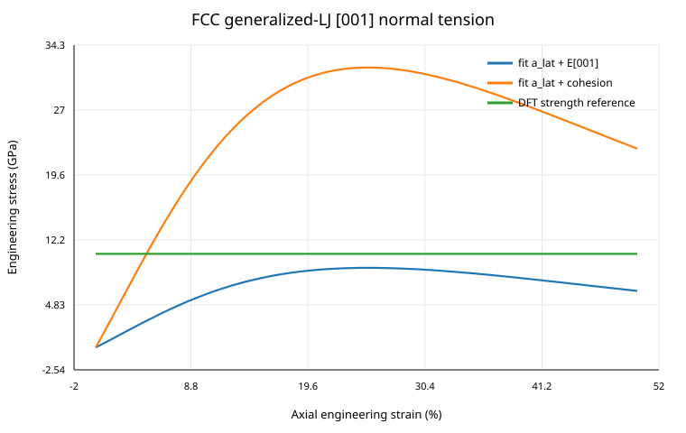
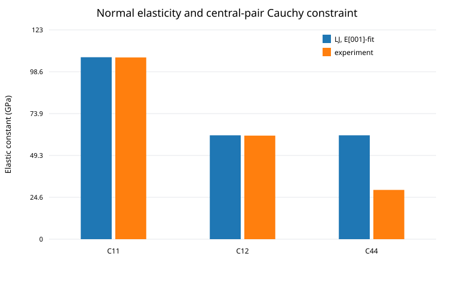
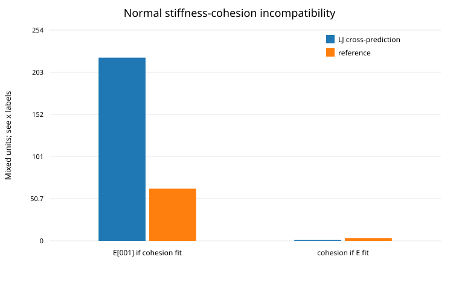
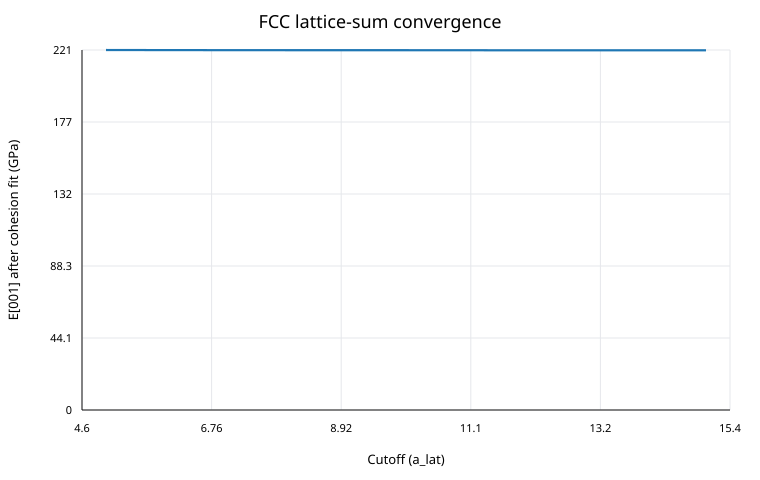

# FCC Normal-LJ Results

## Scope

This report summarizes the current three-dimensional FCC generalized-Lennard-Jones validation for the **normal-deformation mainline**.

It is a calibration and falsification study. It is **not** a fatigue-life prediction and does not contain an empirical damage variable.

The model is

$$
U(\mathbf F)
=\frac12\sum_{\mathbf R\ne0}
v(|\mathbf F\mathbf R|),
$$

with

$$
v(r)=\varepsilon_{\rm LJ}
\left[
\left(\frac{\sigma_{\rm LJ}}r\right)^{12.19}
-
\left(\frac{\sigma_{\rm LJ}}r\right)^6
\right].
$$

For [001] tension,

$$
\mathbf F=\operatorname{diag}(\lambda_t,\lambda_t,\lambda_n),
$$

and the transverse stretch is energy-relaxed at every imposed $\lambda_n$.

## 1. Normal stress-strain response

Two calibrations are deliberately compared while keeping the same FCC geometry and the same fixed $(m,n)=(12.19,6)$ potential shape.

### Normal-modulus calibration

The LJ energy scale is chosen so that

$$
E_{[001]}=62.7024\ \mathrm{GPa}.
$$

This gives

$$
\varepsilon_{\rm LJ}\approx0.445621\ \mathrm{eV}.
$$

Without fitting the peak stress, the relaxed [001] curve reaches approximately

$$
\boxed{\sigma_{\rm max}\approx9.045\ \mathrm{GPa}}
$$

at engineering strain about

$$
\epsilon_n\approx0.25.
$$

A first-principles comparison value near $10.63$ GPa is shown only as an external scale reference. The agreement is useful but is not an exact validation because the calculations do not share identical thermodynamic and relaxation conditions.

### Cohesive-energy calibration

If instead the LJ energy scale is chosen to reproduce

$$
E_{\rm coh}=3.43\ \mathrm{eV/atom},
$$

then

$$
\varepsilon_{\rm LJ}\approx1.56683\ \mathrm{eV}
$$

and the normal lattice becomes much too stiff:

$$
E_{[001]}\approx220.466\ \mathrm{GPa}.
$$

The figure therefore displays a genuine model-calibration conflict rather than a numerical discrepancy.

## 2. Elastic constants and the Cauchy constraint

When the potential is fitted to the normal [001] modulus, it predicts

$$
C_{11}^{\rm LJ}\approx107.169\ \mathrm{GPa},
$$

$$
C_{12}^{\rm LJ}\approx61.180\ \mathrm{GPa}.
$$

These are extremely close to the external reference values $107$ GPa and $61$ GPa.

This is a strong result for the active normal-deformation program: a single energy-scale calibration of the inherited generalized-LJ shape captures the small-strain normal elastic sector very well.

However, the same calculation gives

$$
C_{44}^{\rm LJ}\approx61.180\ \mathrm{GPa}.
$$

For a zero-pressure cubic crystal governed by a central pair potential,

$$
\boxed{C_{12}=C_{44}}
$$

is the Cauchy relation. The numerical difference between the two LJ values is only about $0.060$ MPa, which verifies that the code recovers the structural constraint of the model.

Real Al has $C_{44}$ near $29$ GPa. Therefore the discrepancy is not caused by the lattice-sum code. It is a known structural limitation of the central-pair model class.

## 3. Stiffness-cohesion incompatibility

The same fixed potential shape cannot currently satisfy both normal stiffness and absolute cohesion.

If cohesion is fitted:

$$
E_{[001]}^{\rm prediction}\approx220.466\ \mathrm{GPa}
$$

instead of about $62.702$ GPa.

If the normal modulus is fitted:

$$
E_{\rm coh}^{\rm prediction}\approx0.9755\ \mathrm{eV/atom}
$$

instead of about $3.43$ eV/atom.

This distinction is central to the fatigue-probability theory.

The normal-modulus-fitted potential can be used as an **effective normal-mechanics baseline** for forces, stiffnesses, lattice instability studies, and conservative null tests.

It must **not yet** be used as a quantitatively calibrated thermal-separation energy inside expressions such as

$$
\exp\!\left(-\frac{\Delta U}{k_BT}\right).
$$

The absolute error in $\Delta U$ would enter exponentially.

## 4. Lattice-sum convergence

The FCC sum was repeated with spherical cutoffs of 5, 6, 8, 10, 12, and 15 conventional lattice constants.

For the cohesive-energy calibration, the predicted [001] modulus changes from approximately

$$
220.617\ \mathrm{GPa}
$$

at cutoff 5 to

$$
220.466\ \mathrm{GPa}
$$

at cutoff 15.

The stiffness/cohesion mismatch is therefore orders of magnitude larger than the residual cutoff uncertainty.

The qualitative conclusion does not depend on the chosen converged cutoff.

## 5. Current scientific meaning

The FCC calculation sharpens the role of the generalized LJ model.

### What is supported

1. The generalized-LJ form with $(m,n)=(12.19,6)$ is a surprisingly strong normal-elastic baseline for FCC Al after one normal energy-scale calibration.
2. The correct directional normal modulus must be derived from $C_{11}$ and $C_{12}$ rather than using an aggregate isotropic Young modulus as a [001] single-crystal value.
3. The same normal calibration gives an unfitted ideal-strength scale of order $9$ GPa.
4. The central-pair Cauchy relation is numerically recovered, providing a strong implementation check.

### What is falsified

1. The current fixed pair law is not a complete quantitative 3D Al potential.
2. The same fixed $(12.19,6)$ pair law cannot simultaneously match the experimental normal stiffness and cohesive-energy scale.
3. A quantitative thermal first-passage calculation cannot yet use the normal-fit LJ barrier energy as though it were the real Al separation-energy landscape.

## 6. Next step

Before introducing thermal activation or a 20 Hz fatigue cycle map, the next energy-model problem is

$$
\boxed{
\text{preserve the successful normal LJ mechanical sector}
+\text{identify the minimum physically necessary cohesive correction}.
}
$$

The correction must come from an explicit microscopic energy contribution. It must not be a cycle-dependent damage parameter.

The first test for any proposed correction is whether it can improve absolute cohesion while preserving the already successful $C_{11}$, $C_{12}$ and normal traction response.

---

# 한국어 번역 — FCC Normal-LJ 결과

## 범위

이 문서는 **수직변형 mainline**의 현재 3차원 FCC generalized-Lennard-Jones 검증결과를 정리한다.

calibration 및 falsification 연구이며 **피로수명 예측이 아니다.** 경험적 damage variable도 사용하지 않는다.

모델은

$$
U(\mathbf F)
=\frac12\sum_{\mathbf R\ne0}
v(|\mathbf F\mathbf R|)
$$

이고

$$
v(r)=\varepsilon_{\rm LJ}
\left[
\left(\frac{\sigma_{\rm LJ}}r\right)^{12.19}
-
\left(\frac{\sigma_{\rm LJ}}r\right)^6
\right]
$$

이다.

[001] 인장에서는

$$
\mathbf F=\operatorname{diag}(\lambda_t,\lambda_t,\lambda_n)
$$

을 사용하고 각 imposed $\lambda_n$에서 transverse stretch를 energy relaxation한다.

## 1. Normal stress-strain response

같은 FCC geometry와 같은 fixed $(m,n)=(12.19,6)$ potential shape를 유지한 채 두 calibration을 의도적으로 비교했다.

### Normal-modulus calibration

LJ energy scale을

$$
E_{[001]}=62.7024\ \mathrm{GPa}
$$

가 되도록 정한다.

이때

$$
\varepsilon_{\rm LJ}\approx0.445621\ \mathrm{eV}
$$

이다.

peak stress를 fitting하지 않았는데 relaxed [001] curve는 engineering strain 약

$$
\epsilon_n\approx0.25
$$

에서

$$
\boxed{\sigma_{\rm max}\approx9.045\ \mathrm{GPa}}
$$

까지 올라간다.

first-principles 비교값 약 $10.63$ GPa는 외부 scale reference로만 표시한다. 계산방법, 온도 및 relaxation 조건이 동일하지 않으므로 이를 정확한 validation이라고 과대해석하면 안 된다.

### Cohesive-energy calibration

반대로 LJ energy scale을

$$
E_{\rm coh}=3.43\ \mathrm{eV/atom}
$$

에 맞추면

$$
\varepsilon_{\rm LJ}\approx1.56683\ \mathrm{eV}
$$

가 되고 normal lattice가 지나치게 단단해진다.

$$
E_{[001]}\approx220.466\ \mathrm{GPa}.
$$

따라서 그림의 차이는 numerical discrepancy가 아니라 실제 model-calibration conflict다.

## 2. Elastic constants와 Cauchy constraint

potential을 normal [001] modulus에 맞추면

$$
C_{11}^{\rm LJ}\approx107.169\ \mathrm{GPa},
$$

$$
C_{12}^{\rm LJ}\approx61.180\ \mathrm{GPa}
$$

를 예측한다.

외부 reference $107$ GPa, $61$ GPa와 매우 가깝다.

이는 active normal-deformation 연구에 상당히 강한 결과다. inherited generalized-LJ shape에 energy scale 하나만 calibration해도 small-strain normal elastic sector를 매우 잘 재현한다.

하지만 같은 계산에서

$$
C_{44}^{\rm LJ}\approx61.180\ \mathrm{GPa}
$$

도 나온다.

zero-pressure cubic central pair potential에서는

$$
\boxed{C_{12}=C_{44}}
$$

라는 Cauchy relation이 성립한다. 수치 LJ 값의 차이는 약 $0.060$ MPa뿐이므로 code가 이 model-class structural constraint를 정확히 복원하는 것도 확인된다.

실제 Al의 $C_{44}$는 약 $29$ GPa다. 따라서 이 차이는 lattice-sum code의 오류가 아니라 central-pair model class의 구조적 한계다.

## 3. Stiffness-cohesion incompatibility

같은 fixed potential shape가 normal stiffness와 absolute cohesion을 동시에 만족하지 못한다.

cohesion을 맞추면

$$
E_{[001]}^{\rm prediction}\approx220.466\ \mathrm{GPa}
$$

로 약 $62.702$ GPa보다 훨씬 크다.

normal modulus를 맞추면

$$
E_{\rm coh}^{\rm prediction}\approx0.9755\ \mathrm{eV/atom}
$$

으로 약 $3.43$ eV/atom보다 훨씬 작다.

이 구분은 fatigue probability theory에 직접 중요하다.

normal-modulus-fit potential은 force, stiffness, lattice instability, conservative null test를 위한 **effective normal-mechanics baseline**으로 사용할 수 있다.

하지만 아직

$$
\exp\!\left(-\frac{\Delta U}{k_BT}\right)
$$

같은 식의 quantitative thermal separation energy로 사용하면 안 된다. absolute $\Delta U$ 오차가 지수적으로 들어가기 때문이다.

## 4. Lattice-sum convergence

FCC sum을 conventional lattice constant 기준 spherical cutoff 5, 6, 8, 10, 12, 15에서 반복했다.

cohesive-energy calibration에서 predicted [001] modulus는 cutoff 5에서 약

$$
220.617\ \mathrm{GPa}
$$

이고 cutoff 15에서 약

$$
220.466\ \mathrm{GPa}
$$

로 수렴한다.

stiffness/cohesion mismatch는 남아 있는 cutoff uncertainty보다 압도적으로 크다.

따라서 정성적 결론은 converged cutoff 선택에 의존하지 않는다.

## 5. 현재 과학적 의미

FCC 계산으로 generalized LJ model의 역할이 더 명확해졌다.

### 지지되는 것

1. $(m,n)=(12.19,6)$ generalized-LJ는 energy-scale 하나를 normal modulus에 맞추면 FCC Al normal elastic baseline으로 상당히 강하다.
2. directional normal modulus는 aggregate isotropic Young modulus를 [001] 값으로 직접 사용하면 안 되고 $C_{11}$, $C_{12}$에서 계산해야 한다.
3. 같은 normal calibration이 fitting하지 않은 ideal-strength scale 약 $9$ GPa를 만든다.
4. central-pair Cauchy relation이 수치적으로 복원되어 implementation check도 통과한다.

### 반증된 것

1. 현재 fixed pair law는 complete quantitative 3D Al potential이 아니다.
2. 같은 fixed $(12.19,6)$ pair law로 experimental normal stiffness와 cohesive-energy scale을 동시에 맞출 수 없다.
3. normal-fit LJ barrier energy를 실제 Al separation-energy landscape처럼 사용해 quantitative thermal first-passage를 계산하면 안 된다.

## 6. 다음 단계

thermal activation이나 20 Hz fatigue cycle map을 넣기 전에 다음 energy-model problem을 먼저 해결한다.

$$
\boxed{
\text{성공적인 normal LJ mechanical sector 유지}
+\text{최소한의 물리적으로 필요한 cohesive correction 식별}
}
$$

correction은 explicit microscopic energy contribution에서 나와야 하며 cycle-dependent damage parameter가 되어서는 안 된다.

어떤 correction이든 첫 검증은 absolute cohesion을 개선하면서 이미 잘 맞는 $C_{11}$, $C_{12}$ 및 normal traction response를 유지하는지 확인하는 것이다.
