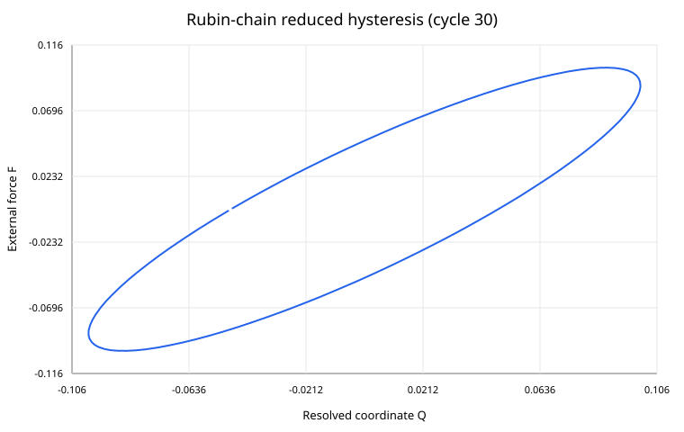
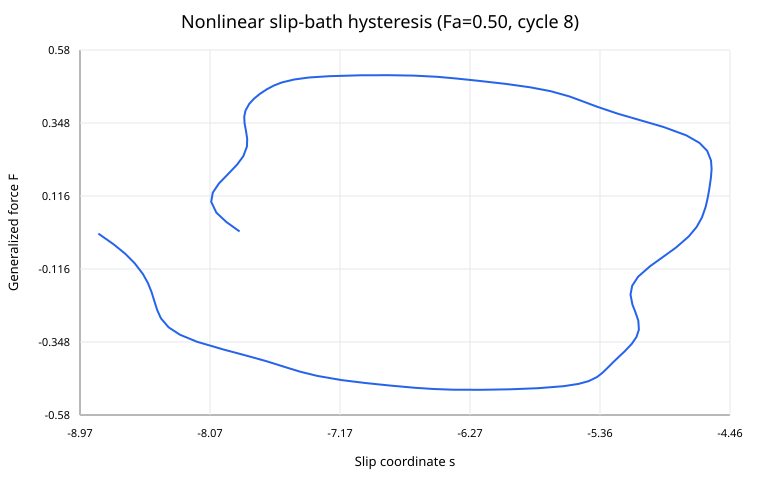

# Simulation Results — Proof-of-principle mechanics tests

## Scope

These figures are generated from auxiliary proof-of-principle models. They are **not calibrated aluminum fatigue-life predictions** and they are **not the final normal-deformation model**.

The main project direction is cyclic normal stress acting on the interatomic-spacing state $P(a,t)$. The figures below are retained because they test two general mechanics questions:

1. can conservative microscopic dynamics produce reduced hysteresis without fitted damping?
2. can conservative nonlinear dynamics produce a nontrivial cycle map without a fitted damage law?

The mainline model must now reproduce the relevant effects directly in the normal-spacing sector.

## 1. Rubin-chain reduced hysteresis

The finite chain is conservative and contains no viscous damping coefficient. The observed coordinate nevertheless has a nonzero loop because external work propagates into unresolved lattice modes.

Reference values:

- analytic loop area: $0.015209170034901047$
- numerical mean loop area: $0.015208839984912282$
- relative difference: $2.1701\times10^{-5}$
- phase lag: $28.9550^\circ$
- external-work / internal-energy relative error: $1.2516\times10^{-5}$

Interpretation: a reduced hysteresis loop does not require an empirical damping law when a resolved coordinate is dynamically coupled to unresolved propagating degrees of freedom.

For the main project, this is a mechanism test. The next task is to derive the corresponding normal hysteresis from $a_i(t)$, $P(a,t)$, and their required correlations/phase-space variables.

## 2. Rubin loop-area convergence

The numerical loop area converges to the exact semi-infinite-chain analytic value. This is a falsification test against the claim that the loop is caused by numerical diffusion.

## 3. Auxiliary nonlinear cycle-state evolution

The previous slip-bath model gives three nondimensional regimes:

- $F_a=0.34$: bounded intra-basin response;
- $F_a=0.40$: finite relocation followed by a periodic state;
- $F_a=0.50$: running state with approximately one period of drift per cycle.

For $F_a=0.50$,

$$
-5.85286,\,-6.85424,\,-7.85235,\,-8.85380,\,-9.85187,\,-10.85336
$$

are representative late cycle-end states, giving

$$
\boxed{
s_{N+1}-s_N\approx-1.
}
$$

Interpretation: conservative microscopic dynamics plus a nonlinear coordinate can generate a secular cycle map without inserting an empirical fatigue-damage law.

**This does not imply that shear slip is the main fatigue mechanism of the project.** The result is retained only as an existence proof.

## 4. Auxiliary running-state hysteresis

The running state combines intra-cycle hysteresis with inter-basin translation. This distinguishes a closed internal-friction loop from a drifting structural cycle map.

For the main normal-deformation theory, the analogous distinction must be made using the spacing state:

$$
P_{N+1}(a)=P_N(a)
$$

for a purely periodic recovered state, versus

$$
\boxed{
P_{N+1}(a)\neq P_N(a)
}
$$

for secular normal-spacing evolution.

## 5. Spacing-like variance diagnostic

This diagnostic uses local relative-displacement samples from the finite auxiliary bath. The variance grows strongly in the running $F_a=0.50$ case.

It must **not** be identified with the thermodynamic-limit variance of the main $P(a,t)$ theory. Propagating phonon strain, auxiliary shear-coordinate dynamics, and finite-domain effects are mixed into this quantity.

## 6. Energy balance

For $F_a=0.50$, the relative global energy-balance error is approximately

$$
1.7654\times10^{-7}.
$$

The observed auxiliary cycle drift is therefore far larger than the numerical energy error.

## Current meaning for the main theory

The valid general lessons are

$$
\text{conservative microscopic dynamics}
\rightarrow
\text{reduced hysteresis can occur},
$$

and

$$
\text{conservative nonlinear dynamics}
\rightarrow
\text{nontrivial cycle maps can occur}.
$$

The main project target is now specifically

$$
\boxed{
\sigma_n(t)
\rightarrow
P(a,t)
\rightarrow
A_H^{(n)}>0
\rightarrow
P_{N+1}(a)\neq P_N(a)
\rightarrow
\text{normal-opening first passage / instability}.
}
$$

The next energy-model step is **not** to calibrate a shear $\gamma$-surface. The mainline step is to derive normal-spacing dynamics from a fixed interatomic potential, using the generalized Lennard-Jones pair law as the principal analytic baseline and introducing additional many-body physics only when quantitatively required by validation.

---

# 한국어 번역 — 원리증명 시뮬레이션 결과

## 범위

이 그림들은 보조적인 원리증명 모델에서 생성한 결과다. **아직 보정된 알루미늄 피로수명 예측값이 아니며 최종 수직변형 모델도 아니다.**

프로젝트의 메인 방향은 반복 수직응력이 원자간격 상태 $P(a,t)$에 작용하는 문제다. 아래 그림은 두 가지 일반적인 mechanics 질문을 검증하기 위해 유지한다.

1. fitted damping 없이 보존적인 미시역학에서 축약 히스테리시스가 가능한가?
2. fitted damage law 없이 보존적인 비선형 dynamics에서 nontrivial cycle map이 가능한가?

이제 메인 모델은 관련 효과를 normal-spacing sector에서 직접 재현해야 한다.

## 1. Rubin-chain 축약 히스테리시스

유한 사슬은 보존계이고 viscous damping coefficient가 없다. 그런데도 외부 일이 unresolved lattice mode로 전파되기 때문에 관측좌표에서 0이 아닌 loop가 생긴다.

기준값:

- 해석적 loop area: $0.015209170034901047$
- 수치 평균 loop area: $0.015208839984912282$
- 상대차이: $2.1701\times10^{-5}$
- phase lag: $28.9550^\circ$
- 외부 일 / 내부에너지 수지 상대오차: $1.2516\times10^{-5}$

의미: 관심좌표가 unresolved propagating degree of freedom과 동적으로 결합되면 empirical damping law 없이도 축약 히스테리시스가 가능하다.

메인 프로젝트에서 이 계산은 mechanism test다. 다음 과제는 $a_i(t)$, $P(a,t)$ 및 필요한 correlation/phase-space variable에서 같은 종류의 수직 히스테리시스를 직접 유도하는 것이다.

## 2. Rubin loop-area 수렴

수치 loop area가 준무한 사슬의 정확한 해석값에 수렴한다. 이는 loop가 numerical diffusion 때문에 생겼다는 설명에 대한 반증 test다.

## 3. 보조 nonlinear cycle-state evolution

이전 slip-bath 모델에서는 세 무차원 영역이 나타났다.

- $F_a=0.34$: 하나의 basin 안에서 제한된 응답;
- $F_a=0.40$: 유한 relocation 후 주기상태;
- $F_a=0.50$: cycle마다 약 한 period씩 drift하는 running state.

$F_a=0.50$의 대표적인 후반 cycle 상태는

$$
-5.85286,\,-6.85424,\,-7.85235,\,-8.85380,\,-9.85187,\,-10.85336
$$

이고,

$$
\boxed{
s_{N+1}-s_N\approx-1
}
$$

이다.

의미: empirical fatigue-damage law를 넣지 않아도 보존적인 미시역학과 비선형 좌표만으로 secular cycle map이 가능하다.

**이 결과는 shear slip이 프로젝트의 주 피로메커니즘이라는 뜻이 아니다.** 가능성을 보여주는 existence proof로만 유지한다.

## 4. 보조 running-state 히스테리시스

running state는 intra-cycle hysteresis와 inter-basin translation을 동시에 포함한다. 따라서 닫힌 internal-friction loop와 drifting structural cycle map을 구분할 수 있다.

메인 수직변형 이론에서는 spacing state를 이용해 같은 구분을 해야 한다.

완전히 복원되는 주기상태는

$$
P_{N+1}(a)=P_N(a)
$$

이고, secular normal-spacing evolution은

$$
\boxed{
P_{N+1}(a)\neq P_N(a)
}
$$

이다.

## 5. spacing-like variance 진단값

이 진단값은 보조 유한 bath의 local relative displacement를 사용한다. running $F_a=0.50$ case에서는 variance가 크게 증가한다.

하지만 이를 메인 $P(a,t)$ 이론의 thermodynamic-limit variance와 **동일시하면 안 된다.** propagating phonon strain, 보조 shear-coordinate dynamics, finite-domain effect가 섞여 있다.

## 6. 에너지수지

$F_a=0.50$에서 전체 energy-balance 상대오차는 약

$$
1.7654\times10^{-7}
$$

이다.

따라서 보조 cycle drift의 크기는 수치 에너지오차보다 훨씬 크다.

## 메인 이론에 대한 현재 의미

유효한 일반 교훈은

$$
\text{보존적인 미시역학}
\rightarrow
\text{축약 히스테리시스 가능},
$$

그리고

$$
\text{보존적인 비선형 dynamics}
\rightarrow
\text{nontrivial cycle map 가능}
$$

이다.

현재 메인 프로젝트 목표는 구체적으로

$$
\boxed{
\sigma_n(t)
\rightarrow
P(a,t)
\rightarrow
A_H^{(n)}>0
\rightarrow
P_{N+1}(a)\neq P_N(a)
\rightarrow
\text{normal-opening first passage / instability}
}
$$

이다.

다음 energy-model 단계는 shear $\gamma$-surface를 calibrate하는 것이 아니다. generalized Lennard-Jones pair law를 주 analytic baseline으로 사용하여 고정된 interatomic potential에서 normal-spacing dynamics를 유도하고, validation에서 정량적으로 필요하다고 확인될 때만 추가 many-body physics를 도입한다.
