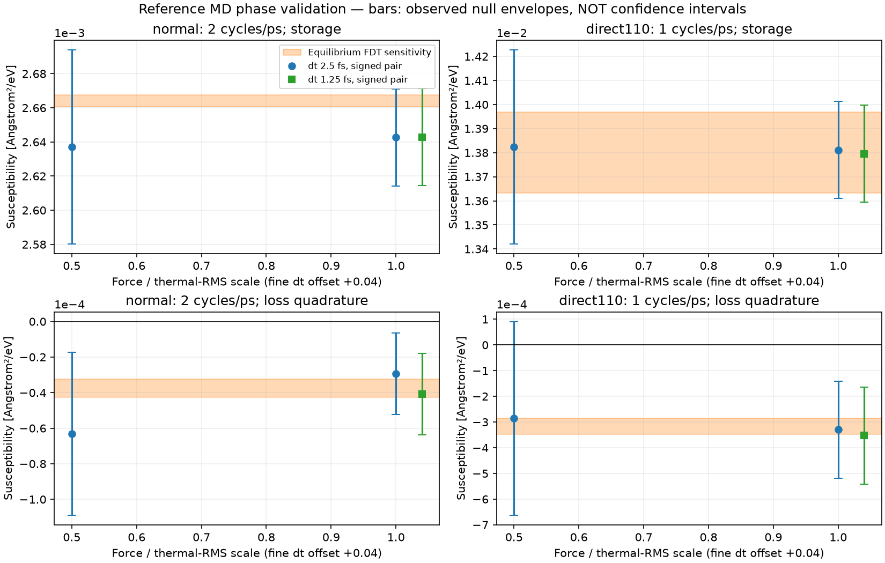

# v27 reference-MD phase validation

Scope and derivation: [PHASE_RESOLUTION_VALIDATION_V27.md](../../solver_v1/PHASE_RESOLUTION_VALIDATION_V27.md).

Twelve400 ps reference-MD runs completed; this is NOT production PDE time
calibration. At full force, both signed-pair lag components exceed the
observed unforced thermal envelope at both dt values:

|Coordinate|Reference frequency [cycles/ps]|Phase dt2.5fs|Phase dt1.25fs|
|---|---:|---:|---:|
|normal|2|-0.63616deg|-0.88445deg|
|direct110|1|-1.36669deg|-1.46510deg|

These are limited-precision finite-frequency detections. The normal loss
component changes39% between dt runs; thermal and timestep errors are not
separated. Many short/weak-force records remain unresolved. No confidence
interval or zero-frequency M certificate is claimed. v26 at0.05 cycles/ps
remains unresolved. Storage gain above the static response indicates this
band cannot simply be used as a constant-overdamped mobility calibration.

- `planning.csv`: equilibrium-only predeclared frequency design.
- `responses.csv`, `paired_responses.csv`: every saved fitting window/control.
- `null_windows.csv`: all complete unforced windows/sites; not independent.
- `fdt_spectral.csv`, `fdt_cutoffs.csv`: all declared FDT sensitivities.
- `covariance_quadrature_audit.csv`: retained trapezoid/Simpson/coarsening
  sensitivity, including the unreliable50fs normal Simpson result.
- `work_checks.csv`: clock, COM, work, endpoint, heating and energy residuals.
- `phase_comparison.csv`, `summary.json`: numerical comparison and provenance.
- `harmonic_controls/`: secondary-harmonic and force-parity null audit.

All source and restart hashes are retained in the protocol/summary. Raw MD
is local ignored cache `.cache/phase_resolution_v27/main`, and the source
is the unchanged v25 six-plane5ns record. Reproduction uses
`solver_v1.run_phase_resolution_study` actions `prepare`, `run`, `analyze`
and `harmonics`, each with the arguments documented in the derivation.
No physical-clock, material, local-interface or fatigue certification follows
from `completed:true` in a research result.
