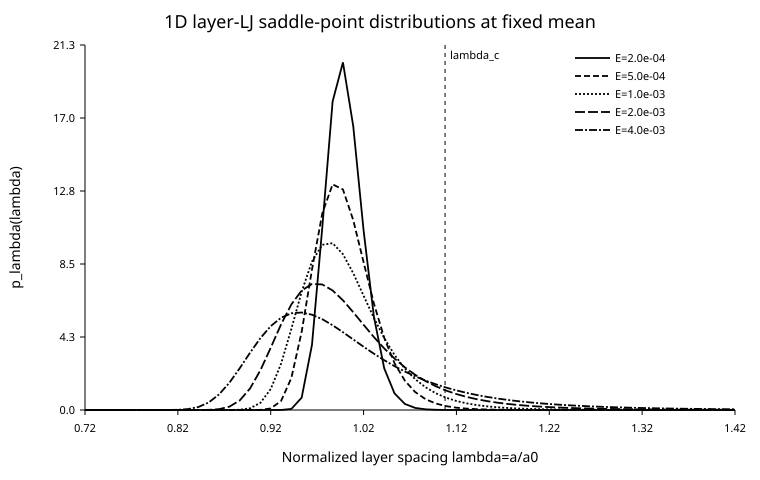
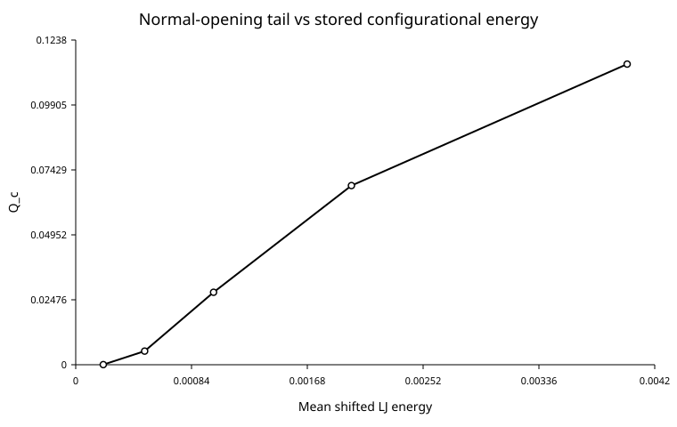
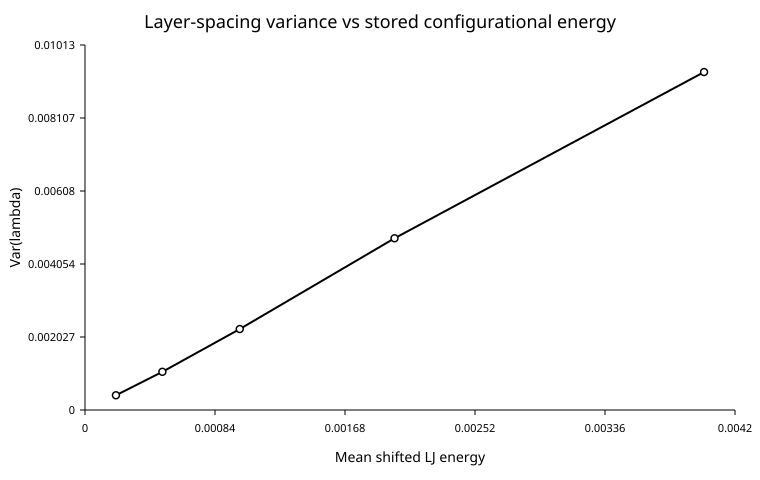

# Normal-LJ Distribution-Closure Results

## Scope

These results test the large-$M$ saddle-point distribution

$$
p_\lambda(\lambda)
=
Z^{-1}e^{-\alpha\lambda-\beta\psi(\lambda)}
$$

for the active 1D normal layer-LJ theory.

The calculations keep the mean stretch fixed at

$$
\mu=1
$$

and increase only the mean shifted configurational energy $\mathcal E$.

This is a **CONTROLLED-APPROXIMATION STUDY**, not a fatigue-life prediction.

## Distribution broadening

The distribution becomes broader as the imposed mean configurational energy increases while the mean spacing remains fixed.

At the lowest sampled energy,

$$
\mathcal E=2\times10^{-4},
$$

$$
\operatorname{Var}(\lambda)
\approx4.09\times10^{-4}.
$$

At

$$
\mathcal E=4\times10^{-3},
$$

it becomes

$$
\operatorname{Var}(\lambda)
\approx9.38\times10^{-3}.
$$

## Normal-opening tail

The unstable-side tail is

$$
Q_c
=
\int_{\lambda_c}^{\infty}p_\lambda(\lambda)\,d\lambda,
$$

where

$$
\lambda_c\approx1.1077715386.
$$

The sampled values are

| $\mathcal E$ | $Q_c$ |
|---:|---:|
| $2\times10^{-4}$ | $4.6411\times10^{-5}$ |
| $5\times10^{-4}$ | $5.1948\times10^{-3}$ |
| $10^{-3}$ | $2.7631\times10^{-2}$ |
| $2\times10^{-3}$ | $6.8314\times10^{-2}$ |
| $4\times10^{-3}$ | $1.1464\times10^{-1}$ |

Thus the present closure converts stored configurational energy into an explicit broadening and a growing tensile tail at fixed mean.

This monotonic $Q_c$ trend is a **numerical result on the sampled energy interval**, not yet a universal theorem.

## Variance versus energy

The same energy sweep shows monotone growth of the spacing variance.

The exact exponential-family identity

$$
\frac{d\mathcal E}{d\beta}\bigg|_\mu
=
-
\left[
\operatorname{Var}(\psi)
-
\frac{\operatorname{Cov}(\lambda,\psi)^2}{\operatorname{Var}(\lambda)}
\right]
\le0
$$

confirms that at fixed mean, increased energy corresponds to reduced $\beta$ within the closure.

## Numerical convergence

At

$$
\mu=1,
\qquad
\mathcal E=10^{-3},
$$

quadrature order 320 gives

$$
Q_c=0.0276314374023,
$$

and order 640 gives

$$
Q_c=0.0276314375062.
$$

The absolute difference is about

$$
1.04\times10^{-10}.
$$

The numerical integration error is therefore negligible compared with the modeling uncertainty.

## Interpretation

The important result is not that this distribution has already been proven to be the exact fatigue distribution.

The important result is that a specific form

$$
\boxed{
p_\lambda\propto e^{-\alpha\lambda-\beta\psi(\lambda)}
}
$$

can be derived from explicit 1D layer-spacing constraints, and its parameters can be solved from $\mu$ and $\mathcal E$ rather than fitted from S-N data.

The next falsification test is to compare this predicted shape against the empirical spacing distribution from the deterministic 1D layer-LJ dynamics at the same measured $\mu(t)$ and $\mathcal E(t)$.

---

# 한국어 번역 — Normal-LJ Distribution-Closure 결과

## 범위

이 결과는 활성 1D normal layer-LJ theory의 large-$M$ saddle-point distribution

$$
p_\lambda(\lambda)
=
Z^{-1}e^{-\alpha\lambda-\beta\psi(\lambda)}
$$

을 시험한다.

계산에서는 평균 stretch를

$$
\mu=1
$$

로 고정하고 평균 shifted configurational energy $\mathcal E$만 증가시켰다.

이는 **CONTROLLED-APPROXIMATION STUDY**이며 피로수명 예측이 아니다.

## Distribution broadening

평균 spacing을 고정한 상태에서 mean configurational energy가 증가하면 distribution이 넓어진다.

가장 낮은 sampled energy

$$
\mathcal E=2\times10^{-4}
$$

에서는

$$
\operatorname{Var}(\lambda)
\approx4.09\times10^{-4}
$$

이고,

$$
\mathcal E=4\times10^{-3}
$$

에서는

$$
\operatorname{Var}(\lambda)
\approx9.38\times10^{-3}
$$

이 된다.

## Normal-opening tail

unstable-side tail은

$$
Q_c
=
\int_{\lambda_c}^{\infty}p_\lambda(\lambda)\,d\lambda
$$

이고

$$
\lambda_c\approx1.1077715386
$$

이다.

sampled value는 다음과 같다.

| $\mathcal E$ | $Q_c$ |
|---:|---:|
| $2\times10^{-4}$ | $4.6411\times10^{-5}$ |
| $5\times10^{-4}$ | $5.1948\times10^{-3}$ |
| $10^{-3}$ | $2.7631\times10^{-2}$ |
| $2\times10^{-3}$ | $6.8314\times10^{-2}$ |
| $4\times10^{-3}$ | $1.1464\times10^{-1}$ |

따라서 현재 closure에서는 fixed mean에서 stored configurational energy가 explicit broadening과 tensile-tail growth로 연결된다.

이 monotonic $Q_c$ trend는 **sampled energy interval에 대한 numerical result**이며 아직 universal theorem은 아니다.

## Variance와 energy

같은 energy sweep에서 spacing variance도 단조 증가한다.

exponential family 내부의 정확한 identity

$$
\frac{d\mathcal E}{d\beta}\bigg|_\mu
=
-
\left[
\operatorname{Var}(\psi)
-
\frac{\operatorname{Cov}(\lambda,\psi)^2}{\operatorname{Var}(\lambda)}
\right]
\le0
$$

로부터 fixed mean에서 energy 증가가 closure 내부의 $\beta$ 감소와 대응한다는 것도 확인된다.

## Numerical convergence

$$
\mu=1,
\qquad
\mathcal E=10^{-3}
$$

에서 quadrature order 320은

$$
Q_c=0.0276314374023
$$

을 주고 order 640은

$$
Q_c=0.0276314375062
$$

를 준다.

절대차이는 약

$$
1.04\times10^{-10}
$$

이다.

따라서 numerical integration error는 modeling uncertainty에 비해 무시할 수 있는 수준이다.

## 해석

중요한 결과는 이 분포가 이미 정확한 fatigue distribution이라고 증명됐다는 것이 아니다.

중요한 점은

$$
\boxed{
p_\lambda\propto e^{-\alpha\lambda-\beta\psi(\lambda)}
}
$$

라는 특정 형태를 명시적인 1D layer-spacing constraint에서 유도할 수 있고, parameter를 S-N data fitting이 아니라 $\mu$와 $\mathcal E$로부터 계산할 수 있다는 것이다.

다음 반증시험은 동일한 measured $\mu(t)$와 $\mathcal E(t)$에서 deterministic 1D layer-LJ dynamics의 empirical spacing distribution과 predicted shape를 직접 비교하는 것이다.
