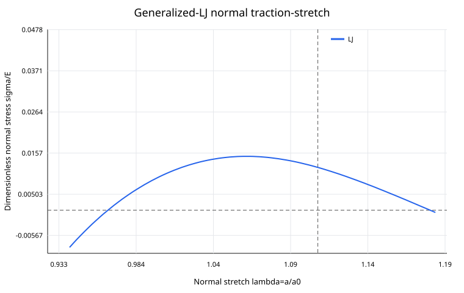

# Normal generalized-LJ chain — first mainline simulation results

## Status

**Proof of principle / falsification study. Not a calibrated 20 Hz aluminum fatigue-life model.**

This is the first simulation aligned with the project's main physical direction:

$$
\sigma_n(t)
\rightarrow
\{a_i(t)\}
\rightarrow
P_N(a,t)
\rightarrow
\text{normal-opening instability}.
$$

No shear/slip coordinate is used.

No viscous damping, empirical damage variable, fitted fatigue law, transition kernel, or prescribed probability family is inserted.

## 1. Microscopic model

A one-dimensional chain of atom coordinates $x_i$ is used. The normal bond stretch is

$$
\lambda_i=x_{i+1}-x_i,
$$

where the equilibrium spacing has been normalized to one.

The internal energy is

$$
V=\sum_i \phi(\lambda_i),
$$

with normalized generalized Lennard-Jones energy

$$
\boxed{
\phi(\lambda)
=
\frac{\lambda^{-m}}{m(m-n)}
-
\frac{\lambda^{-n}}{n(m-n)}.
}
$$

This normalization gives

$$
\phi'(1)=0,
\qquad
\phi''(1)=1.
$$

The current exponents are

$$
m=12.19,
\qquad
n=6.
$$

The left atom is fixed and the right atom receives a cyclic normal generalized force. The equations are integrated directly with velocity Verlet.

### Classification

- **EXACT under the stated finite-chain model:** Newton equations, bond forces, the finite empirical spacing density, and the work-energy identity.
- **CONTROLLED APPROXIMATION:** one-dimensional geometry.
- **CONTROLLED APPROXIMATION:** nearest-neighbor pair reduction instead of the complete 3D FCC pair hierarchy.
- **CONTROLLED APPROXIMATION:** finite chain with a fixed-left / force-right boundary condition.
- **EMPIRICAL / PREVIOUS CALIBRATION INPUT:** $m=12.19$, $n=6$, $E=69$ GPa, $a_0$, and $A_0$ when dimensional mapping is used.

## 2. Static normal instability from the same LJ energy

The dimensionless normal force is

$$
f(\lambda)=\phi'(\lambda).
$$

The local tangent stiffness becomes zero when

$$
\phi''(\lambda_c)=0.
$$

Therefore

$$
\boxed{
\lambda_c
=
\left(\frac{m+1}{n+1}\right)^{1/(m-n)}
=1.1077715386.
}
$$

The corresponding dimensionless force is

$$
\boxed{
f_c=0.03703426967.
}
$$

Using the earlier mapping $f=\sigma/E$ with $E=69$ GPa gives

$$
\boxed{
\sigma_c\approx2.5554\ \mathrm{GPa}.
}
$$

This critical stress is an idealized 1D normal-instability scale, not a real fatigue strength.

## 3. 100 MPa null test

For

$$
\sigma_a=100\ \mathrm{MPa},
$$

and

$$
E=69\ \mathrm{GPa},
$$

the normalized force amplitude is

$$
\boxed{
f_a=\frac{\sigma_a}{E}=1.44927536\times10^{-3}.
}
$$

This is much smaller than the static LJ instability force:

$$
\frac{f_a}{f_c}\approx0.0391.
$$

In the 32-atom reference chain, no bond crossed $\lambda_c$ during the 12-cycle run.

At the final recorded cycle the bond statistics were approximately

$$
\langle\lambda\rangle=0.99999411,
$$

$$
\operatorname{Var}(\lambda)=7.55\times10^{-12},
$$

$$
\lambda_{\max}=0.99999970.
$$

The relative global work-energy error was

$$
\boxed{
1.24\times10^{-10}.
}
$$

Therefore the current perfect 1D normal LJ chain correctly acts as a **null model** at the 100 MPa stress scale: it does not invent fatigue accumulation merely because cyclic loading exists.

## 4. Sub-static-critical dynamic instability

A second test used

$$
f_a=0.03<f_c=0.0370343.
$$

Thus the applied amplitude is below the static perfect-chain normal instability force.

Nevertheless, at dimensionless angular frequency

$$
\omega^*=0.02,
$$

the directly integrated conservative chain first reached

$$
\lambda_{\max}\ge\lambda_c
$$

at approximately

$$
\boxed{
N=2.25074\ \text{cycles}.
}
$$

This is a purely dynamical result: internal lattice modes and boundary-driven waves can temporarily concentrate normal stretch even when the external force amplitude is below the static instability force.

The same force amplitude showed strong frequency dependence in the five-cycle test:

| $\omega^*$ | first $\lambda_c$ crossing |
|---:|---:|
| 0.01 | no crossing in 5 cycles |
| 0.02 | 2.25074 cycles |
| 0.05 | 1.64216 cycles |
| 0.10 | 4.23288 cycles |

This means a single scalar force threshold is not sufficient to describe the finite conservative dynamics. Phase, mode structure, and history matter.

## 5. Connection to $P(a,t)$

For the finite chain, the empirical normal-spacing density is

$$
\boxed{
P_N(\lambda,t)
=
\frac{1}{N_b}
\sum_{i=1}^{N_b}
\delta\!\left(\lambda-\lambda_i(t)\right),
}
$$

where $N_b$ is the number of bonds.

The simulation stores cycle-end spacing snapshots and their mean, variance, maximum, and minimum. In later models this finite empirical density is the numerical precursor to the thermodynamic-limit state

$$
P(a,t).
$$

A crucial caution is that a first mid-cycle crossing of $\lambda_c$ is **not the same thing** as having already derived a realistic fatigue law or a cumulative crack-initiation probability.

## 6. Atomic versus experimental time scale

Using the earlier calibrated values

$$
a_0=2.8627443\ \text{Å},
$$

$$
A_0=6.0338\times10^{-20}\ \mathrm{m^2},
$$

Al atomic mass, and $E=69$ GPa, the normalized atomic time scale is

$$
t_0=\sqrt{\frac{M a_0}{EA_0}}
\approx5.55\times10^{-14}\ \mathrm{s}.
$$

Therefore

$$
\omega^*=0.02
$$

corresponds to a physical frequency of order

$$
\boxed{
5.73\times10^{10}\ \mathrm{Hz},
}
$$

not 20 Hz.

Conversely, a 20 Hz experiment corresponds to approximately

$$
\boxed{
\omega^*_{20\mathrm{Hz}}
\approx6.97\times10^{-12}.
}
$$

This scale separation is enormous. Direct atom-by-atom explicit integration over many physical 20 Hz cycles is therefore not a practical route.

## 7. Meaning for the theory

The current result supports three points.

First, the mainline normal-deformation model can be built directly from a fixed LJ energy without inventing a slip potential or damage law.

Second, the 100 MPa perfect-chain case remains essentially reversible and stable. This is an important falsification result, not a failure to be tuned away.

Third, normal lattice dynamics can create local transient opening beyond the static stability point at some atomic-scale frequencies. Therefore hidden-mode dynamics and memory can matter in the normal sector as well as in the earlier auxiliary Rubin/slip demonstrations.

However, this calculation does **not** explain 20 Hz fatigue. The next theoretical problem is now sharper:

$$
\boxed{
\text{derive the slow projected evolution of }P(a,t)
\text{ across the }10^{12}\text{-scale time separation}
}
$$

without replacing it with an empirical damage law.

Candidate next steps are:

1. derive the exact projected normal-spacing dynamics and memory kernel from the LJ chain;
2. separate fast phonon equilibration from slow evolution of the spacing distribution;
3. add physically defined free-surface / geometric normal-opening heterogeneity;
4. add finite-temperature phase-space initial states without prescribing an arbitrary $P(a)$ family;
5. test whether the cycle map of the slow projected state satisfies $P_{N+1}(a)\neq P_N(a)$ at experimentally relevant loading frequencies.

---

# 한국어 번역 — 수직 generalized-LJ 사슬 첫 메인 시뮬레이션 결과

## 상태

**원리증명 및 반증용 계산이다. 아직 보정된 20 Hz 알루미늄 피로수명 모델이 아니다.**

이번 계산은 현재 프로젝트의 메인 물리방향과 직접 일치하는 첫 simulation이다.

$$
\sigma_n(t)
\rightarrow
\{a_i(t)\}
\rightarrow
P_N(a,t)
\rightarrow
\text{수직 opening instability}.
$$

전단/slip 좌표는 사용하지 않았다.

점성 damping, 경험적 damage variable, fitted fatigue law, transition kernel, 미리 정한 probability family도 사용하지 않았다.

## 1. 미시모델

1차원 원자좌표 $x_i$를 사용하고, 수직 bond stretch를

$$
\lambda_i=x_{i+1}-x_i
$$

로 둔다. 평형 원자간격은 1로 무차원화한다.

내부에너지는

$$
V=\sum_i\phi(\lambda_i)
$$

이며 normalized generalized Lennard-Jones energy를

$$
\boxed{
\phi(\lambda)
=
\frac{\lambda^{-m}}{m(m-n)}
-
\frac{\lambda^{-n}}{n(m-n)}
}
$$

로 사용한다.

이 normalization은

$$
\phi'(1)=0,
\qquad
\phi''(1)=1
$$

을 만족한다.

현재 exponent는

$$
m=12.19,
\qquad
n=6
$$

이다.

왼쪽 원자는 고정하고 오른쪽 끝 원자에 반복 수직 generalized force를 건다. 운동방정식은 velocity Verlet으로 직접 적분한다.

### 분류

- **명시된 finite-chain model 아래 EXACT:** Newton 방정식, bond force, finite empirical spacing density, work-energy identity.
- **CONTROLLED APPROXIMATION:** 1차원 geometry.
- **CONTROLLED APPROXIMATION:** 완전한 3D FCC pair hierarchy 대신 nearest-neighbor pair reduction을 사용.
- **CONTROLLED APPROXIMATION:** fixed-left / force-right finite boundary condition.
- **EMPIRICAL / 이전 calibration INPUT:** 차원복원을 할 때의 $m=12.19$, $n=6$, $E=69$ GPa, $a_0$, $A_0$.

## 2. 동일 LJ energy에서 나오는 정적 수직 instability

무차원 수직 force는

$$
f(\lambda)=\phi'(\lambda)
$$

이다.

국부 tangent stiffness가 0이 되는 조건은

$$
\phi''(\lambda_c)=0
$$

이다.

따라서

$$
\boxed{
\lambda_c
=
\left(\frac{m+1}{n+1}\right)^{1/(m-n)}
=1.1077715386
}
$$

이다.

이에 대응하는 무차원 force는

$$
\boxed{
f_c=0.03703426967
}
$$

이다.

기존 mapping $f=\sigma/E$, $E=69$ GPa를 사용하면

$$
\boxed{
\sigma_c\approx2.5554\ \mathrm{GPa}
}
$$

이다.

이 임계응력은 이상화된 1D normal-instability scale이며 실제 피로강도가 아니다.

## 3. 100 MPa null test

$$
\sigma_a=100\ \mathrm{MPa}
$$

및

$$
E=69\ \mathrm{GPa}
$$

이면 무차원 force amplitude는

$$
\boxed{
f_a=\frac{\sigma_a}{E}=1.44927536\times10^{-3}
}
$$

이다.

이는 static LJ instability force보다 매우 작다.

$$
\frac{f_a}{f_c}\approx0.0391.
$$

32-atom 기준사슬에서 12 cycle 동안 어떤 bond도 $\lambda_c$를 넘지 않았다.

마지막 기록 cycle의 bond 통계는 대략

$$
\langle\lambda\rangle=0.99999411,
$$

$$
\operatorname{Var}(\lambda)=7.55\times10^{-12},
$$

$$
\lambda_{\max}=0.99999970
$$

이었다.

전체 work-energy 상대오차는

$$
\boxed{
1.24\times10^{-10}
}
$$

이었다.

따라서 현재 perfect 1D normal LJ chain은 100 MPa 응력척도에서 **정상적인 null model**로 작동한다. 반복하중이라는 이유만으로 가짜 피로누적을 만들어내지 않는다.

## 4. 정적 임계보다 낮은 force에서의 동적 instability

두 번째 계산에서는

$$
f_a=0.03<f_c=0.0370343
$$

를 사용했다.

즉 외력진폭 자체는 perfect chain의 static normal instability force보다 작다.

그런데 무차원 angular frequency

$$
\omega^*=0.02
$$

에서는 보존적인 사슬을 직접 적분했을 때 처음으로

$$
\lambda_{\max}\ge\lambda_c
$$

가 되는 시점이 약

$$
\boxed{
N=2.25074\ \text{cycle}
}
$$

이었다.

이는 순수 동역학 결과다. 내부 lattice mode와 boundary-driven wave가 수직 stretch를 국부적으로 집중시키면 외력진폭이 static instability force보다 작아도 순간적으로 instability point를 넘을 수 있다.

동일한 $f_a=0.03$에서 5 cycle 동안 frequency를 바꾸면 다음과 같았다.

| $\omega^*$ | 첫 $\lambda_c$ crossing |
|---:|---:|
| 0.01 | 5 cycle 안에서 없음 |
| 0.02 | 2.25074 cycle |
| 0.05 | 1.64216 cycle |
| 0.10 | 4.23288 cycle |

따라서 finite conservative dynamics를 하나의 scalar force threshold만으로 표현할 수 없다. phase, mode structure, history가 중요하다.

## 5. $P(a,t)$와의 연결

finite chain에서는 empirical normal-spacing density를

$$
\boxed{
P_N(\lambda,t)
=
\frac{1}{N_b}
\sum_{i=1}^{N_b}
\delta\!\left(\lambda-\lambda_i(t)\right)
}
$$

로 정의한다. 여기서 $N_b$는 bond 수다.

simulation은 cycle 끝의 spacing snapshot과 mean, variance, maximum, minimum을 저장한다. 이후 이 finite empirical density를 thermodynamic-limit state

$$
P(a,t)
$$

로 연결한다.

중요하게, 한 cycle 중간에서 처음 $\lambda_c$를 넘은 사건을 곧바로 실제 fatigue law 또는 cumulative crack-initiation probability와 동일시하면 안 된다.

## 6. 원자시간척도와 실험시간척도

기존 calibration 값

$$
a_0=2.8627443\ \text{Å},
$$

$$
A_0=6.0338\times10^{-20}\ \mathrm{m^2},
$$

Al atomic mass, $E=69$ GPa를 사용하면 normalized atomic time scale은

$$
t_0=\sqrt{\frac{M a_0}{EA_0}}
\approx5.55\times10^{-14}\ \mathrm{s}
$$

이다.

따라서

$$
\omega^*=0.02
$$

는 실제 frequency로 대략

$$
\boxed{
5.73\times10^{10}\ \mathrm{Hz}
}
$$

이며 20 Hz가 아니다.

반대로 20 Hz 실험은 대략

$$
\boxed{
\omega^*_{20\mathrm{Hz}}
\approx6.97\times10^{-12}
}
$$

에 해당한다.

즉 시간척도 차이가 엄청나다. 실제 20 Hz cycle을 원자 time step으로 수많은 cycle 직접 적분하는 방식은 현실적인 계산경로가 아니다.

## 7. 현재 이론에서의 의미

이번 결과는 세 가지를 지지한다.

첫째, mainline normal-deformation model을 slip potential이나 damage law 없이 고정 LJ energy에서 바로 만들 수 있다.

둘째, 100 MPa perfect-chain 계산은 거의 가역적이고 안정하다. 이것은 tuning으로 없애야 할 실패가 아니라 중요한 반증결과다.

셋째, 특정 원자시간척도에서는 normal lattice dynamics가 static stability point를 넘는 국부 opening을 만들 수 있다. 따라서 earlier Rubin/slip 보조모델에서 보였던 hidden-mode dynamics와 memory의 중요성이 normal sector에도 존재할 수 있다.

하지만 이 계산은 20 Hz fatigue를 설명하지 않는다. 이제 다음 이론문제는 더 선명하다.

$$
\boxed{
10^{12}\text{ 수준의 시간척도 분리를 가로질러 }
P(a,t)\text{의 slow projected evolution을 유도하는 것}
}
$$

이며 이를 empirical damage law로 대체하면 안 된다.

다음 순서는 다음과 같다.

1. LJ chain에서 exact projected normal-spacing dynamics와 memory kernel을 유도한다.
2. fast phonon equilibration과 slow spacing-distribution evolution을 분리한다.
3. 물리적으로 정의된 free-surface / geometric normal-opening heterogeneity를 넣는다.
4. arbitrary $P(a)$ family를 가정하지 않고 finite-temperature phase-space initial state를 넣는다.
5. 실험주파수에서 slow projected state의 cycle map이 $P_{N+1}(a)\neq P_N(a)$를 만족하는지 검증한다.
