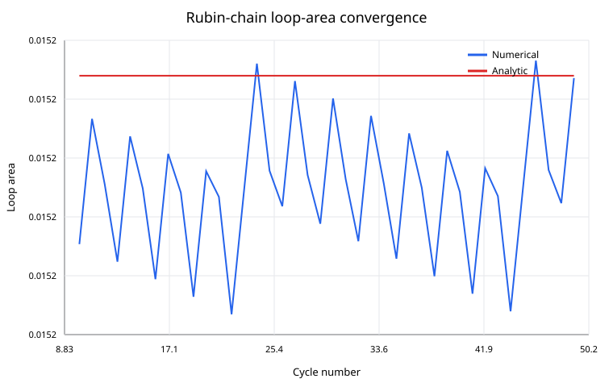
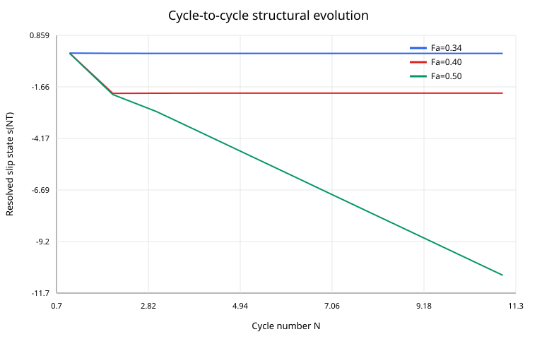
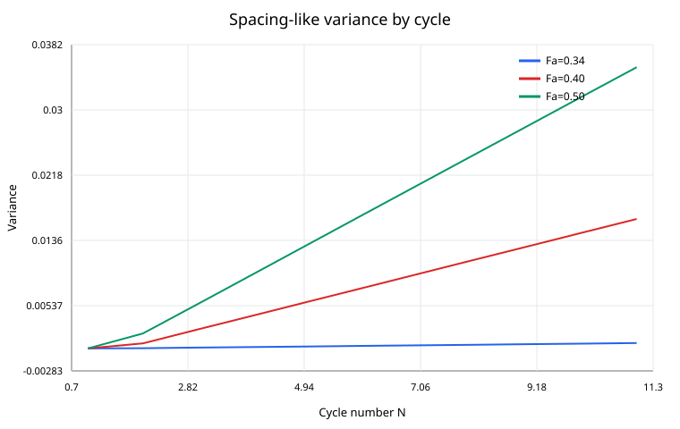
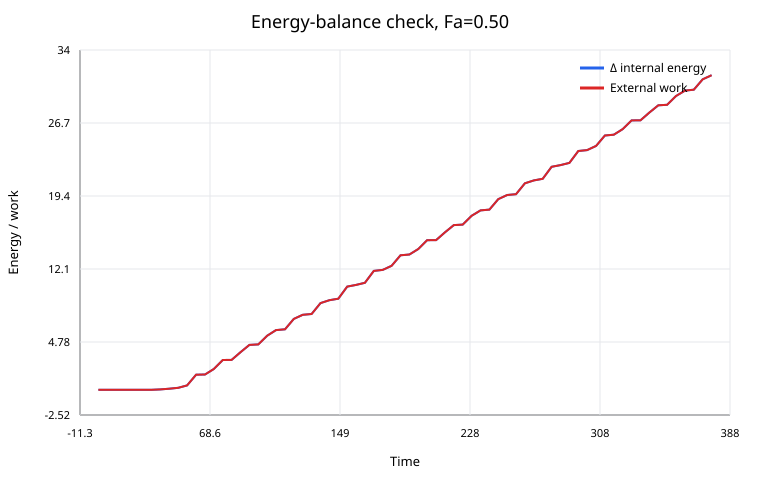

# Simulation Results — Mechanics-derived hysteresis and cycle-state evolution

## Scope

These figures are generated from the current repository proof-of-principle models. They are **not calibrated aluminum fatigue-life predictions**. Their purpose is to verify mechanisms, conservation laws, and failure modes before inserting Al-specific atomistic inputs.

## 1. Rubin-chain reduced hysteresis

The full finite chain is conservative and contains no viscous damping coefficient. The observed coordinate nevertheless has a nonzero loop because external work propagates into unresolved lattice modes.

Reference values:

- analytic loop area: $0.015209170034901047$
- numerical mean loop area: $0.015208839984912282$
- relative difference: $2.1701\times10^{-5}$
- phase lag: $28.9550^\circ$
- external-work / internal-energy relative error: $1.2516\times10^{-5}$

Interpretation: **a reduced hysteresis loop does not require an empirical damping law** when the resolved coordinate is dynamically coupled to unresolved propagating degrees of freedom.

## 2. Rubin loop-area convergence

The cycle-by-cycle numerical loop area converges to the exact semi-infinite-chain analytic result. This is an important numerical falsification test: the loop is not an artifact of numerical diffusion.

## 3. Cycle-to-cycle non-affine state evolution

Three nondimensional forcing regimes are compared:

- $F_a=0.34$: bounded intra-basin response;
- $F_a=0.40$: finite inter-basin relocation followed by a periodic state;
- $F_a=0.50$: running state with approximately one slip period of cycle-to-cycle drift.

For $F_a=0.50$, late cycle-end states are approximately

$$
-5.85286,\,-6.85424,\,-7.85235,\,-8.85380,\,-9.85187,\,-10.85336.
$$

Therefore

$$
s_{N+1}-s_N\approx-1
$$

in this nondimensional proof-of-principle case.

Interpretation: **conservative microscopic dynamics plus a nonlinear periodic non-affine landscape can generate a secular cycle map without inserting an empirical fatigue-damage law.**

## 4. Running-state hysteresis

The running state does not form a simple closed ellipse. It combines intra-cycle hysteresis with inter-basin translation. This distinction matters:

- a closed periodic loop can represent internal friction;
- a drifting cycle map indicates structural evolution;
- fatigue requires a physically calibrated form of the latter, not merely $A_H>0$.

## 5. Spacing-like variance

The diagnostic uses local relative-displacement samples from the finite bath. In the $F_a=0.50$ case, the variance increases strongly with cycling.

This is evidence of redistribution into unresolved lattice modes, but it is **not yet identified with the thermodynamic-limit $P(a,t)$ variance**. Propagating phonon strain and finite-domain effects are mixed into this diagnostic.

## 6. Energy balance

For $F_a=0.50$, the relative global energy-balance error is approximately

$$
1.7654\times10^{-7}.
$$

Thus the observed structural drift is many orders of magnitude larger than the numerical energy error. This strongly rejects numerical damping as the cause of the running state in the reference calculation.

## Current meaning for the fatigue theory

The simulations establish two proof-of-principle links:

$$
\text{conservative microscopic dynamics}
\rightarrow
\text{reduced hysteresis},
$$

and

$$
\text{nonlinear non-affine mechanics}
\rightarrow
\text{inter-basin cycle-state evolution}.
$$

They do **not** yet establish

$$
N_i(\sigma_a,f,T)
$$

for real Al. The next calibration layer must replace the nondimensional periodic landscape with an Al-specific atomistic $\gamma(\mathbf s)$ surface and derive the low-stress local-amplification mechanism without lowering barriers by fitting.

---

# 한국어 번역 — 시뮬레이션 결과와 의미

## 범위

이 그림들은 현재 저장소의 원리증명 모델에서 생성한 결과다. **아직 보정된 알루미늄 피로수명 예측값이 아니다.** 실제 Al 재료값을 넣기 전에 역학적 메커니즘, 보존법칙, 수치오류 여부를 검증하기 위한 것이다.

## 1. Rubin-chain 축약 히스테리시스

전체 유한 사슬에는 점성 감쇠항이 없고 완전한 보존계다. 그런데도 관측하는 구조좌표에서는 외부 일이 해소되지 않은 lattice mode로 전파되기 때문에 0이 아닌 루프가 나타난다.

기준 결과는 다음과 같다.

- 해석적 loop area: $0.015209170034901047$
- 수치적 평균 loop area: $0.015208839984912282$
- 상대차이: $2.1701\times10^{-5}$
- 위상지연: $28.9550^\circ$
- 외부 일 / 내부에너지 수지 상대오차: $1.2516\times10^{-5}$

의미: **관심 좌표가 해소되지 않은 전파 자유도와 동적으로 결합되어 있다면 경험적 damping law 없이도 축약 히스테리시스가 가능하다.**

## 2. Rubin loop area 수렴

cycle별 수치 loop area가 준무한 사슬의 정확한 해석결과로 수렴한다. 따라서 현재 히스테리시스가 단순 numerical diffusion으로 생겼다는 설명을 반증하는 중요한 검증이다.

## 3. cycle-to-cycle 비아핀 구조상태 변화

세 가지 무차원 forcing 영역을 비교했다.

- $F_a=0.34$: 하나의 basin 안에서 제한된 반복응답;
- $F_a=0.40$: 유한한 basin 이동 후 새로운 주기상태;
- $F_a=0.50$: cycle마다 거의 slip period 하나씩 이동하는 running state.

$F_a=0.50$의 후반 cycle 끝 상태는 대략

$$
-5.85286,\,-6.85424,\,-7.85235,\,-8.85380,\,-9.85187,\,-10.85336
$$

이며,

$$
s_{N+1}-s_N\approx-1
$$

이다.

의미: **보존적인 미시역학과 비선형 주기적 비아핀 에너지 지형만으로도 경험적 damage law를 삽입하지 않고 cycle map의 누적변화를 만들 수 있다.**

## 4. running-state 히스테리시스

running state의 루프는 단순한 닫힌 타원이 아니다. 한 cycle 안의 히스테리시스와 basin 간 이동이 동시에 들어 있다.

따라서

- 완전히 닫힌 주기루프는 internal friction일 수 있고,
- cycle map의 drift는 구조진화를 뜻하며,
- 실제 피로를 설명하려면 단순히 $A_H>0$가 아니라 물리적으로 보정된 구조누적이 필요하다.

## 5. spacing-like variance

유한 bath의 local relative displacement를 이용한 진단값이다. $F_a=0.50$에서는 cycle에 따라 분산이 크게 증가한다.

이는 해소되지 않은 lattice mode로 변형이 재분배된다는 증거지만, **아직 이를 열역학적 극한의 $P(a,t)$ 분산과 동일시하면 안 된다.** 이 값에는 propagating phonon strain과 finite-domain 효과가 함께 들어 있다.

## 6. 에너지 수지

$F_a=0.50$에서 전체 energy-balance 상대오차는 약

$$
1.7654\times10^{-7}
$$

이다.

관찰된 구조 drift는 수치 에너지오차보다 훨씬 크다. 따라서 기준 계산에서 running state의 원인을 numerical damping으로 설명하기 어렵다.

## 현재 피로이론에서의 의미

현재 simulation은 두 연결을 원리증명 수준에서 확보했다.

$$
\text{보존적 미시역학}
\rightarrow
\text{축약 히스테리시스},
$$

그리고

$$
\text{비선형 비아핀 역학}
\rightarrow
\text{cycle-to-cycle basin 이동}.
$$

하지만 아직 실제 Al의

$$
N_i(\sigma_a,f,T)
$$

를 예측하는 단계는 아니다. 다음 단계에서는 무차원 주기 potential을 실제 Al의 원자론적 $\gamma(\mathbf s)$ surface로 교체하고, 낮은 macroscopic stress가 어떻게 국부 instability까지 증폭되는지를 barrier fitting 없이 유도해야 한다.
