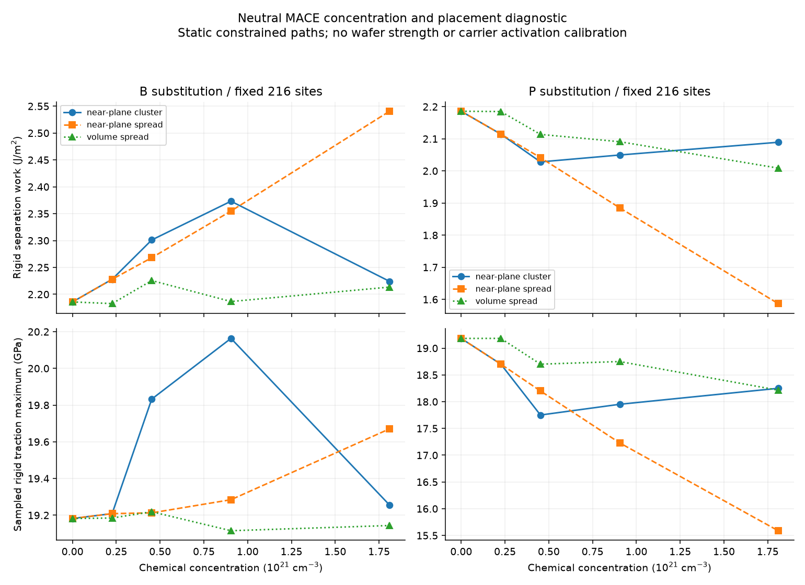
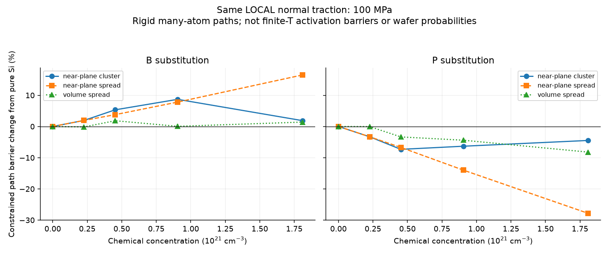

# Si 농도·배치 대조 v10

2026-09-23: 고정 셀 원자 경로·독립 수치 대조 완료. 실제 Si 물성·파손확률·수명 보정은 미완료다.

## 무엇을 확인했는가

Neutral MACE 후보에서 **같은 원자 셀의 화학 도핑 농도와 위치를 바꾸면
분리 에너지와 같은 국소 하중의 구속 경로 장벽이 달라진다.** 따라서 B/P 모두에
동일한 농도 계수를 적용하거나 화학 농도 하나로 파손 확률을 정할 수 없다.
이는 선택된 정적 원자 경로의 계산이며 실제 웨이퍼의 농도별 강도·수명 보정은 아니다.

### 분리면 인접 두 층에 분산한 배치

분리 일은 원자 좌표를 고정하여 한 인터페이스를 여는 에너지 차이를 면적 A로
나눈 값이다. 순수 Si 기준은 **2.185817270 J/m²**다.

| 도펀트 수 / 216자리 | 화학 농도(cm⁻³) | B 분리 일(J/m²) | 순수 대비 | P 분리 일(J/m²) | 순수 대비 |
|---|---:|---:|---:|---:|---:|
| 1 | 2.261715×10²⁰ | 2.227941674 | +1.927% | 2.114642123 | −3.256% |
| 2 | 4.523430×10²⁰ | 2.268106878 | +3.765% | 2.041408552 | −6.607% |
| 4 | 9.046861×10²⁰ | 2.354883200 | +7.735% | 1.885080636 | −13.759% |
| 8 | 1.809372×10²¹ | 2.540511938 | +16.227% | 1.586932274 | −27.399% |

모든 배치가 이 단조 경향을 따르지는 않는다. 군집 B의 분리 일은 N=1/2/4/8에서
2.227942/2.301107/2.373172/2.224164 J/m², 군집 P는
2.114642/2.028146/2.049619/2.089265 J/m²다.
같은 N=8에서도 초기 인접층 점유수는 군집2개, 인접층 분산8개다. 이 비교에는
계면 점유율 변화가 포함되며 같은 점유율에서의 순수한 군집 효과로 읽지 않는다.
가장 가까운 두 층의 전체 자리는24개다. N=8 인접층 분산은 전체 자리의3.704%가
도핑됐지만 그 인접층에서는33.333%가 도핑된 선택 배치다. 균일 도핑의 대표값이 아니다.

최고 농도1.809372×10²¹cm⁻³에서의 배치 대조:

| 선택 배치 | 초기 인접층 도펀트 수 | B 분리 일 변화 | P 분리 일 변화 |
|---|---:|---:|---:|
| 분리면 근처 군집 | 2 | +1.754% | −4.417% |
| 분리면 인접층 분산 | 8 | +16.227% | −27.399% |
| 체적 내부 분산 | 2 | +1.263% | −8.096% |

선은 실제 계산 점 사이의 시각적 안내다. 저농도의 검증된 보간 법칙을 뜻하지 않는다.

### 동일 국소 하중

LOCAL normal traction100MPa에 `Phi(q)=E(q)-A T q`를 적용하고, 실제 힘을
재계산해 최소점과 그 이후 첫 번째로 분해된 극대점을 찾았다. q<0도 포함한다.
순수 Si의 구속 장벽은20.878738847eV, N=8 군집은 B21.268849853/P19.943298467eV다.
같은 N=8 인접층 분산 배치에서는 B24.325455677/P15.065269780eV다.
이는 다수 원자를 고정한 경로의 정적 일이며 finite-T 활성화 자유에너지가 아니다.
실제 시편의 원방100MPa와 같지 않고, Arrhenius 확률/피로 수명으로 지수화하지 않았다.

## 실제 실행과 수치 검증

원자 계산과 저장 원자료의 후처리를 구분하여 확인했다.

- `fixed_cell_v2`: **25/25완료**, 23개 고유 초기 배치와 동일 배치 재실행2개.
  표준 에너지/힘/응력425회, bulk 이완 force-only1184회.
  모든 bulk 잔류 힘 수렴, 최대1.954405e−4eV/Å(기준2e−4).
  각17개 opening 원자료를 저장했다. 모든 경우8→10Å의 에너지 차이0.
- 같은 국소100MPa 하중 **25/25완료**, 새 표준 평가444회.
  정지점 force 잔차 최대3.983265e−6eV/Å, 독립 에너지 차분과의 차이
  최대7.102918e−7eV/Å.
- 저장된 원자 상태425개와 새 하중 상태444개를 원자료에서 재계산했다.
  CSV의 에너지/도함수와 일치했다. B/P의 동일1원자 초기 배치 재실행도 일치했다.
- 새 폴더에서 후처리를 다시 실행하여 CSV5개·JSON1개·PNG3개가 모두 byte 일치했다.
  이는 후처리 재현이며425+444회 전체 MACE 평가의 재실행은 아니다.
  세 그림의 제목/축/범례/잘림도 직접 확인했다.
- 화학 배치의 IID 가정 감사는24행으로 별도 저장했다. 각 원소의 고유 초기
  패턴12개가 가설적 c=1e21cm⁻³ ensemble에서 포함하는 확률 질량은 약.011973이며
  미계산 질량은 약.988027이다. 이는 literal initial pattern 기준이고 대칭 배수를
  임의로 더하지 않았다. 이 질량을 재정규화하거나 실제 파손 확률로 사용하지 않았다.

- 관련 pytest **87PASS**: 새 농도/기하학15개와 기존 도핑/전하72개.
  전체 solver suite 재실행이라고 보고하지 않는다.
- 순수 Si/B8군집/P8군집 각각26회 새 독립 평가. 직접 q±h 에너지 차분,
  별도 force-only 경로, 회전/원자 순서, 두께/면적 복제 검사 통과.
  가장 미세한 h에서 힘 차분 최대 오차는 각각1.833764e−6/1.758649e−6/1.723695e−6eV/Å.
  복제 사이 분리 일 차이는 최대2.344792e−13J/m²다.
- B8군집의 낮은 두 Gamma Cartesian 곡률은+.235408012/+.235716570eV/Ų.
  216개 Hessian-vector product, 433회 force-only 평가를 수행했고,
  3개 차분 간격의 고유쌍 잔차는 최대3.145943e−7eV/Ų다.
  별도 에너지 곡률 검사의 가장 미세한 간격 오차는1.264471e−6eV/Ų다.
- P8군집 재검사의 낮은 두 Gamma 곡률은+.228428740/+.230280927eV/Ų.
  251개 Hessian-vector product, 503회 force-only 평가, 3개 차분 간격의
  고유쌍 잔차 최대2.076200e−6eV/Ų. 고정 셀의 이 검사에서 불안정 모드를 검출하지 않았다.
  새13회 평가의 독립 에너지 곡률 오차는 가장 미세한 간격에서1.416043e−6eV/Ų다.
- 낮은 곡률 검사는 선택된 **군집 B/P**에 대한 고정 셀 Gamma 검사다.
  다른 배치의 전체 Hessian, full-q, 셀 변형, 전역 최소점, finite-T 안정성으로
  확대하지 않는다. 25조건의 잔류 힘 수렴과 이 추가 곡률 검사를 구별한다.

### 실패·재실행 기록

- 첫 `fixed_cell` 실행은 ASE wrap epsilon이 남긴 미소 음수 좌표를 입력 검사가
  거부하여 B1에서 중단했다. 원본 코드와 부분 결과를 보존하고 modulo 처리 후
  새 `fixed_cell_v2`에서 다시 실행했다. 에너지 모델을 바꾼 것이 아니다.
- 첫 B8 독립 에너지 곡률 검사는13회 평가/CSV 저장 후 numpy.bool_의 JSON
  직렬화에서 실패했다. 실패 코드/CSV를 보존하고 기본 Python bool/float로
  변환한 다음 새 폴더에서13회 평가를 다시 수행했다. 두 CSV의 SHA256은 일치한다.
- 순수 Si 독립 대조는 첫 실행의 완료된 순수 조건을 사용했다. v2의 같은 순수
  조건과의 미소 roundoff 차이를 다른 물리 조건이나 독립 재료 표본으로 세지 않는다.
- P8군집 첫 최저 곡률 탐색은 ncv28/240product 한도 내에 수렴하지 않았다.
  481회 force평가의 실행 기록·원래 코드와 비수렴 상태를 `lowest_P8_cluster`에
  보존했다. 재검사 `lowest_P8_cluster_v2`는 ncv64/500product를 사용한다.
  동일 tolerance1e−5와 같은 에너지 모델을 유지했다.
- 경과시간에는 호스트 작업 공백이 포함된다. 이를 연속 CPU 시간 또는 새로운
  MD 궤적 길이로 해석하지 않는다.

## 계산 조건과 적용 범위

- MACE-MP-0b3-medium, 자체 순수 Si 격자5.470992314Å, diamond216자리,
  (111) shuffle 분리면, 부피4421.423122ų, 면적155.529971Ų.
- 같은 부피에서 내부 원자 좌표를 이완했다. 최고 농도 B의 잔류 sigma_zz는
  군집1.833GPa/인접층 분산2.418GPa/체적 분산2.429GPa다. 자유 웨이퍼의
  무응력 상태나 제조 잔류응력을 보정한 값이 아니다.
- N=1에서 군집과 인접층 분산은 같은 초기 배치다. 실제 재실행 대조로 쓰며
  독립 배치로 중복 계산하지 않는다. 선택한 세 배치에 임의의 균등 가중치를 주지 않았다.
- 한 원자 농도 해상도가2.26e20cm⁻³인 고농도 대조다. 10¹⁵~10¹⁹cm⁻³의
  낮은 농도에 외삽하지 않는다. 원자를 벌리며 생긴 진공으로 농도를 희석하지 않는다.
- 표면 재구성, 균열 끝 비균일 변형, 전하상태의 독립 제어, finite-T PMF,
  이동도/실제 시간/피로율은 이 계산의 검증 대상이 아니다.
- 원자 종을 입력하는 neutral ML 모델은 화학 전자구조 효과를 암묵적으로 포함하지만
  활성 전자/정공 수나 페르미 준위를 독립적으로 입력받지 않는다.
  화학 B/P 원자 수를 활성 캐리어 수와 동일시하지 않는다.
- 8→10Å의 분리 에너지 plateau와 셀 복제 대조는 유한 범위 ML 모델 내 검사다.
  실제 장거리 전자 효과나 무작위 도펀트 배치의 수렴을 인증하지 않는다.
- 새 DFT/MD/매개변수 적합0. 기존 Al/PDE/UI 및 Si 생산 해석·Hz gate는 유지했다.

## 문헌과 다음 검증

[Kermode et al.](https://www.nature.com/articles/ncomms3441)은 개별 B 원자의 위치와
균열 속도에 따른 재구성/경로 편향을 보고했다. 이 동적 균열 기작은 이번 강체
경로로 재현한 것이 아니다. [Noda et al.](https://www.nature.com/articles/s41598-023-42676-z)의
주입 전자/정공 DFT도 화학 치환과 별개의 제어 조건이다. 상세한 출처·접근 범위는
`sources.json`과 `solver_v1/SILICON_CONCENTRATION_V10.md`에 기록했다.

공통 구조는 원자 에너지 → 조건부 자유에너지 → 확률밀도 진화를 유지한다.
다음 재료 검증에는 같은 배치·전하·변형 조건의 DFT 대조, 내부/표면 재구성이
허용된 경로, 제조 배치 가중치와 활성 전하 상태가 필요하다. 이를 통과하기 전에
현재 표를 실제 농도별 파손 확률이나 수명으로 사용하지 않는다.

## 파일 안내

- 원시 농도 경로: `fixed_cell_v2`.
- 실제100MPa 구속 경로: `loaded_pure_100MPa`, `loaded_dopants_100MPa`.
- 독립 힘·크기 검사: `independent_pure`, `independent_B8`, `independent_P8`.
- 선택된 Gamma 곡률: `lowest_B8_cluster`, `lowest_P8_cluster_v2` 및 energy control.
- 수치표·그림·원자료 재계산: `analysis`.
- 테스트/별도 후처리 재현: `verification`; 출처: `sources.json`.
- 전체 실행 절차: `REPRODUCE.md`; 연구 소스·원자료 hash: `artifact_manifest.json`.

파일별 SHA256을 만들고 실제 Git index blob과 같은 바이트인지 확인한 뒤 게시한다.
작업 브랜치는 `silicon-wafer-research`, 시작 HEAD는 `7a18c4f5cf038d22e6d8eafca19be87de35ea8d5`다.
최종 커밋은 이 문서를 포함하는 Git 이력에서 확인한다. 원래 Al/UI 작업본은 보존했다.
