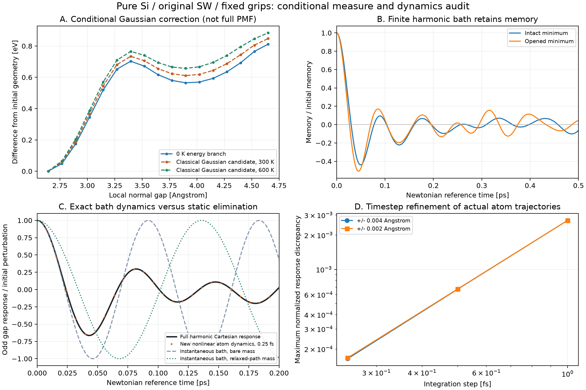

# Si 조건부 자유에너지 후보와 원자 동역학 검증 — v3

2026-09-21 · `silicon-wafer-research` · 사용자의 연구 계속 지시

**같은 국소 균열의 주변 원자를 정적으로만 이완시키면 실제 짧은 시간 응답을
놓친다. 새로운 원자 운동13개/합계13 ps는 전체 원자 조화모델과 일치했고,
주변 원자를 제거한 정확한 식에는 시간에 따라 진동하는 기억 효과가 남았다.**

단일 가지의 고전 Gaussian 자유에너지 후보도 계산했다. 실제 finite-T PMF,
상수 이동도, 생산 Hz, 실측 웨이퍼 강도·피로 수명은 아직 보정하지 않았다.
기존 Al/SG/PDE/UI/보정 파일은 바꾸지 않았다.



## 1. 실제 수행한 계산

- v2의 같은1152원자, 자유672원자, original-SW, (111) shuffle, 고정 grip 구조.
  기존 좌표를 읽고 에너지·힘·Hessian을 새로 평가했다. 정적 이완을 새로 수행한
  것과 구별한다. 새 코드·원시 입력 hash는 `running_summary.json`에 있다.
- 초기/안장점/열린 최소의 conditionally stable Hessian 및 opening/slip 축약.
  0 K 경로17점에서 Gaussian determinant 보정. 모든17점의 조건부 분해가 성공했다.
- 세 정지점의 선택한4개 bath 방향에서100/300/600 K, +/-0.5/1/2 sigma의
  **216개 단일 방향 에너지 검사**. joint thermal sampling은 아니다.
- 실제 보존적 velocity-Verlet13회, 각1 ps, 합계13 ps. 무변위 대조1개와
  +/-0.004,+/-0.002 Angstrom × dt=1,0.5,0.25 fs의12개 진폭/시간간격 대조.
  고정경계·제로 초기속도, thermostat/감쇠/강제 bond 삭제가 없다.
  같은 초기 구조의 deterministic controls이며13개의 독립 열평형 표본이 아니다.
- 주 실행116.56 s/exit0. 별도 분석·그림·수치 검증도 실제 실행해 완료했다.

이론/단위/정규화는 [SILICON_CONDITIONAL_DYNAMICS_V3.md](../../solver_v1/SILICON_CONDITIONAL_DYNAMICS_V3.md).

## 2. Gaussian 자유에너지 후보

원래 total energy와 같은 선형 gap 좌표에서
`Delta F_G = Delta U + kBT/2 * log(det H_bath / det H_bath,initial)`를 사용했다.
아래는 **0 K 정지점 위치에 대입한 값**이다. 온도별 안장점·활성화 장벽이 아니다.

| 위치 | 0 K 에너지 차이 eV | 100 K Gaussian 후보 eV | 300 K 후보 eV | 600 K 후보 eV |
|---|---:|---:|---:|---:|
| 기존 안장점 | 0.7029665391 | 0.7134770553 | 0.7344980877 | 0.7660296363 |
| 기존 열린 최소 | 0.5642199598 | 0.5798561193 | 0.6111284384 | 0.6580369170 |

opening만 남긴 측도와 opening/slip을 남겼다가 slip도 적분한 측도 사이의
log determinant 항등식 오차는 최대3.36e-13이었다. 상대 gap의 질량 m/2와
coarea 상수, slip의 열적 적분을 빠뜨리지 않았다.

선택한 단일 mode 방향에서는 quadratic energy 오차가300 K에서 최대0.000992 kBT,
600 K에서0.001416 kBT였다. 이는 **선택 방향 검사**이며 다수 모드의 비조화 결합,
다른 조건부 가지, 전체 PMF를 검증한 것이 아니다. 최대 bath `hbar omega/kBT`도
300 K에서 약2.79라서 모든 진동의 classical 고온 극한을 만족한다고 할 수 없다.
quantum 진동 보정이나 실험 재료 적합을 반영한 온도별 파괴 예측으로 사용하지 않는다.

## 3. 주변 원자의 기억 효과

전체 quadratic atom dynamics에서 주변 좌표를 정확히 제거한 kernel을 계산했다.
정적 Schur 곡률 K와 이 kernel은 별개다.

| 위치 | K [eV/Angstrom²] | Gamma(0) [같은 단위] | Gamma(0)/abs(K) |
|---|---:|---:|---:|
| 초기 최소 | 6.820390365 | 1.792512678 | 0.262817 |
| 안장점 | -5.584427916 | 1.671581708 | 0.299329 |
| 열린 최소 | 1.257511876 | 1.401120182 | 1.114200 |

초기 상태에서 memory weight의69.08%는 `sqrt(K/m_q)`보다 느린 bath 주파수에
있었다. 최저 bath angular frequency는6.1705 ps^-1, 그 retained rate는68.4556 ps^-1이다.
정적 경로 질량도 bare gap 질량의2.1904배다. 주변 좌표를 순간적으로 제거하는
시간 척도 분리가 자동으로 성립하지 않는다.

새 SW 운동의 +/-진폭 odd gap 응답은 처음 저장된 음수 지점이0.024 ps였고,
초기 변위로 나눈 최소 응답은-0.66427이었다. 작은 변위를 준 뒤 되돌아가며
진동하는 응답이다. 균열 발생이나 확률의 음수 값이 아니다.

전체 Cartesian harmonic 응답과 실제 fine-step SW 응답의 최대 차이는
1.6724e-4였다(+/-0.002 Angstrom,0.25 fs). 같은 K의 즉시 이완 대조군은
bare mass에서1.1946, relaxed-path mass에서도1.1847의 최대 정규화 차이를 보였다.
이 수치는 관측한1 ps 창의 비교이며 장시간 overdamped 한계 전체의 불가능 증명이 아니다.
finite cosine kernel을 abs/clip하거나 그 유한 시간 적분을 양의 상수 마찰로 채택하지 않았다.

## 4. 좌표를 더 남기는 후보 검사

초기 구조의 조건부 Gaussian에서 주변 원자가 주는 generalized-force variance를
후보 gap/slip 관측값으로 얼마나 설명하는지 계산했다. 동역학 오차 감소율과 다르다.

| 추가 관측값 | 개수 | 설명하는 정적 force variance |
|---|---:|---:|
| 같은 쌍의 국소 slip | 1 | 0.1967% |
| 같은 전면의 다른 normal gap | 3 | 1.9575% |
| 다음 전면의 normal gap | 4 | 0.9398% |
| 국소 slip + 같은 전면 gap | 4 | 2.1643% |
| 다른 모든 mobile shuffle gap | 35 | 6.2003% |

35개 경우는 표현력 진단이며 이를 생산 상태변수로 채택한 것이 아니다.
단순히 gap/slip 개수를 늘리는 접근만으로 주변의 집단 변형·기억을 설명하기
어려워 보인다. 실제 느린 좌표의 선택에는 finite-T 응답과 시편 크기 비교가 더 필요하다.

## 5. 수치 검증과 증거의 한계

- dt를 절반으로 줄인 에너지 오차 비율3.99955–4.00008, 관측 차수1.99984–2.00003.
  최대 energy drift는 초기 추가 에너지 대비1 fs에서0.1087%,0.25 fs에서0.006790%였다.
- 무변위 대조의 gap/slip drift1.89e-15 Angstrom. 모든 실행의 고정 원자 변위0.
- O(dt²) Richardson 후처리의 harmonic 응답 차이:
  +/-0.004에서1.4679e-5, +/-0.002에서3.6710e-6, 비율3.99857.
  후처리를 새 MD나 독립 표본으로 세지 않는다.
- 13개 최종 상태의 energy/kinetic/관측값 재계산과 원시 이력 일치 확인.
  초기/최종 상태의 독립 explicit pair/triplet 힘 대조 최대오차6.99e-15 eV/Angstrom,
  total energy 차이 최대3.89e-13 eV. 새 LAMMPS MD 대조는 아니다.
- 관련 테스트49 PASS/1.62s, skip0. Gaussian 실제 적분, metric/marginalization,
  coupled ODE/convolution, 시간역전·에너지 차수, duplicate coordinate 거부,
  기존 Si force/Hessian와 생산 Si gate를 검사했다. 전체827개 회귀를 재실행한 것은 아니다.
- desktop smoke exit0. 그림 PNG 직접 확인. 초기 새 unit test 한 건의 exact-float
  `1==0.9999999999999999` 비교를 roundoff tolerance로 수정한 뒤 전체 관련 검사를 통과했다.

현재 통과는 수학·구현·이 조건의 숫자 검증이다. finite-T PMF/Markov 이동도/
실험 에너지·도핑/파손 사건·피로 수명 보정 통과를 뜻하지 않는다.

## 6. 재현 명령과 자료

저장소 루트에서 기존 결과를 덮어쓰지 않는 새 경로를 지정한다.

```text
python -m results.silicon_wafer_feasibility.run_conditional_dynamics --output .cache/si-v3-reproduction
python -m results.silicon_wafer_feasibility.analyze_conditional_dynamics --calculation .cache/si-v3-reproduction
python -m results.silicon_wafer_feasibility.validate_conditional_dynamics --calculation .cache/si-v3-reproduction
python -m pytest solver_v1/test_silicon_conditional_research.py solver_v1/test_silicon_crack_research.py solver_v1/test_silicon_environment_research.py app/test_materials.py -q
```

- `summary.json`/`running_summary.json`: 실제 입력·source hash·생산 gate·실행 결과.
- `gap_*.npz`: 새13개 운동의 시간·gap/slip·total energy·최종 좌표/속도.
- `memory_spectra.npz`/`harmonic_release.npz`: 조화 고유값·kernel 및 독립 응답 대조.
- `gaussian_profile.csv`/`thermal_mode_slices.csv`:17점 후보와216개 방향 검사.
- `analysis.json`/`numerical_validation.json`: 후처리·재계산·검증 기록.
- `conditional_dynamics.png`/`.svg`: 원시 결과에서 생성한 그림.

다음 단계는 **조건부 finite-T joint 분포와 집단 변형 좌표**, 그리고 그 평형
준비에서 출발한 동역학의 온도·크기·관측 시간 의존성이다. thermostat 준비
시간상수를 물리 mobility로 쓰지 않는다. 공통 확률 보존 틀에서 필요한 좌표와
운동량을 검증한 다음 생산 PDE 연결 여부를 판단한다.
