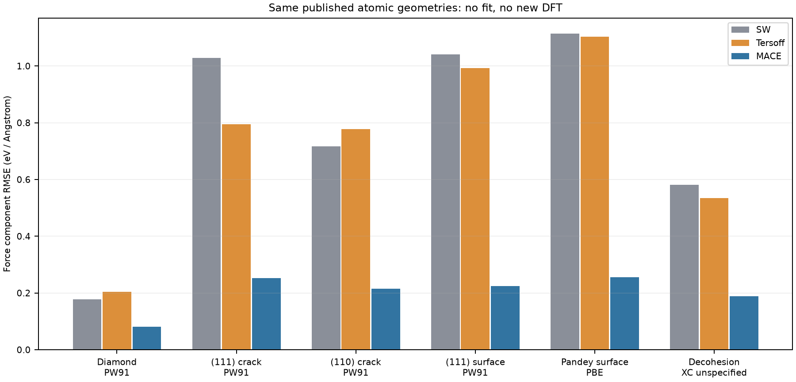
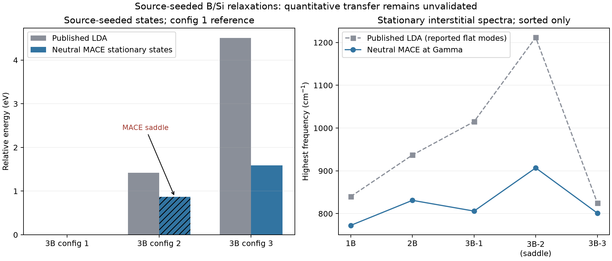
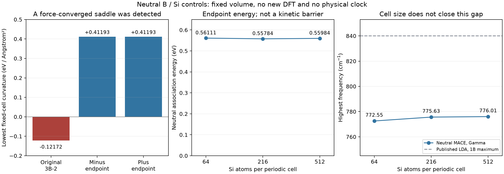

# Si 도핑 검증 v9

## 결론

**공통 확률이론 안에서 도핑을 다룰 수 있는 조건을 검증했고, 실제 Si/B 원자 계산을
추가했다. MACE는 기존 SW/Tersoff보다 공개 순수 Si DFT 힘에 가까웠지만, 도핑된
웨이퍼의 강도·피로수명·물리 Hz를 보정한 상태는 아니다.**

도핑 농도 하나로 에너지를 일괄 배율 조정하면 화학 배치, 전하 상태, 평형 속도의
효과를 섞는다. 이번 구현은 같은 에너지 → 자유에너지 → 보존 확률 흐름을 유지하면서
그 가정을 분리해 검사했다. 특히 힘이 작아졌지만 불안정한 B 군집을 발견하고 수정했다.

- 브랜치 `silicon-wafer-research`, v9 시작 커밋 `19352f2`(게시된 v8).
- 사용자 지시 범위: Si 도핑 연구/검증, 약3시간 자율 작업. 추가 agent 없음.
- 기준 tool clock:2026-09-22 11:59:08 UTC 시작,14:59:08 UTC 마감.
  이 문서의 최종 완료 시각/Git은 인계 기록과 실제 Git 상태를 함께 확인한다.
- 생산 Al/SG/PDE/UI·기존 Si 연구·물리 clock gate를 변경하지 않았다.

## 1. 같은 원자배열의 독립 potential 대조

Cambridge 공개 DFT **2,475구조,171,815원자**를 MACE-MP-0b3 medium으로 새로
계산했다. 2,475frames+기준점1회=**2,476회 potential 평가**다. 새 DFT/MD/fit은0회다.
v5의 DFT energy/force/offset 배열과 **exact equality**를 확인했다.

| 같은 DFT 원자배열 | SW 힘 RMSE | Tersoff 힘 RMSE | MACE 힘 RMSE |
|---|---:|---:|---:|
| diamond, PW91,489구조 | 0.176896 | 0.204127 | 0.080471 |
| (111) 균열, PW91,10구조 | 1.028627 | 0.794703 | 0.252580 |
| (110) 균열, PW91,7구조 | 0.717442 | 0.777878 | 0.214294 |
| (111) 표면, PW91,47구조 | 1.040733 | 0.992666 | 0.224422 |
| Pandey 표면, PBE,50구조 | 1.113458 | 1.102912 | 0.254861 |
| decohesion, XC 미표기,33구조 | 0.581828 | 0.533982 | 0.188014 |

단위는 force Cartesian component의 eV/Å이며 각 group 안에서 원자/성분을 같은
가중으로 집계했다. 전체35group 중34group에서 두 baseline보다 낮았고, 고립 원자
1group은 모두 정확히0이다. 서로 다른 XC group을 하나의 물리 target으로 합치지 않았다.
(111) 균열의 MACE 오차도 DFT force RMS0.608472에 비해 작다고 무시할 수 있는 값은 아니다.

- 원시 frame/group 재집계 오차0; 별도 force-only/표준 ASE7조건 energy/force 차이0.
- 회전·셀 복제 energy/force 오차 최대1.43e−14 범위.
- PW91 diamond 최저 E/N frame548을 energy zero 비교 기준으로 사용했다.
  이 source frame은 이완된 bulk 인증점이 아니다. (111)균열의 이 기준 에너지 RMSE는
  84.68meV/atom이며 force 개선만으로 energy landscape 전부를 승인하지 않는다.
- 원본은 GAP 학습 자료다. MACE 학습 자료와의 중복은 독립 감사하지 않았으므로
  엄격한 held-out generalization 점수라고 부르지 않는다. MACE는 PBE+U 기반이고
  source의 PW91/PBE/미표기와 동일 전자구조 방법이라고 간주하지 않았다.

자료: [전체35group](mace_si_dft_validation/same_geometry_comparison.csv),
[원시 재검산](mace_si_dft_validation/raw_validation.json),
[실행 정보](mace_si_dft/summary.json).

### 벌크 탄성 보충 검사

같은 MACE의 자체 평형 a=5.470992Å에서 hydro/tetragonal/engineering shear,
변형률 간격0.003/0.001/0.0003, ±변형, 내부 원자 고정/이완을 실제 계산했다.
36개 상태의18개 tangent를 에너지 곡률과 work-conjugate Piola 응력 미분으로
독립 비교했다. 작은 간격에서 최대차는0.000315GPa다.

| MACE 자체 기준, 정적 | C11(GPa) | C12(GPa) | C44(GPa) |
|---|---:|---:|---:|
| 내부 원자 고정 | 127.32791 | 57.90052 | 80.45898 |
| 내부 원자 이완 | 127.32791 | 57.90052 | 60.22976 |

이 모델의 [100] 영률은91.12968GPa다. 별도의 단축/혼합 정상변형/yz 전단8개 상태로
다시 구한 계수와 최대차3.45e−5GPa였다. 이는 같은 potential의 정의·미분·내부 이완
검사이며 온도가 맞춰진 실측 Si 재료 보정은 아니다. 균열 force 오차가 더 작다는 사실만으로
bulk·계면·dopant 에너지 모두를 통과했다고 해석하지 않는다.

첫 보충 실행의 `standard_ASE_evaluations=37`은 캐시 hit를 포함한 상태 조회 수였다.
원기록을 보존하고 실제 `calculate` 호출을 계측해 새 폴더에서 재실행했다.
**37개 조회/25회 표준 계산/34회 force-only 계산**으로 확인했고, 두 실행의
states/tangents/constants CSV3개는 byte 일치했다. 별도 변형 대조는13회 force-only 계산이다.
호출 수 기준은 [최종 counted 실행](mace_bulk_elastic_counted/summary.json),
물리량 대조는 [독립 검사](mace_bulk_elastic_independent/validation.json)를 따른다.

## 2. 실제 B 군집 이완과 발견한 안장점

Dhamotharan2025 공개 입력7개를 같은 고정10.862Å cube에서 neutral MACE로
실제 이완했다. 총1,140회 calculator 평가에 초기 derivative/bulk 대조가 포함된다.
모든7개가 max force1e−4eV/Å 조건에 도달했다. 3B configuration1의 첫 LBFGS600step은
실패했고 원래 결과를 보존한 뒤 FIRE119step으로 수렴했다.

**힘 수렴은 최소점 인증이 아니다.** Neutral interstitial5개를 전체 Cartesian
Hessian으로 검사했다. 병진3자유도를 명시적으로 제거했으며 가장 낮은 고유값3개를
무조건 버리는 방식을 쓰지 않았다.

| 원래 source-seeded 상태 | 최저 곡률(eV/Ų) | 고정 셀 판정 |
|---|---:|---|
| 1B interstitial | +0.397515 | 국소 최소 |
| 2B interstitial | +0.424098 | 국소 최소 |
| 3B configuration1 | +0.412208 | 국소 최소 |
| 3B configuration2 | **−0.121721** | **안장점** |
| 3B configuration3 | +0.324939 | 국소 최소 |

추가로 원래7개 입력 중 남은 치환형1B/2B의 **neutral 대조군**도 전체 Hessian을
계산했다. 최저 곡률은 각각+2.006641/+1.943718eV/Ų로 양수였다. 문헌의
acceptor⁻ 전하 상태를 재현한 계산은 아니므로 문헌의 charged energy/진동수와
직접 대응시키지 않는다. 원래7개+새 끝점2개, 총9개 전체 Hessian을 보존했다.

가장 낮고 높은 mode를4차분 간격으로 재검사한40조건에서, 가장 미세한 간격의
곡률 차이는 최대1.25e−6eV/Ų였다. configuration2의 음의 곡률은 −0.12172110으로
유지됐다. 단순 round-off로 생긴 음수라고 처리하거나 clipping하지 않았다.

그 음의 mode를 총 norm0.05Å씩 ±방향으로 따라간 뒤 BFGSLineSearch로 다시 풀었다.
양쪽 모두 원래 안장점보다 **0.86990522eV 낮은 상태**에 도달했고 max force는
8.7e−6eV/Å 이하가 됐다. 새 끝점의 전체 Hessian과 구조 대조는
`boron_endpoint_validation.json` 및 `mace_boron_follow_hessian/`에 별도 보존한다.
최초 source-seeded 안장점 기록은 수정/삭제하지 않았다.
대칭 대조는 외력이 없는 cubic cell의 결과다. 방향성 하중이 있을 때 다른 배치를
하나로 합치거나 대칭 상태의 multiplicity를 없애도 된다는 뜻은 아니다.

새 끝점의 최저 곡률은 +방향0.4119321972, −방향0.4119321976eV/Ų다.
16개 독립 mode/간격 검사에서 최세 곡률 차이는 최대6.05e−7eV/Ų였다.
기존 configuration1과 rotation/reflection/translation·동종 원자 permutation을
허용한 최선 RMS 차이는 양쪽 약4.632e−5Å, 최대 원자 차이는2.185e−4Å다.
독립적으로 만든 회전·이동·원자 순서 변경 대조군도 검사했다.

**두 끝점을 동일한 한 상태로 합치지는 않는다.** +끝점은 proper rotation으로도
일치하지만 −끝점은 반사가 필요하다. Proper rotation만 허용하면 후자의 최선 RMS는
0.281518Å다. 이 고정 cubic 셀에서 거울상으로 대응되는 별도 배치들이며, 방향성
하중·통계적 multiplicity를 다룰 때 이 구별을 보존한다. 에너지 일치만으로 배치
구분을 없애면 안 된다는 추가 대조다.

이는 MACE 고정 셀의 국소 안정성 결과다. 전체 phonon q, 셀 변형, finite-T 자유에너지,
실제 Si의 안정성 인증은 아니다. ±하강 결과와 원래 안장점의 에너지 차이만으로
전역 최소 장벽이나 실제 군집 생성률을 선언하지 않는다.

## 3. B 문헌 대조의 남은 실패

같은 neutral 3B 조성의 정적 상대에너지에서는 B chemical potential이 상쇄된다.

| source configuration | 문헌 LDA 상대 형성에너지(eV) | 원래 MACE stationary energy(eV) |
|---|---:|---:|
| 1 | 0 | 0 |
| 2 | 1.42 | 0.869905 — 안장점 |
| 3 | 4.51 | 1.586407 |

MACE source-seeded configuration3는 문헌보다2.923593eV 낮은 상대에너지를 보인다.
높은3N_B mode를 정렬해 비교한 spectrum RMSE는 약48.8–119.4cm−1다. 이는 mode별
고유벡터 매칭이 아니다. 예를 들어 configuration1의 최고 주파수는 문헌1015,
MACE805.98cm−1로 차이가 남는다.

문헌은 LDA/DFPT의 Gamma–X 계산에서 이 결함 mode들을 nondispersive로 기술한다.
MACE는 Gamma만 계산했고 ASE의 기본 원소 질량을 사용했다. 공개된 높은3N_B mode만으로
문헌의 전체 Hessian이 양수인지 추론하지 않는다. 공개 자료는 **입력 구조**이며 이완된
DFT 좌표/force/Hessian이 없어 다른 최소점·전자구조 방법·셀 protocol의 영향을 분리할
수 없다. 이 불일치를 모두 ML 오차 하나로 귀속하지 않았고, 이 모델을 재료로 채택하지 않았다.

대전 B acceptor⁻ 문헌 에너지를 독립 charge control이 없는 neutral MACE와 수치
비교하지 않았다. 전하가 같지 않은 두 상태를 같은 branch로 합치지 않는다.

## 4. 주기 셀 크기와 농도

| Si host 원자 수 | B1 화학 농도(cm⁻³) | B2 화학 농도(cm⁻³) | 아래 정의의 association energy(eV) |
|---|---:|---:|---:|
| 64 | 7.80316e20 | 1.56063e21 | +0.56111353 |
| 216 | 2.31205e20 | 4.62410e20 | +0.55783545 |
| 512 | 9.75395e19 | 1.95079e20 | +0.55984058 |

각 큰 셀의 B1/B2 이완4개도 force1e−4eV/Å 이하를 통과했다. 216→512의 이 에너지
차이는+0.00200512eV이며 세 값은 단조 수렴하지 않는다. 숫자가 비슷하다는 이유로
무한 희석값의 오차 범위를 선언하지 않았다.

같은 B1 상태의 최고 Gamma 주파수는 **772.55326→775.63393→776.00948cm−1**다.
216→512 변화는0.37554cm−1이며 문헌840cm−1와 남은 차이는약63.99cm−1다.
이 경우 셀 크기만으로 문헌 차이가 해소되지 않았다. 이는 모든 mode/배치에 대한
오차 원인 분해가 아니며 source LDA와 MACE의 다른 이론/최종 구조 차이는 남아 있다.

이 주파수는 full matrix 없이 mass-weighted Hessian-vector product와 ARPACK으로
구했다. 64host 전체 Hessian과 주파수 차이는1.71e−5cm−1였고 각 크기에서3개의
독립 차분 간격을 검사했다. B10.81u/Si28.085u를 사용했다. 이는 최고 mode의 검사이며
큰 셀의 가장 낮은 곡률이나 모든 q의 안정성을 인증하지 않는다.
이 mode의 질량 가중 고유벡터 norm² 중 B 분율은 약0.677–0.680이다. 주변 Si의
변위도 참여하므로 B 원자 단독 진동이나 생산 a/s 좌표와 곧바로 동일시하지 않는다.

비교량은 `2E(Si_N+B)−E(Si_N+2B)−E(Si_N)`다. 같은 원자 수와 화학 조성의 반응
`2(Si_N+B) → (Si_N+2B)+Si_N`에서 양수이면 오른쪽 끝점이 낮다. B chemical potential을
정하지 않아도 이 차이는 계산할 수 있다. 절대 defect 형성에너지, 활성화 장벽,
thermal cluster fraction, 실제 웨이퍼의 strength factor로 바꾸지 않았다.
큰 셀은 force tolerance만 검사했고 full Hessian은 계산하지 않았다. 세 크기의 차이가
작아지는 것만으로 무한 셀 수렴을 인증하지 않는다. MACE 자체 평형 a=5.470992Å와
이 대조의 source a=5.431Å도 구별한다. 후자는 MACE의 무응력 bulk가 아니다.
하나의 결함을 유지하며 셀을 키우면 표시 화학 농도도 바뀐다. 이것은 주기 이미지
상호작용/셀 크기 대조이며 실제 웨이퍼의 균일 도핑 농도 스윕과 같지 않다.
정적 군집 에너지가 낮아도 제조 후 동결된 배치에 임의 Boltzmann 분포를 부여하지 않는다.

## 5. 도핑을 공통 확률식에 넣는 조건 검증

새 `silicon_charge_dynamics.py`는 기존 SG Bernoulli flux를 사용한다. 합성 전하
전이율 λ와 branch별 이동도를 가진 joint probability를 결정론적으로 진화시킨다.
실제 Si 전자 rate가 입력된 것은 아니다.

- **빠른 전하 평형:** 전체 확률식의 정확한 유한 격자 축약은 `S L_spatial T`다.
  grand potential Ω와 평균 이동도를 넣은 SG 행렬과 유한 격자에서 그대로 같지 않다.
  rate108조건·grid15조건·흡수18조건으로 두 극한을 별도 검사했다.
- **정량 결과:** 대표 L1차이는 λ30/300/3000/30000에서
  0.0090103/0.0009995/0.0001010/0.00001011로 줄었다.
  격자96→192에서 두 공간 축약의 차이0.000121763→0.000030420으로 줄었다.
- **보존:** 최대 질량 오차2.09e−12, 최소 확률0. Spectral/Pade 독립 시간 진화 차이
  최대3.37e−13. 음수 clipping/renormalization 없이 검사했다.
- **유한 전하 속도:** 숨은 전하 변수를 제거하면 `B exp(Dt) C` 기억항이 남는다.
  전체 식과 Schur/Laplace 축약50조건의 최대차1.72e−13. 기억을 생략한 최대차는
  0.07339다. 이를 상수 이동도 보정값으로 대체하지 않았다.
- **고정 도펀트 배치:** 배치별 propagator를 평균하는 것과 평균 generator를
  지수화하는 것은 다르다. 실제 deterministic 반례를 저장했다.
- **전체 전하 제약:** 정확한 전체 N, 고정 평균 N, 고정 μ 저장고는 유한 계에서 다르다.
  2/4/8/16개의 스핀 분해 궤도 상태·3온도·3ensemble·3차분 간격의108검사에서
  최세 Hessian/gradient 오차는1.95e−6/4.95e−8 이하. 이 site는 Si 원자 자체가 아니다.
  고립 웨이퍼 전체 전하 중성을 각 mesh의 엄격한 국소 전하 고정으로 바꾸지 않는다.

이 합성 전자 예제에는 Coulomb/Poisson, 실제 Si 전하 branch, finite-T dopant
재배열 kinetics가 없다. 수학 검증을 실제 도핑 자유에너지/Hz calibration으로 부르지 않는다.

## 6. 공개 실측 자료에서 확인된 제한

Durham archive의7개 `.cell`,2개 `.xlsx`,README를 원본 그대로 보존했다.
ZIP의 repository MD5와 SHA256, 모든 member hash를 확인했다.

- Hall HDS의298K 평균 Hall carrier number는9.53225e19/cm³다. 같은 시편의 서로
  다른 측정 전류4회를 독립 wafer4개로 세지 않는다. p-type Hall number를 전자 n으로
  입력하지 않는다. Hall factor/compensation은 미확인이다.
- 원본 Hall 요약의 외부 참조3개가 `#REF!`였다. 워크북은 보존하고 raw row의 별도
  CSV를 만들었다. 온도자료32행의 Hall identity에는 원본이 사용한 e=1.602e−19C의
  반올림 영향이 있다. 약0.011%를 물성 오류로 취급하지 않았다.
- SIMS는 B11/Si29 counts와 시간이다. 감도 계수/깊이 환산이 없으므로 count ratio를
  화학 B 농도·이온화율·cluster fraction으로 변환하지 않았다.
- B fracture 문헌은 균열면·방향·위치·속도에 따라 영향이 달라짐을 보여 준다.
  P 피로수명 문헌과 Si-P potential 후보도 기록했지만, 확보하지 못한 농도/수명/
  매개변수는 null로 남겼다. 단조 strength factor나 endurance limit 증거로 쓰지 않았다.

출처/접근 수준: [source README](sources/README.md),
[B/P 1차 문헌 감사](sources/dopant_fracture_source_screening.json).

## 7. 검증·실패·재현 상태

- 새 module 집중12PASS. 최종 전체 `solver_v1`: **946PASS+6subtests**, exit0.
  pytest reported1802.73s, wrapper1804.74s. 이 시간은 측정 로그이며 CPU시간이 아니다.
- v9는 app/생산 경로를 수정하지 않았다. v8의 app189PASS+3subtests/smoke exit0를
  이전 결과로 유지하며 이번에 새로 돌린 것으로 합산하지 않는다.
- 수학/source audit 별도폴더의 JSON/CSV **19개 byte 일치**. MACE2,475전체와 모든
  최적화의 두 번째 full replay는 하지 않았다. raw 재집계/선택 실행/미분·대칭 대조와 구분한다.
- 전체 Cartesian Hessian9개, 독립 최저/최고 mode 차분72조건, 큰 셀 최고 mode3조건을
  검사했다. 새 끝점의 회전/반사 구분과 cell-size frequency 검사는 별도 원자료로 남겼다.
- 보충 벌크 탄성36상태/18tangent와 독립8상태를 완료했다. 계측 재실행의 CSV3개도
  byte 일치했으며 위19개 source/수학 replay와 구분한다. 전체 solver를 또 돌린 것은 아니다.
- 첫 vectorized autodiff Hessian은 약17GB working set으로 증가해 해당 프로세스만
  중단했다. 실패 script/hash와 상태를 `failed_attempts/`에 보존했다. 순차 force
  difference로 전체 Hessian을 완료했다. 중단한 실행을 통과한 시험으로 세지 않았다.
- 첫 mode-follow LBFGS는 line search 없이 안장점 근처로 돌아와 중단했다.
  실패 경로/기록을 보존하고 BFGSLineSearch로 완료했다. 실패를 성공으로 덮지 않았다.
- [재현 명령](REPRODUCE.md), [저장 자료 감사](verification/saved_artifact_audit.json),
  [파일 hash](artifact_manifest.json), [전체 solver 로그](verification/full_solver.log).

## 다음 물리 gate

같은 α·전하 조건의 독립 Si/B/P energy/force와 이완된 구조 자료가 먼저 필요하다.
그 뒤 균열 끝의 source-matched 장벽, 표면/환경 조건, finite-T 조건부 자유에너지,
기계 collective coordinate의 전이율과 이동도를 검증한다. 현재 결과를 임의 배율로
MPa 강도나 물리 수명에 맞추지 않는다. 기존 v4 PMF/수렴 미완료와 v6 장벽/시편
연결 미완료도 이 검증으로 해결된 것이 아니다.
