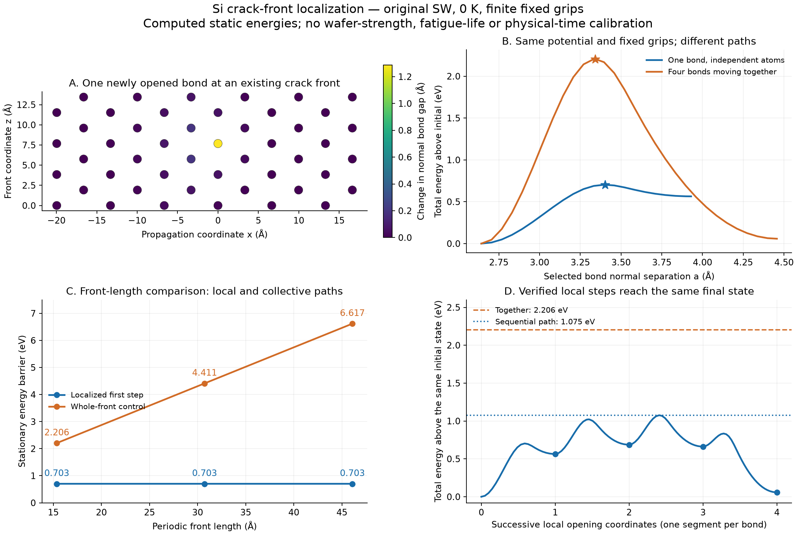

# Si 국소 균열 구현·검증 완료: 균일 분리 제약 제거

2026-09-20 · 사용자의 “이상강도로 나오는가 → 고쳐” 지시에 따른 실제 구현·계산

**균열 끝의 원자들이 독립적으로 움직이고, 결합이 하나씩 열리거나 다시 닫히는
공간 계산을 구현했다. 같은 초기·최종 상태를 잇는 순차 전이 경로가 전면 동시
전이보다 낮은 에너지를 갖는 것을 실제 원자 힘·정지점·Hessian으로 확인했다.**

공통 원자 에너지 → 자유에너지 → 확률 흐름의 구조를 유지한다.
새 경험적 강도 감소계수나 소재별 피로 법칙을 도입하지 않았다.
이번 결과는 **순수 Si, original Stillinger–Weber, 0 K, 지정된 유한 고정-grip
시편의 정적 기준 계산**이다. 실측 웨이퍼 강도·피로 수명·finite-T PMF·이동도는
보정하지 않았으며, 이를 미리 보정된 생산 해석으로 승격하지 않았다.



## 1. 무엇을 고쳤는가

- 새 [공간 원자 계산](../../solver_v1/silicon_crack_research.py)은 모든 자유 원자의
  3성분 변위를 허용한다. 기존 원자면 전체 동시 이동 모델은 대조군으로 보존했다.
- 초기 균열은 실제 원자 좌표의 개구다. pair/triplet을 강제로 지우지 않고,
  현재 거리로 이웃을 갱신하므로 재결합도 허용한다.
- scalar/vector/STF 환경 표현의 총 에너지를 그대로 미분한다. 고정 외곽 원자의
  site 에너지가 자유 원자 변위에 기여하는 부분과 자기항 제거를 유지했다.
- 국소 쌍의 opening과 slip을 정확히 지정할 수 있는 선형 좌표를 구현했다.
  이번 실행은 opening만 지정하고 나머지 원자 변위를 이완했다.
- 기존 SG/PDE·Al 에너지·mobility·Hz gate·Si UI 실행 차단은 바꾸지 않았다.

상세 식과 확률방정식으로 연결되는 조건은
[SILICON_LOCAL_CRACK_V2.md](../../solver_v1/SILICON_LOCAL_CRACK_V2.md)에 있다.

## 2. 입력과 경계조건

- 매개변수: 기존 hash-bound `source_Si.sw`, SHA-256
  `c6d3a7d26db28ee8e3feaf2f8059607de9a4accb45d9719fcabe59488ecf1cad`.
  lambda_SW=21인 원본을 유지했다. brittle 거동을 만들기 위한 수정은 없다.
- 평형 격자상수 5.4309497784 Å, 최근접 결합 2.3516702374 Å,
  SW cutoff 3.77118 Å. 모든 에너지는 **명시된 전체 원자 집합의 총 eV**다.
- (111) shuffle 면, 전진 x=[11-2], 법선 y=[111], 전면 z=[1-10].
  x/y 외곽 4 Å grip 고정, z 주기. 초기 crack seed의 tip=-3 Å, 전이 길이=5 Å.
- 기본 6×4×4 직교 cell: 1,152원자, 자유 원자 672개,
  폭 39.90917 Å, 높이 37.62672 Å, 전면 주기 15.36105 Å.
- 지정 경계 변위장 진폭 3.5 Å. 이는 균일 원격 응력이나 정확한 K_I 경계가 아니다.
  초기 seed에서 내부 원자를 풀어 전체 자유 원자 공간의 안정 상태를 확인했다.
- `A_c`, 메시 면적, 임의 원자수/전면 길이를 장벽 환산에 사용하지 않았다.

## 3. 첫 국소 전이와 전면 동시 전이

| 전면 반복 수 | 실제 전면 길이 Å | 전체 원자 수 | 국소 첫 장벽 eV | 전면 동시 장벽 eV | 동시 전이의 전체 음의 방향 수 |
|---|---:|---:|---:|---:|---:|
| 4 | 15.36105 | 1,152 | 0.7029665391 | 2.2056620828 | 4 |
| 8 | 30.72209 | 2,304 | 0.7029815362 | 4.4113241655 | 8 |
| 12 | 46.08314 | 3,456 | 0.7028622724 | 6.6169862483 | 12 |

국소 안장점의 전체 음의 방향은 세 경우 모두 정확히 **1개**였다.
전면 동시 전이의 장벽은 반복 수에 비례하지만, 국소 장벽의 세 실행 간 폭은
약 0.0001193 eV(0.0170%)였다. 이는 검사한 전면 길이의 수렴 진단이며
무한 전면/무한 시편 극한이나 실제 Si 재료 보정 인증은 아니다.

4반복의 국소 정지점:

- 초기 normal gap 2.642745447 Å.
- 안장점 gap 3.401770737 Å, 에너지 +0.702966539 eV,
  Newton 보정 후 자유 힘 잔차 4.33×10^-14 eV/Å.
- 전체 Hessian의 최소 두 고유값 -9.402654473, +0.110735838 eV/Ų.
  나머지 생략 방향의 조건부 Hessian도 양수다.
- 국소 열린 최소 gap 3.929804573 Å, 에너지 +0.564219960 eV.
  역장벽 0.138746579 eV가 있어 다시 붙는 경로도 존재한다.
- 실제 불안정 고유벡터의 ±방향에서 이완하여 초기/열린 안정 상태로의 연결을
  확인했다. 샘플 경로에서 에너지가 높은 점 하나만 골라 안장점이라 부른 것이 아니다.

## 4. 같은 최종 상태까지 순서대로 전진

앞서 열린 원자를 고정하지 않고 모두 다시 풀어 다음 결합을 전이시켰다.
시작/경계조건/에너지/최종 상태가 전면 동시 전이 대조군과 같다.

| 단계 | 해당 단계의 순방향 장벽 eV | 최초 상태 기준 안장점 eV | 최초 상태 기준 도착 상태 eV | 역장벽 eV |
|---|---:|---:|---:|---:|
| 1 | 0.702966539 | 0.702966539 | 0.564219960 | 0.138746579 |
| 2 | 0.457317270 | 1.021537230 | 0.687016025 | 0.334521205 |
| 3 | 0.388437041 | 1.075453066 | 0.661987779 | 0.413465287 |
| 4 | 0.172482204 | 0.834469983 | 0.058087839 | 0.776382144 |

완전 전진한 최종 원자 위치는 동시 전이 대조군의 최종 위치와 최대
1.29×10^-14 Å 차이로 일치했다. 검증한 순차 경로의 최대 에너지는
**1.075453066 eV**, 동시 전이는 **2.205662083 eV**다.
첫 국소 장벽 0.703 eV를 전면 전체가 전진하는 데 필요한 전체 장벽으로 혼동하지 않는다.
이 결과는 연결된 순차 경로 하나의 검증이며 모든 가능한 경로의 전역 최소 장벽 증명이 아니다.

또한 이 하중에서 마지막 상태도 초기보다 0.058087839 eV 높다.
되돌아가는 경로가 존재하므로 무조건적·불가역적 파손 또는 유한 피로 수명을
확인한 것이 아니다. gap이 cutoff를 넘었다는 사실만으로 확률을 흡수하지 않는다.

## 5. 독립 대조·미분·크기 검사

### 원자 에너지와 힘

[LAMMPS 대조](lammps_validation.json)는 실제 라이브러리 22Jul2025의 `pair_style sw`,
동일 매개변수, `run 0`을 사용했다. 새 MD를 실행한 것은 아니다.
완전한 strip, 열린 seed, 비균일 교란, 국소 안장점, 열린 최소의 다섯 배치에서:

- 전체 에너지 최대 차이 2.065×10^-10 eV.
- 힘 성분 최대 차이 1.832×10^-14 eV/Å.
- 직접 3체 합과 모멘트 표현의 힘 최대 차이 8.22×10^-15 eV/Å.
- 고정 원자까지 포함한 전체 힘의 합은 성분별 최대 잔차가 1.93×10^-14 eV/Å 이하다.
  비주기 원자 환경에서는 회전 공변성과 토크 합도 독립 회귀로 검사했다.

### 조건부 이완과 일

[축약 검증](reduction_validation.json)에서 초기/안장점/열린 최소의 Schur 곡률은
각각 +6.820390365, -5.584427916, +1.257511876 eV/Ų다.
step 0.004→0.002→0.001 Å에서 별도 힘 차분의 Hessian-vector 최대 오차가
4.22×10^-9 eV/Ų 이하로 감소했다. 이완된 반력 차분의 안장점 곡률 오차는
마지막 step에서 5.99×10^-5 eV/Ų다.

경계 변위장에 conjugate한 반력은 35.487975858 eV/Å이며,
이완된 에너지 차분과의 오차가 2.45×10^-6→6.13×10^-7→1.53×10^-7 eV/Å로
2차 감소했다. 측면 grip의 일도 들어가므로 이 숫자를 균일 nominal stress로 바꾸지 않는다.

### 경로/시편 크기

- 32→64구간으로 경로를 다시 풀고 reaction root·Newton correction·양쪽 연결을
  재검증했다. 순/역 장벽의 최대 차이는 6.49×10^-14 eV.
- 폭 6→8→10 cell에서 첫 국소 장벽은
  0.702966539→0.709658794→0.712010386 eV.
  마지막 폭 변화도 약 0.33% 남는다. 이는 외곽 경계 민감도이며 수치 반올림이 아니다.
- 높이·하중·실제 웨이퍼 크기/결함 분포를 수렴·보정했다는 주장은 하지 않는다.

## 6. 실행과 회귀 결과

실제 재실행하는 명령(기존 산출물을 보존하려면 `--output`으로 새 폴더 지정):

```text
python -m results.silicon_wafer_feasibility.run_local_crack_audit
python -m results.silicon_wafer_feasibility.run_local_crack_audit --front-repeats 4 --intervals 64 --output results/silicon_local_crack_v2/refinement64
python -m results.silicon_wafer_feasibility.run_local_crack_audit --front-repeats 4 --nx 8 --output results/silicon_local_crack_v2/width8
python -m results.silicon_wafer_feasibility.run_local_crack_audit --front-repeats 4 --nx 10 --output results/silicon_local_crack_v2/width10
python -m results.silicon_wafer_feasibility.run_local_crack_sequence
python -m results.silicon_wafer_feasibility.validate_local_crack_reduction
python -m results.silicon_wafer_feasibility.check_spatial_sw_lammps
python -m results.silicon_wafer_feasibility.plot_local_crack_audit
```

마지막 LAMMPS 대조에는 선택적 외부 라이브러리가 필요하다. 원자 에너지·이완·
주 실행에는 NumPy/SciPy만 사용하며 새 패키지를 설치하지 않았다.

- main 568.78 s, 64구간 131.79 s, 폭 8/10 각각 149.29/165.69 s,
  순차 연결 122.37 s, 축약 검증 92.17 s; 모두 exit 0.
- 집중 검사 **17 PASS / 1.13 s**. 새 공간 모델 8개 + 기존 Si 환경 모델 9개.
- 전체 solver **836 PASS** / 117파일. 네 독립 파일 그룹의 수집 manifest와
  JUnit 합계를 대조했다. 실패·오류·skip 0.
- 전체 app **189 PASS + 3 subtests / pytest 465.00 s**.
- desktop smoke exit 0: 기존 Al a0=0.7713438268704838, kappa=86.29296488740997.
- 전체 회귀 orchestration의 기록된 wall 160176.56 s, solver 그룹 최대 wall
  159707.23 s다. 9/18~9/20 세션에 걸친 경과시간이며 CPU 시간이나 성능 수치로
  해석하지 않는다. 로그/JUnit의 원래 시간을 [검증 기록](validation_summary.json)에 보존했다.
- 그림 PNG/SVG 생성 후 직접 시각 검사. UTF-8·구문·링크·공백·diff 검사를 수행했다.

초기 소규모 구현 점검에서 총 에너지를 뺀 objective는 약 10^-6 eV/Å에서 일부
force check가 미달했다. per-site 에너지 차를 먼저 합하도록 수정하고 최초 probe의
1×10^-6 eV/Å 기준을 유지한 재검사에서 통과했다. 최종 경로의 조건부 이완 기준은
2×10^-6 eV/Å이며, 정지점은 별도 Newton root correction으로 1×10^-9 eV/Å를
요구하고 실제 힘·Hessian으로 확인했다. optimizer success를 힘 수렴으로 대체하지 않았다.

## 7. Git·미완료·다음 단계

- worktree `aft-pde-bessel-38969ad`, branch `probability-pde-solver-v1`.
- 시작/최신 원격/최종 HEAD `5f878370c1c74be99e1e9b727a8ab9a11872b174`.
  시작과 최종 fetch 성공. 기존 미커밋 변경을 보존했고 commit/push는 하지 않았다.
- 이번 변경은 새 공간 모델·테스트·이론 문서, 재현/검증/그림 스크립트,
  이 결과 폴더와 인계/기존 Si 이론 문서의 연결이다. 생산/UI 코드 변경은 없다.
- **완료:** 공간 자유도, 국소 전이/치유, 총 에너지 정규화, 실제 안장점 및 같은
  최종 상태로의 순차 연결, 독립 힘/Hessian/경계 일 검증.
- **미완료:** 실측 결함·표면/도핑을 포함한 Si 에너지 검증, finite-T PMF,
  이완 시간과 이동도/Markov 축약, 실제 시편 경계 매칭, 파괴 사건/피로 수명.
  물리 이동도·seconds/Hz와 `wafer_strength_GPa`는 여전히 unavailable/null이다.
- 다음은 이 국소 좌표의 finite-T 조건부 분포·느린 이웃 상태와 동역학을 검사하는
  것이다. 현재 G_0와 단위 셀 열항만으로 생산 Hz나 실측 웨이퍼 강도를 만들지 않는다.

물리적 근거와 문헌의 orientation/potential 차이는
[이론 문서의 출처](../../solver_v1/SILICON_LOCAL_CRACK_V2.md#출처)를 따른다.
