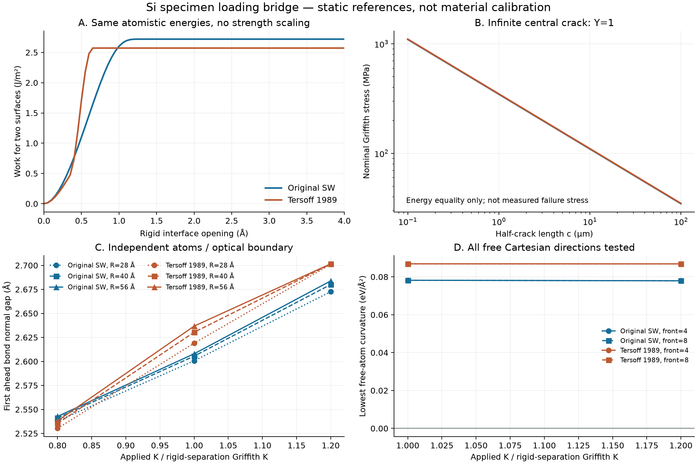

# Si v6 — 시편의 MPa 하중과 원자 균열 경계 연결 완료

2026-09-22 · `silicon-wafer-research`

## 핵심 결과

**시편의 균열 크기 → 응력확대계수 K → Si의 이방성 원자 경계조건**을
구현하고 실제 정적 계산으로 검증했다. 강도를 낮추는 계수나 새로운 피로
법칙을 넣지 않았다. 기존 원자 에너지에서 원격 MPa 응력이 원자 크기 영역의
큰 응력으로 연결되는 경로를 분리했다.

두 모델의 (111) rigid 분리 에너지와 같은 모델의 내부 이완 탄성으로 얻은 값:

| 관측량 | Original SW | Ordinary Tersoff 1989 |
|---|---:|---:|
| 두 새 표면의 분리 일, J/m² | 2.720054177 | 2.572232671 |
| 이방성 mode-I 유효 계수 1/H, GPa | 139.166647 | 149.087857 |
| Griffith 에너지 등식의 K_G, MPa√m | 0.615256711 | 0.619264609 |
| 샘플링된 rigid peak traction, GPa | 36.2285 | 103.4981 |

Peak는 0.05 Å 간격 곡선의 값이다. 동일한 분리 일 규모가 동일한 traction
모양이나 전이 장벽을 뜻하지 않는다. 특히 Tersoff의 짧은 cutoff 부근 형상을
실제 Si 결합 파괴로 승인하지 않는다.

**무한 평판, 중앙 관통균열의 반길이 c, Y=1**에 대한 에너지 등식의 명목응력:

| c | SW, MPa | Tersoff, MPa |
|---|---:|---:|
| 0.1 µm | 1097.69 | 1104.84 |
| 1 µm | 347.12 | 349.38 |
| 10 µm | 109.77 | 110.48 |
| 100 µm | 34.71 | 34.94 |

이는 **실측 웨이퍼 파손 응력 예측이 아니다**. 에너지 등식 K_G와 원자 장벽이
사라지는 K+, 열적 개시 확률을 구별해야 한다. 다른 시편 형상에는 그 형상의
탄성장과 Y가 필요하다. GPa/MPa 표시 변환만으로 재료 강도를 맞추지 않았다.



## 1. 실제 실행과 원시 자료

최종 재현 가능한 pipeline은 다음 두 폴더다.

- `verified_affine_boundary`: SW/Tersoff × 반경 28/40/56 Å × 0.8/1/1.2 K_G = **18회**.
- `verified_internal_boundary`: 위 18회에 반경 28 Å, 전면 8반복,
  1/1.2 K_G의 두 모델 4회를 더한 **22회**. Diamond sublattice 내부 이완을
  같은 potential의 Hessian/strain coupling으로 계산해 외곽에 포함했다.
- 총 **40개 기준 상태**, 1,904–7,600원자. 각 조건에 위치·gradient·site energy·
  고정 원자·원래 bond·cell·origin을 별도 NPZ로 보존했다.
- 내부 이완 경계의 ±dK 재이완은 모델별 4회, **추가 8회**다. 원시/보정 배열과
  실제 힘 종료 상태를 저장했다. 에너지 최적화와 Newton 힘 보정은 구분한다.
- 3/6/9 주기 slab의 실제 rigid separation과 121점 곡선/해석 traction을 계산했다.
- 별도 validation에서 보정된 초기 3개까지 포함해 **40개 상태를 다시 평가**했다.

새 DFT/GAP/MD/잠재함수 fit을 수행한 단계가 아니다. 원래 v5의 potential hash와
0 K 내부 이완 C11/C12/C44를 그대로 썼다. 초기 입력 HEAD/fresh origin은
`6423f8e96b91463e51a58b8084d5ba886c1ef6a7`, 작업 트리는 깨끗했다.

## 2. 원자 안정성과 크기 효과

반경 28 Å에서 모델 2개 × 전면 4/8반복 × K_G/1.2 K_G의 **8개 상태**를
모든 자유 원자 Cartesian 좌표의 Hessian으로 검사했다. 전면 원자를 같은
변위로 묶지 않았다. 두 차분 step에서 최소 여섯 고유값이 모두 양수였다.

- SW 최소 고유값: K_G에서 약 0.07820069, 1.2 K_G에서 0.07792011 eV/Ų.
- Tersoff: 약 0.08688164, 0.0868597 eV/Ų.
- 고유쌍 residual 최대 6.49×10⁻⁶ eV/Ų, 두 step 고유값 차이 최대 4.24×10⁻⁷.
- 해당 정지점의 힘 보정 후 잔차는 최대 2.72×10⁻¹² eV/Å다.

즉, 이 유한한 모델·경계에서는 에너지 등식보다 20% 높은 K에서도 **국소
안정 원자 균열 상태**가 남는다. 에너지 등식을 자동 파손 cutoff로 적용할 수
없다는 직접 대조다. K+ 위치, K 의존 장벽, finite-T 전이율은 계산하지 않았다.

반경을 40→56 Å로 늘릴 때 K_G의 첫 ahead bond gap은 SW 0.002441 Å,
Tersoff 0.006396 Å 변했다. 이 값은 유한 영역 오차 지표이며 무한 시편
수렴 인증이 아니다. 반경 40/56 Å 전체 Hessian은 검사하지 않았다.

기존 v2의 3.5 Å 임의 seed-grip 장벽을 이번 K로 환산해 재사용하지 않았다.
새 경계조건에서 장벽/조건부 자유에너지를 다시 계산해야 한다.

## 3. 힘·일·단위 검증

- 회전 탄성 에너지, 등방성 극한, crack-face traction=0, 앞쪽 K 정규화,
  ∇·σ=0, displacement 미분, K/길이 scaling을 검사했다.
- 원형 J 적분은 서로 다른 반경/해상도에서 𝒢=HK²와 일치했다.
- 주기 cell 높이를 함께 미분한 cleavage traction과 에너지 차분의 최대 차이:
  SW 7.93×10⁻⁷, Tersoff 1.37×10⁻⁶ GPa.
- Diamond 내부 선형 이완이 재현한 C44는 v5 이완값과 각각 4.55×10⁻⁷,
  2.00×10⁻⁵ GPa 차이다.
- 고정 경계 원자의 gradient로 계산한 dU/dK와 ±dK 재이완 에너지 차분:
  최대 상대차 2.26×10⁻⁸, half-step에서 5.99×10⁻⁹ 이하.
- 독립 direct SW triple sum 2개 / ASE Tersoff 2개: 에너지 차이 최대
  9.19×10⁻¹¹ eV, force 차이 최대 6.56×10⁻¹³ eV/Å.
- 전체 Si 모듈 및 소재 gate: **88 PASS + 6 subtests**, 4.01 s.
  전체 Al solver/UI 회귀를 재실행했다는 뜻은 아니다.

ASE 3.26은 외곽 고립 결합의 ζ=0, n<1에서 db/dζ 계산 중 예외를 냈다.
실제 힘에는 ∂ζ/∂R=0이 곱해진다. 설치 파일을 바꾸지 않고 이번 독립 검증의
지역 subclass에서 이 정확한 zero-environment force 극한만 처리했다.
거리 2.35/2.8/3.1 Å의 Si dimer 에너지·힘·차분 검사로 별도 확인했다.
수치 구현 일치를 재료 정확성 검증으로 부르지 않는다.

## 4. 실패·수정 기록

- 최초 소수점 load label이 파일 suffix로 처리되어 6개 기준 상태가 덮어써졌다.
  첫 18회 전체 배열 보존을 주장하지 않는다. 경로 회귀·덮어쓰기 차단을 추가하고
  위 `verified_*` 폴더에서 전체를 새로 실행했다.
- 최초 내부 이완 실행은 SW 11회 뒤 그 파일명 문제로 중단됐다. checkpoint와
  실제 실행 소스를 보존했다. 자세한 내용은 `INITIAL_RUN_ISSUES.md`.
- 최종 baseline에서도 Tersoff 1.2 K_G 3개는 optimizer success와 달리 힘 기준에
  실패했다. 기존 실패를 보존하고 별도 Newton–CG로 최대 9.52×10⁻¹² eV/Å까지
  보정했다. 내부 이완 경계의 최초 힘 실패 4개도 별도 보정 기록을 남겼다.
- 처음 거리 후처리의 Tersoff cutoff 표기는 3.2 Å로 잘못돼 있었다. 공식 파일의
  R+D=3.0 Å를 직접 읽도록 수정했다. LAMMPS 힘·에너지는 처음부터 원본 파일을
  사용했으며, 최종 전체 실행은 올바른 거리 분류를 보존한다.
- 첫 unittest smoke는 pytest형 기존 검사를 수집하지 않았다. 14개 smoke와
  최종 pytest의 88개 검사를 구별한다.
- 검증 파일 저장의 자동 승인 검토가 시간 초과했고, 안전성 거부 사유는 없었다.
  저장 상태 확인 후 재시도해 완료했다. 내부 경계 실행의 기록된 elapsed
  9,406.48 s에는 약 2.5시간의 도구 응답 공백이 겹친다. 원인을 확인하지
  못했으므로 이를 연속 CPU 계산 시간으로 보고하지 않는다.

## 5. 아직 남은 물리 gate

1. v5 SW/Tersoff의 큰 DFT surface/crack force 오차는 해결되지 않았다.
   이번 수치가 실제 Si 재료 calibration 통과를 뜻하지 않는다.
2. 원자 경계 radius·grip·nonlinear/flexible far-field의 추가 수렴과 실제
   유한 시편 형상 해석이 필요하다. 임의 Y=1을 모든 시편에 사용하지 않는다.
3. 이 K 경계에서의 재배열/개구 장벽과 finite-T 조건부 PMF가 필요하다.
   기존 경계의 barrier를 옮기거나 −𝒢ΔA 일을 이중으로 더하지 않는다.
4. 독립 screened/GAP 에너지 기준·도핑/표면 화학·memory/이동도/Hz는 미완료다.
   v4의 56 profile/2 multibasin와 경계 충돌 문제도 해결된 것으로 표시하지 않는다.

다음 연구는 같은 K 경계에서의 전이 경로와 독립 재료 기준의 대조다.
CAD·UI·AI 개발은 사용자의 지시에 따라 별도 작업으로 분리했다.

## 재현

NumPy/SciPy/Matplotlib/pytest, optional serial LAMMPS MANYBODY와 ASE 3.26이
필요하다. LAMMPS Python/DLL 경로는 실행 환경에서 지정한다. 기존 완료 자료를
덮어쓰지 않도록 새 output 경로를 사용한다.

```text
python -m results.silicon_wafer_feasibility.run_specimen_bridge --output .cache/si-v6-reproduce/verified_affine_boundary
python -m results.silicon_wafer_feasibility.refine_specimen_bridge --source .cache/si-v6-reproduce/verified_affine_boundary --output .cache/si-v6-reproduce/verified_internal_boundary
python -m results.silicon_wafer_feasibility.validate_specimen_bridge --root .cache/si-v6-reproduce
python -m pytest solver_v1/test_silicon*.py app/test_materials.py -q
```

핵심 유도·문헌·단위는 [v6 이론](../../solver_v1/SILICON_SPECIMEN_LOADING_V6.md).
원시 비교는 `validation.json`, 테스트 목록은 `tests.json`, 전체 파일 hash는
`artifact_manifest.json`에 있다. 최종 Git 커밋/게시 상태는 handoff와 실제 Git을 따른다.
