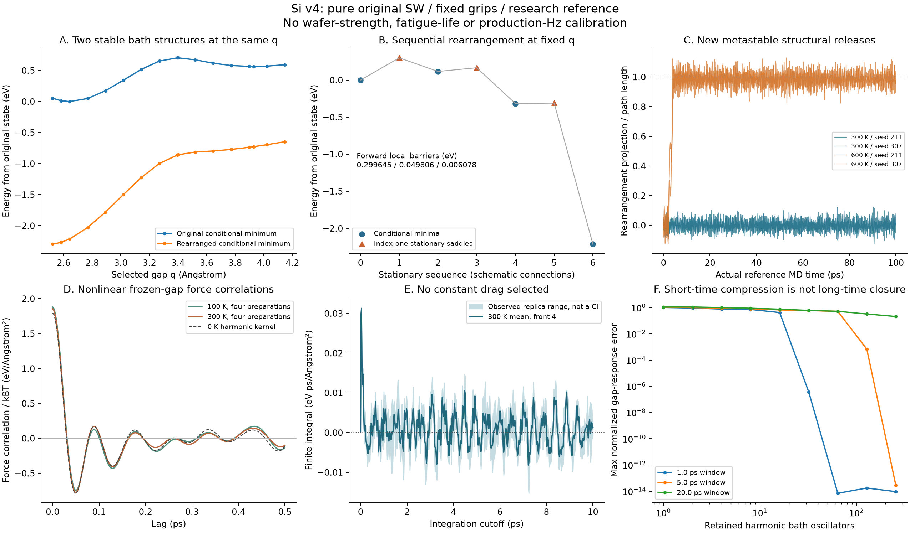
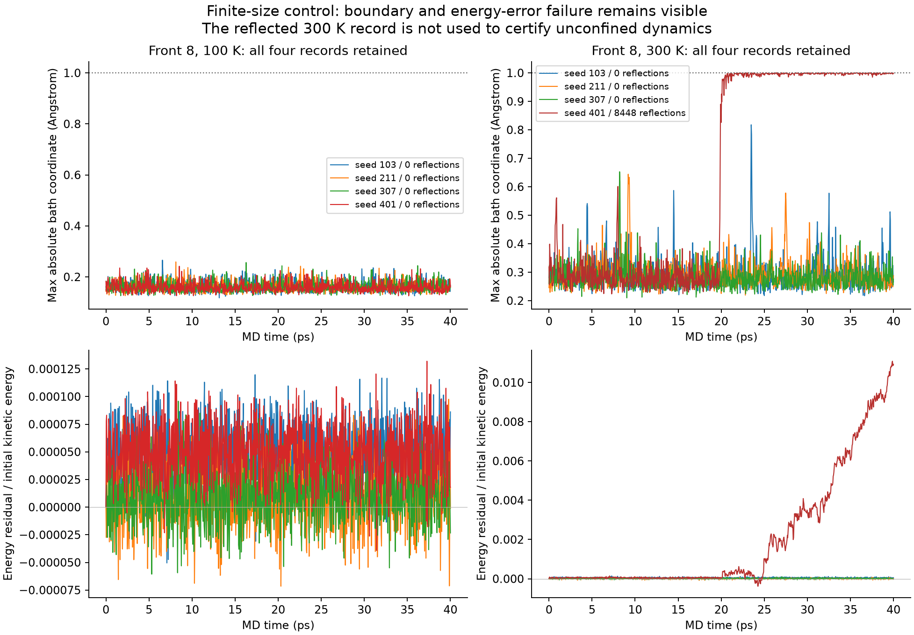

# Si v4 작업 마감 — 완료한 연구와 미완료 계산

2026-09-21 · `silicon-wafer-research` · pure original SW / fixed-grip 연구

**같은 결합 간격에서도 주변 원자의 다른 안정 구조가 존재하며, 실제 원자운동에서도
그 재배열을 확인했다. 단일 가지의 Gaussian 자유에너지와 일정한 이동도만으로
이 결과를 대표할 수 있다는 가정은 아직 통과하지 못했다.**

재료별로 별개의 경험 법칙을 추가하지 않았다. 같은 원자 에너지, 조건부 측도,
확률 보존 구조 안에서 비선형 열분포·기억·재배열 좌표를 검사했다. Al/생산 SG/PDE,
기존 UI, 보정 JSON, Si 실행 차단과 physical-Hz gate는 변경하지 않았다.



## 1. 시간 예산과 실제 완료 상태

사용자가 준 4시간의 시작은 2026-09-20 19:11:55 UTC, 기한은23:11:55 UTC였다.
20:33:41 UTC 확인 이후 다음 명시적 시각 확인이 2026-09-21 01:00:26 UTC였다.
이 긴 wall-clock 공백의 원인은 확인하지 못했다. 일부 프로세스의 elapsed 값에도
약15,900–16,400초가 포함되므로 이를 연속 CPU 계산 시간으로 보고하지 않는다.
기한 초과를 확인한 뒤 새 물리 계산을 시작하지 않고 남은 두 sampling job과
그 작업의 자식 프로세스만 중단했다. 이후 원시 결과 검증·그림·문서·Git 마감을 했다.

| 계산 | 저장 완료 | 판정 |
|---|---:|---|
| Gaussian joint importance pilot | 9조건 ×512 | 300/600 K overlap 부족, 채택 안 함 |
| pCN pilot | 36체인 ×1024 | 혼합 부족 대조군 |
| HMC pilot | 36체인 ×1024 | 원래 가지의100/300 K 반복 일치, global equilibrium 미인증 |
| 평균 힘 profile | **80/136체인** ×2048 | 17개 예정 q 중10개 완료; 미완료 |
| 전면8 초기 열분포 | 8체인 ×2048 | 준비 완료; 동역학의 경계 문제와 별도 |
| 여러 초기 구조, box1.5 A | **6/8체인** ×2048 | 동일 target에서 초기 구조 의존 확인; 미완료 |
| 전면4 고정-gap MD | 24 ×40 ps =960 ps | 저장/검증 완료, 반사0 |
| 전면8 고정-gap MD | 8 ×40 ps =320 ps | 완료했으나1개 실행에 경계·에너지 오차 문제 |
| dt 절반 대조 | 12 ×5 ps =60 ps | 같은 초기 상태, 시간간격 수렴 확인 |
| 구조 재배열 MD | 4 ×100 ps =400 ps | 실제 새 실행; metastable 준비/넓은 영역 |

실제 새 MD는 **48회, 합계1.74 ns**다. 모든 실행을 독립 열평형 표본으로 세지 않는다.
서로 다른 q/온도 대조는 같은 seed를 재사용했고, dt 대조는 같은 초기 상태다.
MCMC 저장 표본266,240개는 물리 시간·피로 trajectory 수가 아니다.
미완료 실행에는 성공 `summary.json`을 만들지 않았다. 각각의
`interrupted_summary.json`에 완료/미완료 label과 종료 이유를 기록했다.

## 2. 고정 간격에서의 재배열

원래 전면4 구조는1152원자/자유672원자이며 bath 차원은2015다.
q=2.6427454609767165 A를 고정해도 원래 상태보다 **2.213422554 eV 낮은**
조건부 안정 구조가 존재한다. 최저 조건부 Hessian 고유값은 약0.109991 eV/A²다.
다른17개 q에서도 새 가지를 추적했다. 에너지, 반력, Hessian과 원자 좌표를 저장했다.
이는 original SW에서의 재배열이며 실제 Si의 특정2×1 표면 재구성 인증이 아니다.

공간 전체의 동시 재배열 후보 최고점에는 불안정 방향이2개 있었다. 이를 장벽으로
채택하지 않고, 비대칭 국소 전이의 정지점과 양쪽 이완 연결을 따로 찾았다.

| 국소 단계 | 시작 최소의 에너지 eV | 안장점의 에너지 eV | 시작 최소 기준 장벽 eV | 도착 최소 eV |
|---|---:|---:|---:|---:|
| 첫 국소 재배열 | 0 | 0.2996448950 | 0.2996448950 | +0.1163749895 |
| 인접 재배열 | +0.1163749895 | +0.1661814816 | 0.0498064921 | −0.3167982195 |
| 추가 재배열 | −0.3167982195 | −0.3107200289 | 0.0060781906 | −2.2134225543 |

세 안장점의 **고정-q bath Hessian**은 음의 고유값이 하나다. 양쪽 이완 결과와
최소의 양의 Hessian을 각각 검사했다. q까지 자유롭게 한 전체 Hessian의 index,
전역 최저 경로, finite-T 전이율을 인증한 것은 아니다. v2의 opening0.702966539 eV와
이 고정-q 재배열 장벽은 다른 과정이다.

첫15-image NEB는563회/최대 힘 잔차1.8382e-4 eV/A로 설정 기준을 통과했다.
29-image와 작은 step의 재검사는 polish된 index-one 에너지에서 약6e-14 eV 안으로
일치했지만 **전체 band 수렴은 실패**했다(최종 잔차0.02348/0.007455 eV/A).
인접 전이는 양방향49점 제약 추적 후 같은 안장점과 양쪽 최소를 찾았다.
실패한 긴25-image band와 추가 network band의 이력도 보존했다. 실패한 band의
큰 에너지를 물리적 장벽으로 사용하지 않는다.

## 3. 실제 열적 원자운동

Metropolis 표본은 위치 준비에만 사용했다. 독립 Maxwell 속도와 실제 기준 Si 질량으로
보존적 velocity-Verlet를 새로 수행했다. 이 reference MD의 ps를 생산 overdamped
t0에 대입하지 않는다. 외부 thermostat, 강제 결합 삭제, 임의 소산은 없다.

구조 응답 대조는 원래 basin으로 quench되는 준비를 확인한 뒤 box를1 A에서2 A로
넓혔다. 따라서 **metastable 비평형 release**이며 canonical memory 측정이 아니다.

- 300 K 두 실행:100 ps 뒤 원래 minimum으로 이완됐다.
- 600 K 두 실행:재배열 후 −2.213422554 eV minimum으로 이완됐다.
- 네 실행 모두 경계 반사0, 초기 kinetic energy 기준 최대 에너지 잔차0.0156–0.0242%.
- 각 실행의2 ps 간격 snapshot을 이완한204개 구조와 모든 원시 이력을 저장했다.
  두 사건으로 확률·전이율·수명을 추정하지 않았다.

## 4. 비선형 분포와 평균 힘

공통 orthonormal bath box에서 full SW target을 그대로 사용하는 pCN/HMC를 구현했다.
HMC의 보조 운동량·적분간격·제안 횟수는 물리 시간이 아니다. 유한 box face에서
normal 성분이0인 vector field를 사용해 integration-by-parts force control의 경계항을
보존했다. 원시 힘과 controlled 힘을 모두 저장했고 실제1D 적분으로 평균 불변을 검사했다.

완료한 원래 가지 profile의 controlled-force split-Rhat 최대는 약1.00094다.
하지만 넓은 **같은 box1.5 A / 같은 q / 300 K**에서 원래 구조로 준비한 평균 반력은
약0.0752 eV/A, 다른 두 구조로 준비한 평균은 약1.154–1.155 eV/A였다.
각 준비 내부의 반복 일치가 전체 basin 혼합을 보증하지 않음이 드러났다.
새 reference Hessian은 sampling preconditioner이며 target 에너지를 바꾼 것이 아니다.

미완료 profile의 힘 적분은 `analysis.json`에 진단으로 남겼다. 정확히 계산한0 K
에너지/미분의 Hermite 보간과 thermal excess-force 적분을 분리하고, PCHIP/cubic
차이와 seed별 적분도 저장했다. 원래 q_initial에 대한300 K 적분 최고값 약0.7362 eV는
**평형 초기점 기준 활성화 장벽이 아니다**. 낮은 q의 예정 표본이 미완료이고,
전체 basin 혼합과 box 독립성도 확보되지 않았다.

Force control의 평균0 증명은 전체 선언된 target에 대한 것이다. 한 basin에 갇힌
분포에 조용히 적용해 인증된 basin PMF라고 부르지 않는다. 재배열 좌표u를 남길 때
기존 box의 단면은 u에 따라 움직이므로 그 자유에너지 미분에는 경계항이 필요하다.
유도와 현재 구현 범위는 [v4 이론](../../solver_v1/SILICON_FINITE_T_ENSEMBLES_V4.md)을 따른다.

## 5. 기억과 유한 크기 실패

전면4의 실제 frozen-q force correlation은 진동하며, 초기 상태300 K에서
10 ps cutoff 적분은 평균0.001283 eV ps/A², replica 값은−0.000675부터0.002763까지다.
이 범위는 신뢰구간이 아니다. cutoff/centering/초기·후기/replica 차이를 보존했으며
abs/clip으로 양의 상수 마찰이나 mobility를 만들지 않았다. 비선형 frozen-q correlation을
정확한 nonlinear Mori kernel과 등치하지 않는다.

전면8 /300 K /seed401은 약20 ps 이후 box에 닿아 **8,448회 반사**했고, 에너지
잔차가 초기 kinetic energy의**1.1111%**에 이르렀다. 다른 세 실행을 골라 크기 수렴을
선언하지 않는다. 전체 원시 통계에는 이 실행을 표시해 보존했지만, 이 군의 큰 장시간
상관 적분을 실제 마찰로 해석하거나 unconfined dynamics를 인증하지 않는다.
영역 확대 및 해당 초기 상태의 dt 대조는 미완료다.



같은0 K Hessian의 양의 spectral measure를 적합 없이 Lanczos/Gauss quadrature로
압축했다. 정적 counterterm과 열적 구조를 보존하는 독립 연구 구현이다.
초기 gap 응답의32개 oscillator 오차는1 ps에서3.68e-7이지만5 ps에서0.593이다.
256개에서도20 ps 오차는0.210이다. 짧은 창의 압축 성공을 장시간 축약으로 채택하지 않았다.

## 6. 조화 양자 민감도

동일 차원의 안정 oscillator를 양자 partition으로 계산했다. 기존0 K opening saddle
위치에서300 K 보정은 classical0.03153155 eV, quantum harmonic0.04504018 eV로
차이가0.01350864 eV다. 후보 차이는0.748006724 eV다.
이는 고정 classical q의 국소 조화 민감도이며 quantum PMF/터널링/전자구조/도핑
보정을 포함하지 않는다. 실측 Si 결과로 채택하지 않는다.

## 7. 실제 검증과 남은 한계

- Si 수학·에너지·동역학 관련42 PASS/31.85 s, 소재/Si 실행 gate24 PASS/11.01 s.
  프로파일 후처리 수정 후 해당1개 재검사 PASS/0.73 s. 고유 관련 검사는66개다.
  과거 전체827개 회귀를 이번에 다시 실행했다고 보고하지 않는다.
- desktop smoke exit0: a0=0.7713438268704838, kappa=86.29296488740997 유지.
- 완성된130개 HMC 기록의 최종 상태,48개 MD 최종 상태를 재계산했다.
  raw observation 최대차 약7.1e-14, MD 힘/에너지 최대차 약4.3e-14.
- 독립 explicit triple과 moment 방식39개 대조를 수행했다. 정확한 최대 오차와
  모든 코드/reference hash 검사는 [raw_validation.json](raw_validation.json)에 있다.
  원시 재현 일치는 경계 반사 record의 물리적/시간적 정확도 인증이 아니다.
- 동일5 ps 창의 dt1→0.5 fs 에너지 오차 비율3.9645–4.1180. 기준2차 수렴과 일치한다.
- 두 그림을 생성한 뒤 직접 확인했다. 실패/미완료/부분 결과를 삭제하지 않았다.

생산 활성화에 필요한 **실제 Si 에너지·표면·도핑, global finite-T 분포, 좌표와 memory의
축약 검증, 경계/크기 수렴, 실제 파손 사건·수명**은 여전히 미완료다.

## 8. 재현과 다음 작업

정확한 reference NPZ/JSON30개(약25.7 MB)를 `references/`에 보관했다.
기존 `.cache` 경로는 당시 이력이고, 검증기는 캐시가 없으면 archive를 사용한다.
반복 가능한 분석은 다음과 같다. 기존 raw 결과를 새 계산 출력으로 덮어쓰지 않는다.

```text
python -m results.silicon_wafer_feasibility.validate_thermal_results
python -m results.silicon_wafer_feasibility.analyze_conditional_ensemble --calculation results/silicon_thermal_v4/mean_force_profile --allow-incomplete
python -m results.silicon_wafer_feasibility.analyze_thermal_dynamics --calculation results/silicon_thermal_v4/thermal_dynamics
python -m results.silicon_wafer_feasibility.plot_thermal_results
```

새 표본화/MD는 `run_conditional_ensemble`, `run_thermal_dynamics`에 `--references`,
`--ensembles`, **비어 있는 새 `--output`**을 지정한다. 각 결과의
`running_summary.json`/`summary.json`/`interrupted_summary.json`에 실제 설정을 저장했다.
원자량·SW 매개변수·좌표는 기존 source를 사용한다. 처음의 pCN와 실패 NEB pilot은
개발 중 버전이며 일부 이전 source는 `source_snapshots/`에 보관했다. 현재 코드로
모든 과거 pilot의 source hash가 같다고 주장하지 않는다.

우선 남은 작업은 (1) 중단된56개 profile/2개 multibasin 체인,
(2) 전면8 seed401의 넓은 영역과 dt 대조,
(3) 구조 전이를 포함한 전체 분포/경계 검증이다. 그 뒤 실제 Si 재료 보정과
생산 확률 솔버 연결을 판단한다. 낮은 Rhat나 정적 saddle만으로 gate를 열지 않는다.
