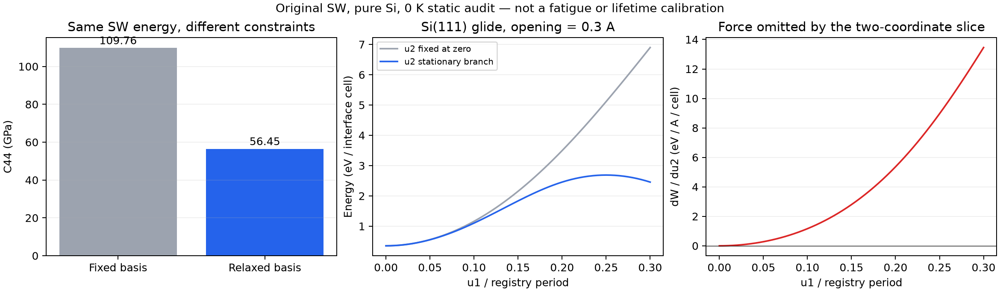

# Si 공통 에너지 표현과 좌표 축약: 첫 정적 감사

2026-09-17 · 사용자 승인에 따른 공통 이론 연구의 후속 계산

**공통 확률 지배방정식을 유지한다. 이번 결과는 그 식에 들어갈 에너지 표현과
좌표 축약의 검사이며, Si 재료·피로·kinetic calibration 승인이 아니다.**

## 1. 완료한 계산과 핵심 판정

1. SW의 직접 3원자 합과 scalar/vector/STF 모멘트 표현이 **에너지·힘·Hessian까지**
   같은지 확인했다. 같은 원자 에너지를 두 표현으로 계산했으며 재료별 피로 법칙을 추가하지 않았다.
2. Diamond의 두 원자 basis 사이 내부 이동을 고정/이완한 탄성을 같은 에너지로 계산했다.
   내부 이동을 버리면 전단 곡률이 크게 달라진다.
3. Si(111) glide의 기존 `<110>` 직선 slice에는 횡방향 힘이 남는 반례가 있다.
   반면 실제 `<112>` 방향에서는 검사한 구간의 횡방향 힘이 0이고 곡률이 양수다.
   따라서 **2좌표 형식의 폐기가 결론이 아니라, 좌표의 방향과 생략 규약을 검증하는 것이 결론**이다.
4. 고정 opening에서 전체 두 registry 힘이 0인 정지점, Hessian 부호, 양쪽 안정 상태로의
   연결을 확인했다. 이는 강체 계면의 정적 registry 전이이며 국소 균열 핵생성/전파 장벽은 아니다.

실제 후보는 **원본 Stillinger–Weber, 순수 Si, 0 K, 고정 반경 cutoff**인 기준 계산이다.
새 Si fit이나 도핑 모델을 만들지 않았다. Al LJ/Bessel 생산 에너지, SG/PDE, 이동도,
물리 Hz gate, Si UI 실행 차단은 수정하지 않았다.

## 2. 표현의 연결과 현재 함수족의 차이

원 식의 `c=cos(theta0)`에 대해 각 중심 원자에서

```text
rho = sum w_j
v   = sum w_j n_j
Q   = sum w_j (n_j tensor n_j - I/3)
d   = sum w_j^2
U3/(lambda epsilon) = Q:Q/2 - c(v·v) + (1/6+c^2/2)rho^2 - (1-c)^2 d/2
```

를 쓴다. 원본 파일의 반올림된 c도 그대로 사용한다. 마지막 항은 이웃 자기항 제거이며
그 미분도 유지한다. 반경 가중치와 방향까지 두 번 미분하는 forward jet을 구현했다.
직접 이웃쌍 식의 jet 및 기존 NumPy slab의 에너지 유한차분과 독립적으로 대조했다.

**기존 Al solid-harmonic 모멘트와의 차이를 숨기지 않는다.** 기존 코드는
`sum k_l(r) STF(r^tensor_l)`를 쓰며, 위 단위방향 표현과 정확히 대응하려면
`k_l(r)=w(r)/r^l`가 필요하다. 고정 r0의 배율만 곱하면 변형된 이웃 배열에서는 같은
힘/Hessian이 아니다. 이 관계는 동일한 단위 체계에서 적용하며 진폭 gauge도 고정해야 한다.
원본 SW의 compact radial/pair 함수는 현재 LJ/지수 함수와 같지 않다. 같은 불변량을
쓴다는 이유로 현재 전체 함수족의 Si 적합이 완료되었다고 해석하지 않는다.

또한 diamond의 각 원자 주변은 반전대칭이 아니다. 단위 정사면체 4방향의 rank3 STF
제곱합은 `32/9`이며 반대 basis에서 부호가 바뀐다. 두 원자군의 모멘트를 먼저 더하면
0이지만 **각 site의 제곱합은 0이 아니다.** 기존 FCC의 odd bulk moment=0 가정을
Si에 그대로 적용할 수 없다. 이 대수적 예는 최근접 정사면체에 대한 것이며 무한 범위
Si 환경 전체를 계산했다는 뜻은 아니다.

## 3. 내부 basis 이동을 같은 에너지에서 제거했을 때

상태를 `q=(exx,eyy,ezz,gamma_yz,gamma_xz,gamma_xy,ux,uy,uz)`로 잡았다.
`F=I+대칭 engineering strain`, u는 변형된 basis에 추가하는 상대 변위(Å)다.
2원자 primitive cell의 에너지 Hessian에서

```text
H_relaxed = H_ee - H_eu H_uu^(-1) H_ue
du/de = -H_uu^(-1) H_ue
```

를 계산했다. 평형 force와 H_uu의 양의 정부호를 확인한 뒤 제거했다.

| 원본 SW의 0 K 계산, GPa | basis 고정 | 내부 이동 이완 |
|---|---:|---:|
| C11 | 151.424492 | 151.424492 |
| C12 | 76.422091 | 76.422091 |
| C44 | 109.756491 | 56.449341 |

전단 곡률은 **48.5686% 감소**한다. gamma_xy에 대한 `duz/dgamma=-0.853949895 Å`다.
이를 실제 Si의 보정된 탄성값으로 쓰지 않는다. 원본 SW의 격자상수는 5.430949778 Å,
원자당 응집 에너지는 -4.3366 eV다.

독립적으로 gamma=0.004, 0.002, 0.001, 0.0005의 내부 force 방정식을 풀고 에너지 차로
C44를 재계산했다. Schur 값과의 차이는 2.909e-4 → 7.272e-5 → 1.816e-5 →
4.398e-6 GPa로 감소했다. SciPy root의 success flag는 네 경우 모두 false로 남았으나,
실제 force residual은 최대 4.95e-15 eV/Å이고 양의 내부 Hessian 및 독립 곡률 수렴을
확인했다. flag를 true로 바꾸거나 실패 기록을 지우지 않았다.

내부 strain의 존재와 고정/이완 탄성을 구분하는 물리적 근거는 Erhart–Albe (2005)의
논의와 일치한다. 그 논문 표의 SW 수치를 현재 계수 파일과 동일하다고 가정하거나
재료 target으로 혼합하지 않았다. [원문, DOI 10.1103/PhysRevB.71.035211](https://materialsmodeling.org/assets/publications/ErhAlb05a.pdf)

## 4. 기존 직선 slice의 반례와 물리 방향을 잡은 2좌표 후보

계면 법선은 [111], 기존 u1 방향은 [1,-1,0], u2는 이에 수직인 [1,1,-2] 방향이다.
다음은 같은 glide 계면의 `opening=0.3 Å`, `u1=0.2 b=0.768052283 Å`다.

| 양 | u2=0으로 고정 | u2를 국소 이완 |
|---|---:|---:|
| u2, Å | 0 | -0.381794624 |
| W, eV/interface cell | 3.494363845 | 2.455598539 |
| dW/du2, eV/Å/interface cell | 5.360388432 | 2.46e-15 |

이 점에서 에너지는 1.038765307 eV/cell 감소했다. **이 점 자체가 saddle이라는
뜻이나, 실제 균열 활성화 장벽이 이만큼 낮아졌다는 뜻은 아니다.**
이완된 동일 상태의 u1 고정-u2 곡률은 +0.361860이지만, u2 결합을 포함한 Schur
곡률은 -11.336550 eV/Ų/cell이다. 누락 좌표는 단순 상수 보정으로 끝나지 않는다.
Shuffle의 같은 sample은 dW/du2≈0, 양의 횡곡률로 이 반례를 보이지 않는다.

그 다음 전단 방향을 `<112>`인 `[1,-2,1]/sqrt(6)`로 잡았다.
평면 좌표에서 `u=s(sqrt(3)/2,-1/2)`, partial translation 길이는
`L=a_lat/sqrt(6)=2.217175963 Å`다. 원래 full lattice translation b와 다르다.
세 opening 각각 161점에서 횡 force와 곡률을 검사했다.

| opening, Å | 최대 횡 gradient, eV/Å/cell | 최소 횡곡률, eV/Ų/cell | registry 정지점 s/L |
|---|---:|---:|---|
| 0 | 3.00e-14 | 16.152995 | 0, 0.5, 1 |
| 0.3 | 2.31e-14 | 11.040430 | 0, 0.5, 1 |
| 0.75 | 1.14e-14 | 5.629422 | 0, 0.433976125, 0.5, 0.566023875, 1 |

80/160구간의 전체 derivative sign scan으로 정지점을 찾고 결과를 대조했다.
각 정지점의 **두 registry gradient**를 검사하고 전체 2×2 Hessian으로 분류했다.
opening 0/0.3에서는 가운데가 index-1 saddle이고 양쪽이 minimum이다. 각 saddle의
불안정 eigenvector 양쪽에서 2D energy minimization으로 다른 안정 상태에 도달했다.
opening 0.75에서는 가운데 minimum과 그 양옆 saddle 두 개가 나타난다. 전체 구간을
단일 unimodal 장벽으로 취급하면 이 구조를 놓친다.

opening 0/0.3의 saddle 에너지는 시작 minimum 위로 각각 3.821737059 /
2.334973251 eV/interface cell이다. opening 0.75의 두 saddle은 시작 위로
0.774502512이고 가운데 minimum은 0.771853892 eV/cell이다. 모두 **고정 opening,
coherent rigid registry surface**의 값이다. 법선 방향 정지점/국소 crack-front kink
장벽/유한 영역의 열적 활성화 에너지로 승격하지 않는다. 임의 면적 Ac를 곱하지 않는다.

Partial 이동 뒤의 endpoint는 격자 좌표 (2/3,-1/3)이며 정수 full translation이 아니다.
그런데 원본 SW에서는 시작과 endpoint 에너지가 약 2e-15 eV/cell 이내에서 같다.
최근접 국소 환경만으로 stacking 차이를 분해하지 못하는 가능성을 후속 material gate에
남긴다. 실제 Si의 intrinsic stacking-fault energy가 정확히 0이라고 결론내리지 않는다.
Si glide의 `<1,-2,1>` 경로와 완화된 GSF는 Juan–Kaxiras의 독립 DFT 연구에서 비교할
대상이 있다. [원문](https://arxiv.org/abs/mtrl-th/9604006)

### Full registry 주기는 partial 거리와 다르다

위 방향의 완전한 Bravais translation은 `B=3L=6.651527888 Å`다. 3개 opening과
3개 시작점에서 `s→s+3L`의 energy/gradient/Hessian을 직접 비교했다. 최대차는
각각 3.553e-15 / 1.799e-14 / 2.776e-14다. 반면 `s→s+L`은 일반적으로 에너지를
보존하지 않는다. opening=0.3 Å에서 `(0,L,2L,3L)`의 W는
`(0.353044, 0.353044, 61.126299, 0.353044) eV/cell`이다.
2L의 큰 값은 이 고정 opening의 강체 경로에서 원자가 가까워지는 결과이며 실제
원자 완화 경로의 최소 활성화 장벽으로 해석하지 않는다.

따라서 현재 Al의 `s=b*n+xi`를 Si에 옮길 때 partial L을 b로 대입하면 안 된다.
공통 연속 확률밀도에는 full period 안의 서로 다른 subwell을 그대로 남길 수 있다.
Full-translation index와 partial 상태의 population/flux를 구별하고, 실제 소성·잔류
변형의 해석은 원자 전이와 unload/hold로 검증한다. 새 경험 손상 법칙을 추가할 필요는 없다.



## 5. 확률 지배방정식에 연결할 때 유지할 계약

확률 흐름 `J=-M(P grad G+kBT grad P)`은 공통으로 둔다. 정적 Hessian을 이완했다고
곧바로 kinetic 좌표 제거까지 검증된 것은 아니다. 같은 상위 좌표를 `(q,z)`로 나누고
평형 주위 Hessian을 `[[A,B],[B^T,C]]`, 일정한 block-diagonal 마찰을
`Gamma=diag(Gamma_q,Gamma_z)=M^(-1)`라 두면 선형 역응답은

```text
Z_eff(omega) = A+i omega Gamma_q - B(C+i omega Gamma_z)^(-1)B^T
H_static    = A-B C^(-1) B^T
Gamma_low   = Gamma_q+B C^(-1) Gamma_z C^(-1) B^T
```

다. `exp(i omega t)` convention이며 finite-frequency memory는 일반적으로 남는다.
따라서 같은 원자 에너지에서 좌표를 제거해도 static G와 이동도를 함께 검토해야 한다.
열항의 변환도 같은 fluctuation–dissipation 관계를 따라야 한다. 현재 Si Gamma/M은
미보정이므로 이 식에 수치를 만들어 넣지 않았다.

빠른 좌표의 Gaussian 조건부 평형이 타당하면 finite-T PMF에는 최소 에너지 외에
`(kBT/2) log[det H_zz(q)/det H_ref]`가 더해진다. H_ref는 단위를 맞춘 고정 참조이고
q와 무관한 T항은 생략한 표현이다. 여기서 계산한 0 K 최소 경로는 이 PMF가 아니다.
같은 q에서 조건부 이완/약한 conjugate response/재교차 검증이 다음 kinetic gate다.

이번 정적 검사는 피로한도 존재 여부를 결정하지 않는다. Registry minimum 간 이동을
opening 흡수 또는 wafer 파단으로 세지 않는다. 실제 파손 집합, 공간적 국소 전이와
물리 시간 검증 후에 공통 생성자의 장시간 생존확률을 검사한다.

## 6. 재현, 검증 범위와 보존

- 구현: [silicon_environment_research.py](../../solver_v1/silicon_environment_research.py).
  생산 registry에 등록하지 않았다. 추가 Python 패키지를 설치하지 않았다.
- 실행: `python -m results.silicon_wafer_feasibility.run_unified_coordinate_audit`
  (실제 108.98 s), `python -m results.silicon_wafer_feasibility.run_registry_stationary_audit`
  (최초 20.02 s, full-period 검사를 추가한 최종 실행 19.38 s), 모두 exit0.
  입력·코드 SHA-256과 단위는 JSON에 기록했다.
- 결과: [summary.json](summary.json), [registry_stationary.json](registry_stationary.json),
  [registry_path.csv](registry_path.csv), [bulk_internal_relaxation.csv](bulk_internal_relaxation.csv),
  [glide_transverse_profiles.csv](glide_transverse_profiles.csv),
  [shuffle_transverse_profiles.csv](shuffle_transverse_profiles.csv).
- 직접합/모멘트의 Cartesian force/Hessian, 회전 공변성, torque, 독립 slab 미분,
  이미지/깊이/반복 면적, 내부 이완 곡률 수렴, 잘못된 이미지 범위 거부 검사를 했다.
  새 집중 검사 **9 PASS, 3.11 s**. 초기 BFGS energy line search가 작은 force 잔차에서
  정체해 1 FAIL을 낸 뒤, force 방정식 직접 풀이와 독립 곡률 수렴으로 고쳤다.
  허용 오차를 늘려 통과시키지 않았다.
- 모멘트/직접합 interface Hessian 최대차 7.106e-15 eV/Ų/cell, 기하 크기 대조
  최대차 7.816e-14. 독립 NumPy 중앙차분 h=0.00025 Å의 최대 gradient/Hessian 차이는
  2.733e-7 / 8.316e-7이며 더 큰 h부터 감소했다. 이 유한 cutoff 모델의 검증이다.
- 전체 solver **828 PASS**. 116개 파일을 겹치지 않는 4개 pytest 프로세스로 나눴고
  수집 828개와 JUnit 합계를 대조했다. 각 프로세스는 BLAS 1 thread, 별도 log/JUnit을
  썼다. 새 에이전트를 생성한 것이 아니다. solver wall time 4845.53 s;
  **전체 app 189 PASS +3 subtests, 540.21 s**, smoke exit0.
  전체 검증 orchestration wall time 5388.56 s. [검증 기록](validation_summary.json).
  `git diff --check`, 새 파일 UTF-8/공백/compile/local-link 검사 PASS.
  PNG/SVG를 생성했고 PNG의 레이아웃과 표기를 직접 확인했다.
- 시작 fresh fetch 성공. 시작 local/origin HEAD는 모두 `5f878370c1c74be99e1e9b727a8ab9a11872b174`,
  브랜치는 `probability-pde-solver-v1`, worktree는 `aft-pde-bessel-38969ad`.
  기존 변경/미추적 작업 보존. 커밋·푸시 없음.

**미완료:** 현재 LJ/Bessel 함수족의 Si joint fit, 실제 Si/도핑 material gate,
원자 완화된 국소 crack 경로, finite-T PMF, 물리 이동도/Hz, 피로한도 및 wafer 수명.
다음은 위 `<112>` 좌표와 국소 균열 좌표의 원자 전이 비교 및 조건부 축약 검증이다.
