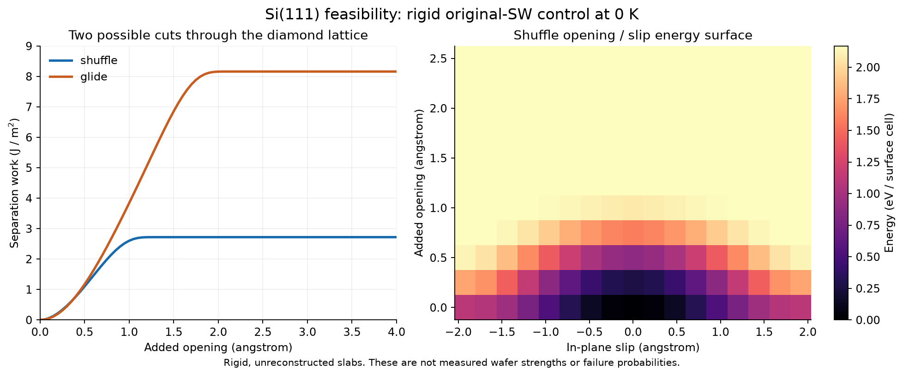

# 실리콘 웨이퍼 확장: 에너지·동역학 교체의 실현 가능성

2026-09-17 · 문헌 원문/현행 코드 감사 + 독립 정적 계산 + 기존 SG 커널 재사용 검사

**판정: 별도 실리콘 연구를 시작할 근거가 있다. 공통 확률 계산기를 유지하는 경로는
실제 수치 검사까지 통과했다. 실리콘 재료·동역학·웨이퍼 파손 확률은 아직 보정하지 않았다.**

이번 작업은 사용자의 “실리콘 웨이퍼로 바꾸는 것을 진지하게 탐색” 요청에 따른다.
Al 생산 에너지, registry, 이동도, Hz gate, UI 및 기존 연구 결과를 변경하지 않았다.
아래의 권장 사항과 아직 실행하지 않은 연구를 완료 결과와 구분한다.

## 1. 핵심 결론

1. **에너지·동역학을 바꾸고 확률 해석기를 재사용한다는 발상은 타당하다.**
   Si(111) 원자 계면의 에너지 표를 실제로 만들고 현행 SG 커널에 넣었다.
   질량 보존, Gibbs 정상상태, 비음수 전이율, 암시 시간적분의 비음수성이 통과했다.
   이는 수치 커널의 재사용 확인이며 실제 Si 확률 과정의 유효성 검증은 아니다.
2. **새 Si 포텐셜을 처음부터 발명하는 것이 첫 작업일 필요는 없다.**
   공개된 GAP 모델을 기준 계산기로, screened bond-order 모델을 저비용 대조군으로
   사용할 구체적인 경로가 있다. 각 후보의 해당 결정면·변형·파괴 경로를 재검증해야 한다.
3. **가장 큰 물리적 쟁점은 상태 좌표다.** 평탄한 원자층 전체를 함께 벌리는 좌표와,
   이미 있는 균열 끝에서 일부 결합이 순차적으로 끊어지는 좌표는 다르다.
   전자의 에너지 표가 정확해도 후자의 전파 장벽·속도를 자동으로 주지는 않는다.
4. **첫 대상은 조건이 명확한 순수 단결정 Si의 기계적 cleavage로 잡는 것이 적절하다.**
   원자 기준계 → 알려진 결함의 균열 → 표면 처리와 지지가 알려진 굽힘 시편 순서다.
   피로·공정 환경·다층 패키지까지 한꺼번에 인증하려는 범위는 피한다.

이 결론은 “전체 프로그램을 다시 만들어야 한다”는 판단이 아니다. 필요한 변경을
재료 모듈, 응력 연결, 파손 사건 정의에 집중할 수 있다는 판단이다.

## 2. 실제로 무엇을 확인했는가

### 2.1 Si(111) 강체 계면 계산

[run_static_probe.py](run_static_probe.py)는 원본 Stillinger–Weber(SW)를 구현한
독립 연구 스크립트다. [LAMMPS 공식 식](https://docs.lammps.org/pair_sw.html)과
[공식 Si.sw](https://raw.githubusercontent.com/lammps/lammps/develop/potentials/Si.sw)를 사용했다.
식의 원 출처는 F. H. Stillinger와 T. A. Weber, *Computer simulation of local order
in condensed phases of silicon* (1985), [DOI](https://doi.org/10.1103/PhysRevB.31.5262)다.
기존 LJ/Bessel 모델에는 접속하지 않는다.

- 조건: 순수 Si, 0 K 정적 에너지, 강체 반결정, 원자 완화·표면 재구성 없음.
- 단위: 원자 위치 Å, 에너지 eV/표면 primitive cell, 분리 일 J/m².
- 평면 내에는 주기 경계, 법선 방향에는 유한 slab의 자유 표면을 둔다.
- 중앙 계면에서 위쪽만 이동시키고 같은 slab의 초기 에너지를 뺀다.
  바깥 자유 표면의 기여는 이 차이에서 상쇄된다. 두/세 원자 항을 모두 합산한다.
- 면적 반복 1/2/3, 법선 주기 2/3/4, 이미지 shell 2/3을 대조했다.
  이 유한 범위 SW 조건에서의 검사이며 무한 범위 에너지의 수렴 주장은 아니다.

Diamond cubic은 FCC Bravais lattice에 두 원자 basis를 둔 구조다. (111)은
bilayer 내부의 좁은 **glide** 절단과 bilayer 사이의 넓은 **shuffle** 절단을 구별한다.
이 구별 및 원자 완화에 따른 GSF 차이는 Y.-M. Juan와 E. Kaxiras의
[*Generalized Stacking Fault Energy Surfaces and Dislocation Properties of Silicon*
(1996)](https://arxiv.org/abs/mtrl-th/9604006)에서도 다룬다. 본 계산의 격자상수는
문헌 실험값을 넣은 것이 아니라 원본 SW의 평형 결합 길이에서 계산했다.

| 이번에 계산한 양 | shuffle | glide |
|---|---:|---:|
| 초기 인접 원자층 간격, Å | 2.351670 | 0.783890 |
| 표면 primitive cell 면적, Ų | 12.771803 | 12.771803 |
| 완전 분리 일, eV/cell | 2.168300 | 6.504900 |
| 완전 분리 일, J/m² | 2.720054 | 8.160163 |
| 국소 법선 곡률, eV/Ų | 10.313895 | 7.957751 |
| 국소 전단 곡률, eV/Ų | 1.271190 | 16.152995 |

계산한 격자상수는 5.430950 Å, 평면 내 full translation 주기는 3.840261 Å다.
층간격은 각각 `3 d111/4`, `d111/4`이고 `d111 = a_lat/sqrt(3)`다.
단순히 Al의 등간격 FCC 평면에 Si 상수만 넣으면 이 두 계면을 놓친다.

표의 분리 일은 **새 표면 두 개를 만드는 일**이다. 단면 surface energy와 비교할
때에는 같은 완화 조건에서 2로 나눠야 한다. Shuffle의 절반인 1.360027 J/m²는
Pastewka 외 (2013)의 Table II 원본 SW 값 1.36 J/m²와 표의 정밀도에서 일치한다.
이 일치는 파괴 역학 검증이나 실제 시편 강도 검증이 아니다.

Shuffle에서 평면을 수직으로만 벌리면 교차 결합의 방향은 유지된다. 원본 SW의
각도 항은 0을 유지하고, 이 조건에서는

```text
W_shuffle(delta, 0) = phi_SW(r0 + delta) - phi_SW(r0)
```

가 된다. 독립적인 닫힌 식과 slab 합산의 최대 차이는 **2.354e-14 eV/cell**이다.
단면 셀당 끊어지는 결합 수가 1개/3개라는 분리 극한도 검사했다.
각도 항의 tetrahedral dyadic 합으로 따로 유도한 shuffle Hessian과 중앙 차분의
최대 차이는 **1.473e-6 eV/Ų**다. 주기성 오차는 **1.421e-14 eV/cell**,
slab/면적/image 대조의 최대 차이는 **1.057e-13 eV/cell**이다.

원본 SW의 shuffle 강체 경로에서 이상 최대 견인력은 **36.239 GPa**로 계산된다.
이는 위의 강체·무결함 경로에서의 모델 값이다. 실제 Si의 강도, 실험 임계값,
균열 끝 파괴 인성 또는 보정 목표로 사용하지 않는다.



원자료: [static_probe_summary.json](static_probe_summary.json),
[rigid_cleavage.csv](rigid_cleavage.csv), [shuffle_energy_grid.csv](shuffle_energy_grid.csv).
그림의 11×17 에너지 표는 연결 검사용이며 물리적 확률 수렴을 인증하는 해상도가 아니다.

### 2.2 기존 확률 커널을 실제 재사용

[check_existing_sg.py](check_existing_sg.py)가 위 Si 에너지 표를 현행
`solver_v1.probability_pde_2d._sg_generator_2d`와 `_implicit_step_2d`에 전달했다.
해당 생산 파일은 수정하지 않았다. 에너지 배열을 직접 받는 커널이어서 가능한 검사다.

검사 조건은 임의 mobility 1, 0.05, 수치적 kT=0.02 eV, 인위적인 고정 reflecting box,
dt=0.005의 20회 backward-Euler 적분이다. **Si 이동도·온도 의존 자유에너지·실제 시간의
보정이 아니다.** 원자 이완을 적분해 얻은 PMF도 아니다. 흡수 경계는 사용하지 않았다.

| 검사 | 실제 결과 |
|---|---:|
| 생성자 열 합 최대 절댓값 | 1.560e-15 |
| 비대각 전이율 | 모두 비음수 |
| Gibbs 정상상태 scaled residual | 4.121e-20 |
| 20회 적분의 최대 질량 오차 | 1.110e-15 |
| 음수 질량 보정 | 0 |

이는 **재료 에너지 교체 후에도 기존 확률 보존 수치 구조를 유지할 수 있다**는 직접
증거다. Si 파손 확률, 흡수 사건, wafer 수명 또는 physical Hz를 계산한 것은 아니다.
사용한 에너지 표와 기존 커널의 SHA-256은 [sg_reuse_summary.json](sg_reuse_summary.json)에 있다.

## 3. 어떤 에너지 모델을 우선 검토할 것인가

| 후보 | 확인한 근거 | 이번 판단 |
|---|---|---|
| 원본 SW / 일반 Tersoff | 공유결합 방향성을 표현하고 구현·자료가 풍부함. 파괴 장벽·전파에 알려진 문제가 있음 | 기하학·단위·코드 대조군 |
| Screened Tersoff 계열 | 원래 짧은 cutoff의 문제를 screening으로 개선. 논문에 cohesive traction와 정적 crack-tip 검사가 있음 | 저비용 대조 후보 |
| GAP Si 2018 | DFT 기반 모델, 균열 계산 사례, 모델 및 학습 자료 공개 | 우선 기준 계산기 후보 |
| 별도 DFT / QM-MM | 선택한 균열 및 계면 경로의 기준 에너지·장벽을 계산 가능 | 소수 핵심 경로의 독립 검증 |

### 3.1 원본 SW나 Tersoff 이름만으로 채택할 수 없는 이유

A. Mattoni, M. Ippolito, L. Colombo의 *Atomistic modeling of brittleness in covalent
materials* (2007)는 일부 단거리 포텐셜이 결합 파단 힘을 과대평가하는 문제를 분석한다.
이 논문의 진단을 모든 현대 포텐셜에 대한 불가능성 증명으로 확대하지 않는다.
[원 논문](https://doi.org/10.1103/PhysRevB.76.224103)

L. Pastewka, A. Klemenz, P. Gumbsch, M. Moseler의 *Screened empirical bond-order
potentials for Si-C* (2013)는 screening을 도입한 후보를 cohesive traction 및
Mode I crack-tip 경로에서 검사한다. **최대 traction이 맞아도 표면 에너지의 오차가
남을 수 있음**을 본문에서 확인했다. 값 하나만으로 후보를 고르지 않는 이유다.
[논문](https://doi.org/10.1103/PhysRevB.87.205410),
[공개 원문](https://arxiv.org/abs/1301.2142),
[구현 저장소](https://github.com/Atomistica/atomistica)

### 3.2 GAP Si는 실제 출발점이 될 수 있다

A. P. Bartók, J. Kermode, N. Bernstein, G. Csányi의 *Machine Learning a General-Purpose
Interatomic Potential for Silicon* (2018), Sec. III F에는 (111)[1-10] cleavage의
23,496원자, 300 K MD와 준정적 완화 결과가 있다. 균열 끝 구조 17개를 학습 자료에
포함한 뒤 bond breaking/rotation의 경쟁을 재현했다. 따라서 이 결과를 균열 구조를
전혀 보지 않은 완전한 제외 검증으로 소개하면 안 된다. 해당 경로의 성공을 모든
결정면·결함·환경으로 일반화할 수도 없다.
[원 논문](https://doi.org/10.1103/PhysRevX.8.041048)

공개 모델의 식별자는 `GAP_2017_6_17_60_4_3_56_165`다. Cambridge 저장소에서
모델과 원래 DFT 학습 자료가 들어 있는 `Si_PRX_GAP.zip`의 공개를 확인했다.
이번에는 **논문 원문을 확보·검토했으며 GAP 모델 자체의 실행은 하지 않았다.**
[데이터, DOI 10.17863/CAM.65004](https://doi.org/10.17863/CAM.65004),
[QUIP 구현](https://github.com/libAtoms/QUIP)

## 4. 가장 중요한 물리적 선택: 무엇이 확률적으로 움직이는가

### 4.1 평탄한 계면의 2차원 에너지는 만들 수 있다

이번 강체 계산처럼 `q=(delta,s)`를 지정하면 Si 에너지 표를 얻을 수 있다.
실제 원자 완화를 허용할 경우 최소한 다음 셋을 구별한다.

```text
W_rigid(q) = U(R_rigid(q)) - U(reference)
W_min(q)   = min_{R: Q(R)=q} U(R) - U(reference)
F(q,T)     = -kBT log [Z_constrained(q,T)/Z_reference]
```

세 번째는 고정한 좌표 측도에서 정의한 PMF다. 일반 비선형 collective coordinate라면
측도/Jacobian 및 constraint 보정을 포함한다. 최소 에너지 표는 finite-T 자유에너지와
같지 않다. 여러 재구성 branch가 있으면 최저 branch를 점마다 골라 붙이는 것만으로
전이 장벽과 동역학이 결정되지 않는다.

평탄한 기준 계면, 작은 주변 변형, 주어진 견인력 조건에서는 대응하는 work를

```text
G(q,t) = F_Si(q,T) - A0 [Tn(t) delta + tau1(t) u1 + tau2(t) u2]
Tn     = n^T sigma n
tau_i  = m_i^T sigma n
```

로 구성할 수 있다. 이 식의 `A0`는 에너지를 정의한 **원자적 기준 계면 면적**이다.
FEM 삼각형 면적이나 통계적 상관 면적 Ac를 넣지 않는다. 계면을 이동할 때의 외부
탄성 에너지나 하중 장치의 일을 이미 PMF에 포함했다면 work를 중복으로 빼지 않는다.

이번 단위에서 `MPa × Å² × Å`를 eV로 바꾸는 계수는 `6.241509074e-6`이다.
계면에 두 전단 방향이 필요하면 `q=(delta,u1,u2)`가 된다. 특정 대칭 경로로 하나를
고정/축약하는 근거가 있을 때 2D를 유지한다.

### 4.2 실제 균열에서는 전체 원자층의 동시 이동이 병목이 될 수 있다

J. R. Kermode 외의 *Low Speed Crack Propagation via Kink Formation and Advance on
the Silicon (110) Cleavage Plane* (2015)는 앞선 전체 crack front의 동시 전진과
국소 kink의 생성·이동을 구별한다. 전자의 장벽은 front 길이에 비례할 수 있고,
후자는 국소 전이에 의해 다른 장벽을 갖는다. DFT 기반 장벽 계산과 약 100 m/s 영역의
실험을 비교한 연구다. 이를 우리 2좌표의 mobility가 이미 알려졌다는 뜻으로 읽지 않는다.
[논문](https://doi.org/10.1103/PhysRevLett.115.135501),
[원문](https://wrap.warwick.ac.uk/id/eprint/72523/7/WRAP_Kermode_2015.pdf)

**따라서 실용적인 다음 기준계는 알려진 초기 균열을 둔 원자 영역이다.**
첫 미파단 결합의 opening, 근처 재구성 좌표, crack front의 국소 전진 등을 후보로
비교한다. 처음부터 모든 자유도를 늘리는 대신 다음 순서로 좌표를 선택한다.

1. 구속 완화와 전이 경로에서 현재 q가 minimum/saddle/advanced state를 구별하는지 검사.
2. 같은 q에서도 빠진 원자 좌표에 따라 전이 결과가 크게 달라지는지 검사.
3. 문제가 있으면 추가 재구성 좌표 또는 이산 branch 상태를 도입.
4. 빠른 좌표가 충분히 이완될 때 PMF로 적분하고, 그에 대응하는 mobility를 별도로 측정.

이산 상태가 더 적합하면 상태별 확률의 master equation도 결정론적으로 풀 수 있다.
확률 해석이라는 연구 원칙은 유지된다. 다만 기존 2D SG와 같은 생성자인지는 별도다.

### 4.3 물리 시간은 새로 검증한다

후보 에너지로 원자 MD를 돌릴 수 있다는 사실은 coarse-grained overdamped M을
정해주지 않는다. 선택한 q의 조건부 자유에너지, 상관/외력 응답, 재교차를 포함한
전이율, 온도/하중 변화에 따른 재현성을 함께 확인한다.

- 충분한 시간척도 분리가 있으면 현재 형태의 Smoluchowski 방정식을 적용할 수 있다.
- 관성·기억효과가 크면 더 많은 좌표, 속도 변수 또는 다른 생성자가 필요할 수 있다.
- constant diagonal M을 사용할 수 있는지도 검사 대상이다.
- 영역의 원자 수를 바꾸면 에너지·열항·mobility의 정규화를 함께 바꾼다.
- 원자 질량의 진동 시간을 현재 모델 시간에 직접 대입하지 않는다.

일반 통계역학 기반 균열 성장 모델도 이미 존재한다. M. R. Buche와 S. J. Grutzik,
*Statistical mechanical model for crack growth* (2024)는 관련 비교 대상이다.
따라서 “확률로 파괴를 계산한다” 자체를 새로움으로 주장할 수 없다. 특정 Si 좌표에서
에너지·동역학·실험을 같은 의미로 연결하고 검증하는 것이 이번 경로의 연구 과제다.
[논문](https://doi.org/10.1103/PhysRevE.109.015001)

## 5. 현행 코드에서의 변경 범위

| 층 | 현행 확인 | Si에 필요한 범위 |
|---|---|---|
| SG flux/보존 적분 | 에너지 배열을 직접 받음 | 동일 generator 가정이면 재사용; 이번에 실제 확인 |
| 에너지 registry | 에너지 선택과 공통 kinetics/strain/opening을 분리하지 못함 | Si model metadata와 재료별 contracts 필요 |
| 하중 연결 | `G=W-f[(a-a0)+chi*s]`, `chi=0.2` 경로 | 실제 계면 법선/전단의 conjugate work |
| 초기 상태·파손 경계 | `opening_saddle_batch`, `_fc_grid`, `_opening_table_ready`에 의존 | Si 상태와 coupled transition에 맞는 boundary/초기 ensemble |
| 거시 탄성 | E, nu의 등방 6×6 행렬 | 결정방향으로 회전한 Si 탄성 텐서 |
| 국소 입력 | 전체 FEM 응력에서 `e^T sigma e`만 전달 | 필요한 `Tn,tau1,tau2`와 상태 좌표의 대응 |
| 공간 샘플 선택 | 축응력 이력 거리로 대표점 선택 | 다성분 견인력 이력에 맞는 선택/오차 진단 |
| 후처리 | 원자 opening, survivor strain, 체적 상관 가정 | 사건 의미와 표면/가장자리/체적 통계를 각각 정의 |
| UI/형상/힘·토크 합산 | 재료와 대체로 독립 | 활용 가능; 지지·접촉 문제는 경계조건 기능 추가 |

코드 근거: [energy registry](../../solver_v1/energy_model_registry.py),
[PDE](../../solver_v1/probability_pde_2d.py), [하중 에너지](../../solver_v1/model.py),
[solid mechanics](../../app/solid_mechanics.py), [체적 위험도](../../app/volume_risk.py).

### 방향성은 수정 범위가 명확하다

M. A. Hopcroft, W. D. Nix, T. W. Kenny, *What is the Young's Modulus of Silicon?*
(2010)의 실온 참조 C11=165.7, C12=63.9, C44=79.6 GPa로 직접 역행렬을 계산했다.
E[100]=130.132, E[110]=169.101, E[111]=187.853 GPa다.
이 실온 실험 참조를 앞의 0 K SW 결과에 섞어 하나의 보정으로 만들지 않았다.
[논문](https://doi.org/10.1109/JMEMS.2009.2039697)

같은 단위 축응력에서도 (111) 계면의 견인력은 달라진다.

| 하중축 | Tn/sigma | tau1/sigma | tau2/sigma |
|---|---:|---:|---:|
| [111] | 1 | 0 | 0 |
| [001] | 1/3 | 0 | -sqrt(2)/3 |

여기서 `m1=[1,-1,0]/sqrt(2)`, `m2=[1,1,-2]/sqrt(6)`다.
실제 파괴 경로의 하중을 하나의 고정 chi 비율로 표현할 수 없음을 보여준다.
FEM의 `B^T C B` 구조는 일반 탄성 텐서에도 쓸 수 있다. 전체 FEM을 새로 만들
필요 없이 재료 행렬·방향 변환·검증을 확장하는 범위다.

## 6. 웨이퍼 실험과 연결하는 구체적인 순서

### 권장 첫 범위

순수 단결정 Si, 결정방향 명시, 표면 상태 명시, 건조 불활성 기준 환경,
온도 일정, 알려진 초기 결함/균열, 단조 Mode I 하중으로 시작한다.
이는 연구 조건의 제안이며 실제 사용자 웨이퍼가 이 조건이라는 추정은 아니다.
(111) 원자 기준계와 (001) 웨이퍼는 서로 다른 orientation 설정이다.
웨이퍼 모델에서는 (111)/(110) 등의 후보 균열면을 실제 하중에 맞춰 구별한다.

| 단계 | 실행할 비교 | 통과해야 다음으로 갈 수 있는 근거 |
|---|---|---|
| A. 원자 재료 | GAP/Screened BOP의 bulk, 각 절단의 완화·비완화 에너지, traction, Hessian | 동일 좌표·조건의 DFT 기준과 numerical refinement |
| B. 균열 좌표 | 알려진 균열 끝의 경로, branch, 전이 장벽 | 선택한 q가 전이를 구별하고 빠진 상태가 예측을 지배하지 않음 |
| C. 동역학 | 조건부 PMF, 약한 conjugate response, first-passage/재교차 | 같은 q에서 시간척도·온도·하중·크기 대조를 재현 |
| D. 시편 역학 | 방향성 탄성, 실제 지지/접촉, force-displacement | 실험 곡선 및 메시/요소 수렴 |
| E. 파손 분포 | 초기 결함, 파손 위치, 하중 분포와 미파손 관측 | fitting에 쓰지 않은 시편/표면처리 조건에서 예측 확인 |

초기 실험은 절단한 Si strip의 3점 굽힘이면 단면·결함 방향을 지정하기 쉽다.
다만 가장자리 가공 결함이 결과에 들어갈 수 있다. 표면 영향의 분리를 목표로 하면
ball-on-ring/ring-on-ring 검사를 검토한다.

M. Y. Tsai, P. J. Hsieh, T. C. Kuo의 *Correction factors to biaxial bending strength
of thin silicon die in the ball-on-ring test by considering geometric nonlinearity
and material anisotropy* (2023)는 10×10 mm, 두께 57–297 μm 시편을 다룬다.
접촉·기하 비선형으로 최대 응력 위치가 바뀔 수 있어 단순 선형식의 강도 환산에
오차가 생긴다. 본문 조건과 데이터를 차후 역학 대조에 사용할 수 있으나 현재
자유 물체 traction FEM만으로 이 실험을 재현했다고 할 수 없다.
[실험·해석 원문](https://doi.org/10.1093/jom/ufad026)

얇은 판에서 작은 변형률과 작은 처짐은 같은 가정이 아니다. 기존 1차 사면체도
충분한 해상도와 검증으로 사용할 수 있지만, 매우 얇은 웨이퍼는 두께 방향 분할의
비용과 굽힘 정확도를 검토해야 한다. shell/plate 또는 고차 요소의 필요성은
기준 실험의 처짐·응력 수렴으로 판단한다. “실리콘이면 무조건 새 mesher”는 아니다.

하중 제어 조건도 중요하다. 단순 Euler–Bernoulli 3점 굽힘의 같은 폭/스팬에서는
고정 힘일 때 최대 응력은 `1/t²`에 비례하지만, 고정 중앙 처짐에서는 `t`에 비례한다.
따라서 두께만 줄였다는 정보로 응력 증감을 결정하지 않는다.

### 파손 확률의 공간 합산

상관 가정을 확인한 경우의 후보 표현은

```text
-log S = integral_surface H_A dA
       + integral_edge    H_L dL
       + integral_bulk    H_V dV
```

이다. H는 여기서 누적 hazard의 면적/길이/체적 밀도이며 시간당 rate와 구별한다.
이 합은 서로 중복되지 않는 독립 위험 원천이라는 가정 아래의 제안이다. 표면과
edge 원천을 두 번 세지 않으며, 상관이 중요하면 공동 확률을 모델링해야 한다.
메시 체적을 물리적 상관 체적으로 간주하지 않는다. 기존 체적 위험도를 그대로
복제해 웨이퍼 표면 결함의 위험도로 부르지 않는다.

### 환경 피로는 후속 범위로 남긴다

H. Izumi, A. Udhayakumar, S. Kamiya, *Hydrogen enhanced mechanical fatigue in single
crystal silicon* (2015)는 wafer-cut 시편의 환경별 cyclic 결과를 비교한다. 본문의
380±25 μm 시편, 정적 강도 대비 약 90% 진폭 조건에서 공기/수소와 건조 질소/산소의
차이가 있다. 이 조건을 전체 Si 또는 모든 산소 환경으로 일반화하지 않는다.
[원 논문](https://doi.org/10.1016/j.matlet.2014.11.027)

A. Gleizer, G. Peralta, J. R. Kermode, A. De Vita, D. Sherman의 *Dissociative
Chemisorption of O2 Inducing Stress Corrosion Cracking in Silicon Crystals* (2014)는
다른 cleavage 조건에서 환경과 화학 반응의 영향을 다룬다. 순수 Si 포텐셜만으로
Si/O/H 반응까지 계산했다고 할 수 없다. 수치 상수 하나를 환경별로 바꿔 메커니즘을
대체하는 방법은 이번 권장안에 포함하지 않는다.
[원 논문](https://doi.org/10.1103/PhysRevLett.112.115501)

## 7. 완료·미완료 및 재현

**완료:** 주요 논문 본문 검토, 현행 생성 경로 확인, 해시 고정 SW 데이터 확보,
강체 계면/2D 에너지 표 계산, 독립 해석식·Hessian·기하 대조,
기존 SG 커널 재사용 검사, 그림 생성 및 직접 시각 확인.
세 스크립트의 실제 실행/py_compile, git diff --check, source/table/kernel 해시,
문서의 12개 로컬 링크와 새 소스의 공백 검사도 통과했다.

**미실행:** GAP/Screened BOP 계산, DFT 추가 실행, 원자 완화/PMF,
Si MD·kinetic fit, Si 흡수 경계·전체 PDE, 웨이퍼 굽힘·접촉 계산, 실험 보정.
이번 탐색을 물리시간 보정·Si 모델 채택·산업 파손 예측의 완료로 보고하지 않는다.

저장소 루트에서 아래 명령을 각각 실행한다.

```powershell
python results/silicon_wafer_feasibility/run_static_probe.py
python results/silicon_wafer_feasibility/check_existing_sg.py
python results/silicon_wafer_feasibility/plot_static_probe.py
```

실행에는 NumPy/SciPy 및 그림용 Matplotlib가 필요하다. 원본 SW 파일은 함께 보관하며
SHA-256을 검사한다. 파일이 없으면 공식 출처에서 받아 같은 해시인지 검사한다.
이 세 스크립트는 Al 생산 코드를 편집하거나 UI를 실행하지 않는다.

**권장 다음 연구:** 공개 GAP/Screened BOP를 같은 Si 기준계에서 대조하고,
평탄한 계면의 W뿐 아니라 알려진 균열 끝의 전이 장벽을 추출한다. 그 결과로
기존 두 좌표를 유지할지 결정한다. 확률 계산기를 새로 만드는 것이 첫 병목은 아니다.
