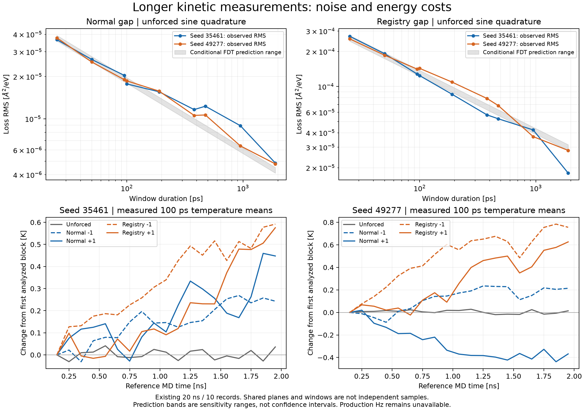

# Kinetic duration, noise and heating audit

## Result and scope

The completed v31 campaign contains ten reference Al99 MD records, each 2 ns.
This audit reuses those **existing 20 ns**; it does not run new MD. Raw trajectory
SHA256, actual initialized restart bytes, signed-force pairing, sampling, NVE
metadata and earlier analysis inputs are checked before any report is written.

Longer records reduce the observed unforced quadrature RMS over the inspected
25–1900 ps windows, but do not establish an 80 ns stationary measurement.
The previous conditional duration estimates also imply non-negligible energy
input to this 864-atom NVE crystal:

| Axis | Previous duration per record | Expected input work | Conditional temperature rise | Previous wall time per record |
|---|---:|---:|---:|---:|
| Normal | 80.406 ns | 2.40818 eV | 10.794 K | 39.816 h |
| Registry / direct110 | 31.161 ns | 1.67698 eV | 7.517 K | 15.431 h |

Temperature rises use the **assumed harmonic heat capacity**
`Cv=(3*864-3)*kB=0.2231027582 eV/K`, with fixed center of mass. This is not a
measured Al heat capacity, an actual long-record temperature measurement, or a
claim that all finite-record work is heat. The estimate assumes unchanged
linear loss, approximate equilibration of the secular work, and constant Cv.
Temperature-dependent damping or anharmonicity can invalidate the extrapolation.

No production energy, parameter file, mobility, thermal term or physical-time
gate is changed. The latest signed normal loss remains unresolved. This result
does not calibrate production Hz, local-cell PMF kinetics or Al material response.

## Sine-quadrature noise: the factor of two matters

Use reference units `q [angstrom]`, `F [eV/angstrom]`, `t [ps]`, and the existing
`exp(+i*omega*t)` convention:

    omega = 2*pi*f
    F(t) = F0*cos(omega*t)
    q_response(t) = F0*[chi_R*cos(omega*t) + L*sin(omega*t)]
    L = -Im(chi)
    L_hat = 2/(F0*T_record) * integral q(t)*sin(omega*t) dt

For stationary zero-mean noise eta with covariance C, the exact finite-interval
variance is

    Var(L_hat) = 4/(F0^2*T_record^2) *
        integral integral C(t-t')*sin(omega*t)*sin(omega*t') dt dt'.

For sampled data and trapezoidal weights w, this is `w^T C w`. The implementation
contracts a supplied stationary covariance by FFT and tests it against an
independent dense Toeplitz matrix. It does not estimate a reliable long-lag
covariance from these two MD initializations or repair negative contractions.

Define the TWO-SIDED spectrum

    S_q(omega) = integral_(-infinity)^infinity C(t)*exp(-i*omega*t) dt.

In classical thermal equilibrium the fluctuation-dissipation relation gives
`S_q(omega)=2*kBT*L/omega`. This is the equilibrium linear-response assumption;
finite NVE records and finite-band spectrum estimates require additional checks.
See R. Kubo, *The fluctuation-dissipation theorem*, Reports on Progress in
Physics 29, 255–284 (1966), [DOI: 10.1088/0034-4885/29/1/306](https://doi.org/10.1088/0034-4885/29/1/306),
[paper](https://courses.physics.ucsd.edu/2020/Fall/physics210b/Kubo_FDT.pdf).

The following planning formulas are derived here from that relation and the
finite-window estimator. If the record is long relative to relevant covariance
decay and window leakage is negligible,

    Var(L_hat) ~ 2*S_q(omega)/(F0^2*T_record)
               = 4*kBT*L/(omega*F0^2*T_record)
    SNR_std^2 = L^2/Var(L_hat)
              = omega*F0^2*L*T_record/(4*kBT)
    expected_work = omega*F0^2*L*T_record/2
                  = 2*kBT*SNR_std^2.

`SNR_std` uses a predicted standard deviation. It is not the earlier ratio to
the largest observed null, a confidence level, or an experimentally achieved SNR.
Using a one-sided PSD in these formulas without changing normalization would
give an incorrect factor. No sign is changed to obtain a positive measured drag;
planning uses the prior unforced FDT proxy only.

For fixed SNR and loss, halving force requires four times the duration and leaves
the predicted cumulative work unchanged. Reducing force alone therefore does not
remove heating at fixed precision in this model. Independent shorter experiments
could distribute the total work across fresh states, but the required independence,
transient control and cost would need a newly declared protocol and measurement.
Shared restarts and signed branches are not automatically independent records.

### Independent analytic test

For the explicitly specified Ornstein–Uhlenbeck covariance
`C(t)=C0*exp(-lambda*abs(t))`, a complete-cycle interval beginning at phase zero
has the exact variance

    D = lambda^2 + omega^2
    Var(L_hat) = 4*C0*lambda/(F0^2*T_record*D)
              + 8*C0*omega^2*(1-exp(-lambda*T_record))/(F0^2*T_record^2*D^2).

The second term is a finite-window correction, not extra friction. Numerical
quadrature converges to this expression at second order under sampling refinement.
The first term matches the two-sided FDT long-record formula. This is an analytic
test of the estimator and normalization, not a declaration that Al99 is an OU
process. The general sampled variance implementation retains arbitrary phase.

## What the existing unforced records show

Each seed uses the entire previously accepted interval [100, 2000] ps at 25 fs
sampling. The fixed partition list is `(1,2,4,5,10,19,20,38,76)`, producing
1900, 950, 475, 380, 190, 100, 95, 50 and 25 ps windows. Every window spans
complete drive cycles; all data in the interval are retained at every duration.
No favorable segment, plane or sign is selected. Absolute force phase is preserved.

The report stores 4200 signed plane/window observations and 36 RMS summaries.
For each seed, axis and duration, RMS is over the available windows and six
equivalent planes. It is an observed magnitude, not a standard error computed
with `sqrt(number of windows * number of planes)`. All duration partitions reuse
the same trajectory. Neighbouring trapezoidal windows share an endpoint.

The quantity `RMS(L_hat)*sqrt(T_record)` would be roughly constant in the
asymptotic stationary-noise approximation. Across the entire inspected range:

| Seed | Axis | Maximum / minimum of RMS times sqrt(duration) |
|---|---|---:|
| 35461 | Normal | 1.55424 |
| 49277 | Normal | 1.29379 |
| 35461 | Registry | 1.72604 |
| 49277 | Registry | 1.34752 |

These finite-sample variations do not statistically reject or establish the
inverse-square-root law. No fit to overlapping duration points is presented as
an independent-sample exponent confidence interval. The full-record RMS divided
by the conditional FDT standard deviation ranges from 1.061 to 1.179 for normal
and 0.570 to 1.001 for registry, retaining every prior band/taper/seed choice.
These predictions and measured nulls reuse the same unforced records, so their
comparison is a consistency diagnostic, not independent validation of FDT.

Periodic gaps obey `sum_planes q=0`. Consequently the signed mean of plane
lock-ins cancels to numerical precision despite nonzero individual-plane noise.
Averaging all six signed plane gaps would erase the coordinate; it cannot be
claimed as a six-sample reduction of the uncertainty of the driven gap.

## Actual temperature and work observations

Nineteen consecutive 100 ps blocks cover each analyzed record. The following
values are measured means in the last block minus the first analyzed block,
namely [1900,2000] minus [100,200] ps. They are not instantaneous endpoint
temperature differences or the older [0,100] transient comparison.

| Seed | Unforced | Normal -F | Normal +F | Registry -F | Registry +F |
|---|---:|---:|---:|---:|---:|
| 35461 | +0.03584 K | +0.24305 K | +0.44763 K | +0.59193 K | +0.57548 K |
| 49277 | +0.01403 K | +0.21442 K | **-0.36849 K** | +0.75583 K | +0.62609 K |

Mean unforced temperatures remain 293.10099 and 300.16425 K, respectively.
Negative finite-record work/cooling is retained. It is consistent with why a
positive weak normal loss cannot yet be declared from the signed noisy records.
The finite-time trends are descriptive; they are not proven constant heating
rates at 80 ns. Large between-initialization temperature differences also remain
explicit rather than being relabeled exactly 300 K.

The raw LAMMPS temperature comes from kinetic energy and includes coherent
velocity contributions unless a suitable bias is explicitly removed; the
reference campaign did not add such a removal. The usual translational degrees
of freedom are subtracted. See the official [compute temp documentation](https://docs.lammps.org/compute_temp.html).
Here total internal energy excludes the applied variable-force potential, so
`Delta U - integral F*dq` measures the work/energy accounting residual, not
physical dissipation. This matches the recorded commands and the default energy
behavior of [fix addforce](https://docs.lammps.org/fix_addforce.html).

## Two planning criteria remain distinct

The standard-deviation formula with desired `SNR_std=3` gives conditional
single-record durations of 13.245–15.417 ns normal and 6.568–8.652 ns registry
over all previous full-record FDT choices. These shorter values do not supersede
the previous observed-maximum criterion. The expected work at this idealized
standard-deviation target is `18*kBT`, about 0.455–0.466 eV for the measured
unforced temperatures. The predicted duration still assumes equilibrium,
stationarity and long-window spectral behavior; it is not a guarantee.

The previous **maximum-null** criterion was

    T_required = 1900 ps * (3*N_observed/L_predicted)^2.

Its 80.406/31.161 ns durations are reproduced from the independently computed
full-record null and the retained FDT CSV before the heating estimate is accepted.
The first table uses these durations. Their distinction from both `SNR_std` and
the older v28 spectral planning convention is preserved.

If the ten-record structure were repeated at these durations, assigning each
null the longer normal duration and retaining two initializations and both force
signs, the total would be

    2 * [max(T_normal,T_registry) + 2*T_normal + 2*T_registry]
      = 607.084 ns.

The sum of record wall-time estimates is 300.619 hours using the prior measured
median seconds/ps. This is summed execution cost, **not a calendar runtime**:
those rates came from concurrent, hardware-dependent measurements. Equilibration,
new I/O and changed contention would add or change cost. No campaign is scheduled.

## Completion, remaining gates, reproduction

Completed: raw-source binding, duration-partition noise calculation, exact
variance-normalization tests, measured temperature/work comparison, conditional
cost/heat calculation and CSV/figure exports. Independent numerical checks do not
turn this reanalysis into new physical evidence for a finite production mobility.

Still required before Hz: resolved low-frequency loss and uncertainty, a valid
coarse-time/local-coordinate PMF and thermal mapping, and an accepted Al energy
surface. A suitable next experimental design would compare separately initialized
shorter signed/null records at controlled measured temperatures and assess
between-record variation before extending the total sampling budget. Switching
on a thermostat would itself require a dynamical-bias control. This audit does not
select a thermostat, invent a mobility or launch a large MD campaign.

Reproduction (fresh output directories are mandatory):

    python -m solver_v1.run_kinetic_duration_audit \
      --study <existing v31 raw campaign> \
      --previous results/weak_replica_v31 \
      --work-audit results/work_phase_audit --out <fresh report>
    python -m solver_v1.plot_kinetic_duration_audit --report <fresh report>
    python -m pytest solver_v1/test_kinetic_duration_audit.py -q

The six numerical CSVs are deterministic; elapsed time and plot metadata are
not used as physical results. Full regression and Git completion are recorded
in `CURRENT_WORK_HANDOFF.md`, rather than presumed here.
