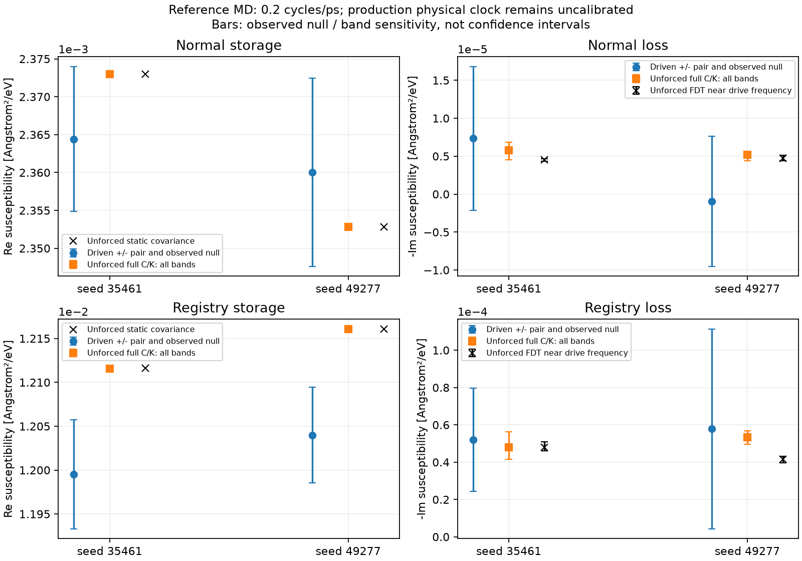

# v31: weak kinetic measurement, generator mapping, material compatibility

Three distinct work packages; none changes production LJ/Bessel/PDE or its
physical-time gate. A computed number is not automatically a calibrated Al
mobility, a local-cell law, actual yield or fatigue.

## 1. Predeclared new weak-forcing experiment

Two fresh N6/864-atom crystals use fixed velocity initialization seeds35461
and49277; each is equilibrated100 ps with the existing300 K NVT protocol
before NVE measurements. This is atomistic reference MD, not Monte Carlo
counting of fatigue trajectories. Independent initial velocity draws do not
alone prove statistical independence or exactly equal microcanonical T.
Actual temperature per record must be retained, not relabeled exactly300 K.

For each initialized state: one unforced2000 ps record and normal/direct110
signed-force pairs, each2000 ps. Total10 records20 ns, excluding equilibration.
Frequency .2 cycles/ps; weak force1F_sigma using the unchanged v29 planning
scales. dt1.25 fs, saved25 fs, first100 ps excluded; full/half fits preserved.
v30 native internal-step work is ON for forced records. No thermostat is
added during forced runs. No strength, mobility or energy is tuned.

This bounded first stage is a SCREEN, not a pre-certified precision target:
v28's linear/stationary planning at1RMS predicted SNR3 would need about13.2 ns
normal/7.3 ns slip for a single record. Combining shorter independently
initialized records may improve precision, but no sqrt(N) benefit is claimed
without examining observed between-initialization variation and heating.
The conservative null envelope is NOT a confidence interval. We keep signs,
nonlinear parity harmonics, halves and raw work residuals even if they fail.
The protocol and then initialized-restart hashes precede measurement.

## 2. Full plane generator versus scalar eliminated response

For N periodic planes, sum_l q_l=0. Let B be a real orthonormal basis for
this zero-sum subspace (Helmert columns times the3-coordinate identity),
q=B z, B^T B=I, BB^T=(I-11^T/N) tensor I3. The full independent coordinate
dimension is3(N-1), not3N. Inverting the redundant3N covariance is invalid.

For matched full-coordinate equilibrium covariance C and its integral K:

    H=kBT C^-1,
    Gamma=kBT C^-1 K C^-1,
    M=C K^-1 C/(kBT).

The measured finite-band K=Re<S(omega)>/2 is only a proxy, NOT a proven
zero-frequency limit. For the marginal coordinate q0=v^T z:

    M_scalar=(v^T C v)^2/[kBT(v^T K v)],
    M_projected=v^T M v.

These generally differ because scalar elimination includes memory from
other coordinates. Neither alone licenses a diagonal two-coordinate PDE.
The actual N6/N12 records test this distinction, without pseudoinverse
regularization manufacturing a finite mobility from unresolved modes.

There is also an exact inequality, not a fitted trend. Cauchy-Schwarz for
a=K^(-1/2)Cv and b=K^(1/2)v gives

    (v^T C v)^2 <= (v^T C K^-1 C v)(v^T K v),
    M_scalar <= M_projected.

Equality requires Cv proportional to Kv along this projection. A persistent
difference therefore cannot be repaired by merely choosing the scalar value
as the diagonal full-system mobility. State elimination and energy scaling
are distinct operations. This algebra holds for the supplied SPD finite-band
matrices; calling them actual zero-frequency dynamics still needs validation.

The distinction can be checked without MD sampling assumptions. For an exact
harmonic full Markov system and conjugate forcing, with exp(+i omega t),

    chi_v(omega)=v^T(i omega I+MH)^(-1)Mv,
    chi_v(0)=v^T C v/(kBT),
    -Im chi_v(omega)/omega -> v^T K v/(kBT),
    i omega chi_v(omega) -> v^T M v  (omega -> infinity).

Matching the static and first low-frequency terms of a scalar response gives
M_scalar above, whereas its high-frequency coefficient would need M_projected.
The analytic regression shows both limits and a finite-frequency mismatch.
Thus eliminating coupled coordinates generally generates memory even when the
full system is Markovian. Inertial MD adds further restrictions; this formula
does not assert that its high-frequency motion is actually overdamped.

Numerical inversion requires full numerical rank. Additionally the declared
linear algebra error budget is kappa(K)*gamma_d<=.01 (also for C), where
gamma_d=d*eps/(1-d*eps). This1% numerical budget is NOT a physical rare-event
floor, statistical confidence interval or a guarantee of sampling precision.
Rejected inverse values remain unavailable; raw C/K and reasons are saved.

Under a per-plane-atom energy normalization Np:

    Hbar=H/Np, Mbar=Np M, theta_bar=kBT/Np,
    Mbar Hbar=M H, theta_bar Mbar=kBT M.

Drift AND diffusion are unchanged only with BOTH transformations. Keeping
kBT unchanged while multiplying M by Np increases diffusion by Np. This is
not a temperature correction and does not establish equivalence to a local
atomic-cell PMF. Conditional projection, boundary conditions, independent
state-dependent PMF and kinetics remain required for production transfer.

## 3. Material compatibility before actual-strength claims

Use the unchanged per-atom LJ/Bessel/environment family with10 coefficients,
7 exact bulk/pristine-interface anchors and therefore3 free coefficient
directions at fixed radial shape. Source Al99 supplies matched0 K static
matrices; it is a reference potential, not experimental yield data.

The static source's0 K geometry and the MD4.065 Angstrom finite-temperature
box are separate conditions. No static Hessian is silently treated as the
finite-T collective PMF, and their targets are not mixed into one residual.

Four prescribed fit wavevectors and four excluded wavevectors are defined in
run_finite_q_compatibility_v31.points(). Full symmetric3x3 matrices use
features(H00,H11,H22,sqrt(2)H01,sqrt(2)H02,sqrt(2)H12). Source eV/Angstrom²
is converted to eV/L0² by(L0/Angstrom)². The component discrepancy scale
.05*||H_source||F is transparent, not experimental uncertainty.

For M(theta)c=y and E c=e, solve deterministic minimax LPs for finite-q only,
old115 inspected interface curvatures only, and their union. All previous
inspected jets are development data. The excluded q points are never used
in the optimization; this is a new partition, not a claim that the whole
source material is blind independent validation. Radius12/16 coefficient
differences and analytic tails are propagated with the returned coefficients.

The nullspace Jacobian is J D N, with N spanning null(E D) and D the declared
column normalization. Its SVD assesses the remaining identifiable directions.
The per-atom quartic invariant has no harmonic bulk column at the pristine
centrosymmetric state; harmonic finite-q data cannot identify that direction
by themselves. The existing full per-site environmental sums and Bessel
derivatives are retained. No extra stiffness, empirical yield or cutoff is
inserted to force agreement.

A bounded40-evaluation deterministic Powell follow-up varies only the
existing radial shapes inside inherited numerical search bounds. It may
terminate at its budget; that is not a converged/global material fit.
Positive-LJ/sign/anchor feasibility alone is not full spectral, interface,
core or actual-yield validity. A failed fixed-shape fit does not prove the
whole analytical family impossible. No candidate is automatically adopted.

## Intermediate static and generator checks

Fixed-shape joint minimax eta: original34.2548, wider22.6127, radial33.3359.
The original finite-q-only fit attains eta.8763 but excluded q error reaches
19.63% in full-matrix Frobenius norm. Interface and finite-q constraints must
be tested together. Their fixed-shape finite-q nullspace rank is2 of3.

The40-profile radial pilot attains18.5179; a separately saved160-profile
continuation attains13.151558 (2450.42 s). Both terminate at maxfev, not a
converged optimizer success. Full replay reproduces the best objective;
excluded-wavevector relative matrix error reaches2.227958 (222.8%). All eight
tested matrices have positive eigenvalues (minimum1.43449 eV/L0²), which is
NOT a full Brillouin-zone stability proof and does not repair target error.
The saturation shape reaches999063.74 near the declared numerical upper
bound1e6; this is not an independently measured material value.

Conditional on that radial shape, the joint normalized coefficient Jacobian
has three singular values1.01157,.246311,.0286860 (condition35.26).
This is conditional coefficient identifiability, not full nonlinear parameter
identifiability. eta must be<=1 to meet the declared discrepancy box;13.15
fails. No candidate is adopted and actual yield/fatigue remains unvalidated.
There is no reason to run a costly dislocation-core calculation with a trial
that already fails its necessary short-wave/interface material checks.

The first completed new2ns unforced initialization gives full/scalar mobility
ratios1.139–3.189 over the declared finite bands/windows. That is another
observed violation of a simple scalar/full identification, not a physical
local-cell mobility calibration. MD signs, second initialization and loss
analysis remain pending until all required records complete.

This section preserves intermediate results; the final campaign section and
CURRENT_WORK_HANDOFF take precedence for completion status.

## Fixed-shape conflict diagnosis after the 320-profile continuation

The additional deterministic continuation reaches eta=13.128092912988262.
It also ends at maxfev, not optimizer convergence. A full replay reproduces
the objective and gives maximum excluded-q matrix error2.228143653 (222.8%).
The conditional coefficient singular values are1.011602,.247320,.0296032.
The final saturation shape is999999.99865, essentially the declared search
bound. Neither this boundary value nor the optimizer budget is material data.

Seven separate LP ablations at this SAME fixed radial shape give:

| Target subset | eta | Strict positive LJ at returned optimum |
|---|---:|---|
| K-direction finite q | 1.61264 | yes |
| L-direction finite q | .012633 | no, closure boundary |
| both finite-q directions | 2.52949 | yes |
| inspected interface curvatures | 13.12809 | yes |
| interface + K | 13.12809 | yes |
| interface + L | 13.12809 | yes |
| joint | 13.12809 | yes |

These are diagnostic ablations, not alternate calibrations that may be adopted
by discarding inconvenient targets. The joint primal/dual gap is about3e-14.
Its nonzero target dual weights concentrate on four interface curvatures:

| Target | State(a,u1,u2), reduced | Source | Prediction | Absolute dual weight |
|---|---|---:|---:|---:|
| saddle_Hxx | (.849292,.371406,.214431) | −.186425 | .0583154 | .0267582 |
| v19_new_2_Hxx | (.934889,0,0) | .964298 | −.348511 | .2121004 |
| v19_power_new_4_Haa | (1.441116,0,0) | .983877 | −.328932 | .0350173 |
| v20_new_11_Haa | (1.023070,.443,.163) | 2.865426 | −.896332 | .7261241 |

Curvatures use eV/L0². Thus the obstruction at this shape is not merely a
long-wave modulus rescaling: selected interface curvature components disagree
in sign. A full saddle index still requires all Hessian eigenvalues; a single
Hxx or Haa component does not establish coupled saddle topology by itself.
The K-direction excluded q=(.625,.625,0) also has severe matrix disagreement,
while the L-direction excluded points are much closer. Analytic bulk tail
bound .0002595eV/L0² cannot account for matrix errors of many eV/L0².
The interface-only lower bound already equals the joint one. Finite-q data
provide a further material check but are not the active minimax bottleneck
at this shape. This certificate does NOT rule out the entire radial family.

The returned joint LP has **zero coefficient-bound duals**, not merely small
inactive positive coefficients. Write its scaled exact system E z=e,
observable residual r=J z-y, equality dual lambda, and signed error dual
w=dual_upper-dual_lower. The independent stationarity residual is1.94e-16:

    E^T lambda+J^T w=0,   ||w||_1=1,
    e^T lambda+y^T w=eta,
    w^T r=−eta  for every z satisfying E z=e.

Consequently||r||_infinity>=eta for this numerical coefficient matrix even
if coefficient signs are relaxed. The four nonzero signed weights are
−.0267582,+.2121004,+.0350173,+.7261241 in the table order. Thus arbitrary
sign changes alone cannot fix this fixed-shape conflict. The certificate is
for the evaluated/validated jet matrix, with its recorded numerical residual;
it is not an exact global theorem over unbounded coefficients, all radial
shapes or all infinite-series truncation errors.

An explicit follow-up frees the **already implemented** power-screening
exponent z within its inherited[-1,1] range, with five existing positive radial
coordinates logarithmized and z kept linear. No interaction term is added.
The isolated-neighbor decay requirement2*k_rank1+min(z,0)*k_scalar>0 remains.
The study definition is saved before measurement; completion and replay must
be checked in screening_followup, not presumed from this description.

## No-refit dynamic closure check

For each new initialization, construct H and M from its unforced full-space
C/K report and predict the separate signed-forcing response at .2cycles/ps:

    chi_full(omega)=v^T(i omega I+MH)^(-1)Mv,
    chi_scalar(omega)=1/[kBT/Cq+i omega/M_scalar].

run_weak_closure_v31 compares every declared unforced band/window, not a
best-selected band. It requires completed campaign records and matching raw
source hashes. Half-record uncertainties remain in the original report.
The conversion from SI m²/J compliance to Angstrom²/eV is16.02176634.
No forcing data refit either H or M. Both predictions remain conditional on
the harmonic Markovian and finite-band assumptions, not physical clock approval.

For symmetric positive H,M the harmonic overdamped transfer is a positive
sum of relaxations. Therefore0<Re chi(omega)<=chi(0), and−Im chi(omega)>=0.
Storage above static compliance would require examining covariance sampling,
nonlinearity, inertia or eliminated memory before adopting this closure.
Tests verify this inequality and its SI/Angstrom/eV unit conversion.

The second new2ns unforced state has all36 finite-band inversions numerically
resolved, with projected/scalar ratios1.0899–4.3624. The two new NVE records
have actual mean temperatures293.101K and300.164K. These are retained as
measured rather than silently replaced by the300K equilibration setpoint.

## Reference forcing scale is not a specimen fatigue load

The new reference box has a_lat=4.065Angstrom and144 atoms per(111)plane.
Its geometric plane area is

    A_plane=144*(sqrt(3)/4)*a_lat²=1030.348701205Angstrom².

The normal/slip conjugate force amplitudes correspond to F/A_plane=
514.091541MPa and228.636585MPa. These are opposing forces on selected periodic
planes, not a uniform macroscopic specimen stress or a calibrated fatigue
loading recommendation. The reference weak probe means1RMS relative to its
thermal collective-coordinate scale; it does not mean an ordinary experimental
small-stress fatigue test. Linearity is checked from signed/harmonic responses.
This atomic geometric area has no connection to statistical A_c.

The inherited initialization starts Gaussian velocities at600K and then uses
the prescribed100ps300K NVT equilibration. All measured records are restarted
from the equilibrated state and evolve without a thermostat. The600K creation
command is not the measurement temperature or a newly raised production T.
The production potential, kT, mobilities, stress mapping and temperature are
unchanged; source MD is an independent target-generation calculation.

## Completed weak-response campaign: actual 20 ns

All ten planned records completed with exit status zero. The two initialization
equilibrations add 200 ps, separately from the 20 ns measurement campaign.
Analysis uses the final 1900 ps of each record and also its two 950 ps halves.
`results/weak_replica_v31` contains all signed fits, null envelopes, parity
harmonics, temperatures, work residuals, FDT estimates and inverse-error sets.
Each paired susceptibility below averages the two response estimates after
dividing by their signed forces, not the absolute values of the loss.

| Initialization | Coordinate | Re chi [Angstrom²/eV] | Im chi [Angstrom²/eV] | Phase [deg] | −Im chi / observed imaginary null |
|---|---|---:|---:|---:|---:|
| 35461 | normal | .00236441873 | −7.34913224e−6 | −.178087 | .77714 |
| 49277 | normal | .00236005985 | +9.22909269e−7 | +.022406 | −.10765 |
| 35461 | registry | .0119954452 | −5.20673660e−5 | −.248696 | 1.88207 |
| 49277 | registry | .0120399511 | −5.78520088e−5 | −.275304 | 1.08172 |

Normal loss is not resolved. The small positive imaginary part in seed49277
is retained; it is not replaced by its absolute value or called active material.
Registry loss exceeds each full-record imaginary null, but its half-record
ratios range .426–1.012 for seed35461 and .581–.822 for seed49277. Thus it is
evidence compatible with dissipation, not a robust precision calibration.
Observed envelopes and their ratios are not confidence levels or p-values.

All full-record h3 parity ratios are below .75 of their matching null; h2 is
below .64 except normal seed49277 (1.37159). Both halves of that exception
are below .77. Compared with the earlier strong-drive harmonics, contamination
is smaller, but this does not certify exact linearity. The two NVE temperatures
also differ by about 7 K; initialization variation is not purely estimator
noise at one perfectly fixed temperature.

The two-initialization averaged diagnostic impedances give point estimates

    M_normal,point = 1.362141598e11 m²/(J s),
    M_registry,point = 2.061137124e11 m²/(J s).

These are **reference plane-coordinate finite-frequency point estimates**.
For the recorded full-record complex null plus initialization-spread disks,
the admissible positive-drag sets still contain zero drag. Their mobility
intervals have lower endpoints 2.154400583e10 and 8.113054922e10 m²/(J s),
respectively, and **no finite upper endpoint**. These empirical sets are not
statistical confidence intervals; they do not yet include a certified
zero-frequency extrapolation, full parameter uncertainty or every half-record
variation. Enlarging them cannot remove the zero-drag ambiguity. No t0 or
production mobility is selected from these point values.

### Work, thermal drift and response prediction

Native internal-step work residual RMS over each full driven record ranges
5.37756e−4–1.00761e−3 eV; maximum absolute residual ranges
.00232889–.00312699 eV. First/last 100 ps mean-temperature changes range
−.296224 to +.773479 K. The normal positive-force seed49277 trajectory has
net external work −.106835 eV and internal-energy change −.106569 eV: a finite
thermal record can return energy to the drive. This is not negative calibrated
friction. Work agreement checks numerical bookkeeping, not linear-response
precision or local a/s coordinate equivalence.

Without refitting any driven response, the 24 full-matrix unforced C/K
predictions have:

| Coordinate | Relative complex-response error | Imaginary-response error / observed null | Predicted phase range [deg] |
|---|---:|---:|---:|
| normal | .3626–.4132% | .0513–.7590 | −.16572 to −.10779 |
| registry | 1.0007–1.0074% | .0168–.3777 | −.26834 to −.19681 |

The FDT estimates near the drive frequency, independently from each null
record, give normal loss 4.3610e−6–5.1184e−6 and registry loss
3.9618e−5–5.0960e−5 Angstrom²/eV over the prescribed windows/bands. They are
compatible with the directly driven imaginary responses within the observed
null envelopes. This is a positive consistency check, not a calibration pass:
the much better determined storage still differs by about 1% for registry,
while its loss remains relatively uncertain. The observed normal storage/static
ratio spans .99638–1.00308 and registry .99005–.99007. Covariance sampling,
temperature and anharmonicity remain distinct from changing mobility.

### Reproduction and export repair

The first report attempt encountered different null/driven CSV columns. A
second attempt wrote all numerical files but failed while printing a NumPy
boolean as JSON. Both were post-processing defects, not MD failures. Null
work diagnostics now have the same columns with unavailable entries, not
fake zeros. The print path uses normalized JSON. A synthetic end-to-end
export regression covers both cases. The successful final analysis replay
matches all seven published result files byte-for-byte; the failed partial
export and failure logs are preserved in the task cache. No trajectory was
rerun, altered or selected away during this repair.

### Kinetic conclusion

The weak-drive test substantially improves the explicit comparison between
unforced fluctuation-derived response and driven phase lag. It does **not**
yet justify importing one number as a local constant diagonal mobility.
Remaining independent gates are: sufficiently resolved dissipative response,
zero-frequency/coarse-time validity, full-to-local coordinate/PMF mapping
including the thermal normalization, and an accepted Al energy surface.
Physical a/s seconds and Hz therefore remain disabled. Reference MD time
is dimensional, but that fact alone does not calibrate the production PDE.

## Final existing-family static continuation and rejection

The final 600-evaluation continuation is complete (4639.96 s). Across the
40/160/320/240/600 recorded stages, 1360 objective evaluations were performed;
these are optimizer evaluations, not independent material observations.
The final best feasible positive-LJ trial has eta=12.507384978807881.
The optimizer still ended at its evaluation limit, not convergence. Its full
jet/matrix replay and the separate conflict LP both reproduce this value.

The existing shape vector is

    (4.94606220891, 10.1346515846, 11.5993783876,
     999871.198390, 8.47782747979, 1.0).

The unchanged ten-column coefficient convention gives

    (.04477473923, .61491485993, 5.37918539865, 7.10267321387,
     .91112328429, 7.38378394230, 2.18191787790, 3.00183145618,
     1.80087536746, 0).

These are a saved **rejected research trial**, not recommended Al parameters.
The saturation parameter remains near its inherited 1e6 numerical bound and
the existing power exponent is at its upper bound 1. Neither bound was
expanded or reinterpreted as measured physics. No new term was added.

All seven exact anchors are satisfied to maximum normalized residual
3.69e−13. The remaining coefficient sensitivity has singular values
(1.0123707446, .2485696941, .02459919572), rank3 and condition about41.15,
conditional on the final shape. This does not establish full nonlinear
identifiability or parameter confidence. The maximum excluded-q relative
matrix error is **2.100801577 (210.08%)**, at q=(.625,.625,0).
At excluded q=(.25,.25,0) the error is30.76%, whereas the two excluded L-path
points give .715% and2.264%. The error is strongly direction dependent, not
a common force/unit multiplier. The analytic tail bound is .00030104 eV/L0²
and the largest radius12/16 bound .00012485 eV/L0², far below the matrix
mismatch. Minimum eigenvalue among the eight tested matrices is positive,
1.43571172 eV/L0²; this neither fixes the mismatch nor certifies the whole BZ.

Final fixed-shape ablations give K-only eta1.94660, L-only .024309,
finite-q-only2.83990 and interface-only/joint12.50738. The active target
components of the joint fit are:

| Curvature [eV/L0²] | Source | Final trial | Normalized residual |
|---|---:|---:|---:|
| saddle_Hxx | −.186424631 | +.046743832 | +12.50738 |
| v19_new_2_Hxx | +.964297985 | −.286440513 | −12.50738 |
| v20_new_11_Haa | +2.865426416 | −.718472715 | −12.50738 |

Again, these are component-sign disagreements, not full saddle-index claims.
The final LP primal/dual gap is5.33e−15 in magnitude and stationarity residual
1.32e−16. **Unlike the earlier 320-profile witness**, the final quartic
coefficient lower bound has a nonzero dual (.00314028); the earlier sign-free
lower-bound argument must not silently be transferred to this final shape.
Its certificate includes the stated coefficient admissibility conditions.
All raw duals, residuals and ablations are saved in
`screening_continuation_conflicts`; none was used to discard a difficult target
or promote a nonphysical negative-coefficient fit.

### What has and has not been resolved

1. The weak-drive reference data and internal-work accounting are now actually
   computed and reproducible. Harmonic full-generator predictions are broadly
   compatible with their measured weak loss, with the uncertainties shown.
2. Full versus scalar mobility and energy/thermal normalization are explicitly
   derived and tested. They cannot be fixed by a bare mobility multiplier.
3. The necessary material test fails quantitatively, despite extensive
   optimization of the existing family. At the inspected shapes the main
   active obstruction is interface curvature, with an additional large
   K-direction short-wave error. This is not a proof that every possible
   LJ/Bessel radial environment family is impossible.

Consequently the candidate is not passed to a costly new core/PDE/fatigue
calculation as if Al-calibrated. The next scientifically meaningful material
step must address the independent curvature/short-wave information while
preserving the LJ pair, infinite sums, per-site environmental bookkeeping and
the demonstrated exact anchors. Repeatedly increasing mobility or converting
an ideal-strength fold into experimental yield cannot solve this static failure.
Any proposed extra analytic degree of freedom needs a gauge/rank analysis and
new out-of-fit tests; no such extra term is adopted in v31.

## Validation and presentation deliverables

Final targeted v31 tests:14 passed (2.24 s), including complete null/driven
report export. Final whole solver suite:720 passed (799.55 s). App:34 passed
(92.53 s); desktop smoke passed with original TwoRowLJ a0=.7713438268704838
and kappa=86.29296488740997. No tests were skipped in those final runs.
The earlier 719-test run preceded the last export regression and is not used
as the final result. No production energy, kinetic JSON, A_c or PDE was changed.

The 40-slide Korean theory deck, editable equations, detailed speaker notes,
source list and PDF are in `presentations/theory_core_v31`. All slides were
rendered and visually inspected; PDF pages were independently rendered and
checked against the native output. Copies are in the user's Downloads folder.
The earlier user presentation is preserved. The deck explains theory and
derivations rather than claiming successful material or kinetic calibration.
